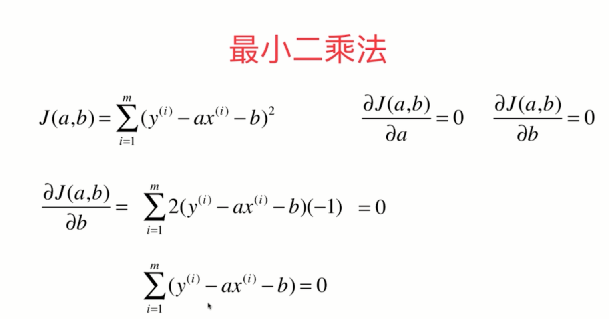
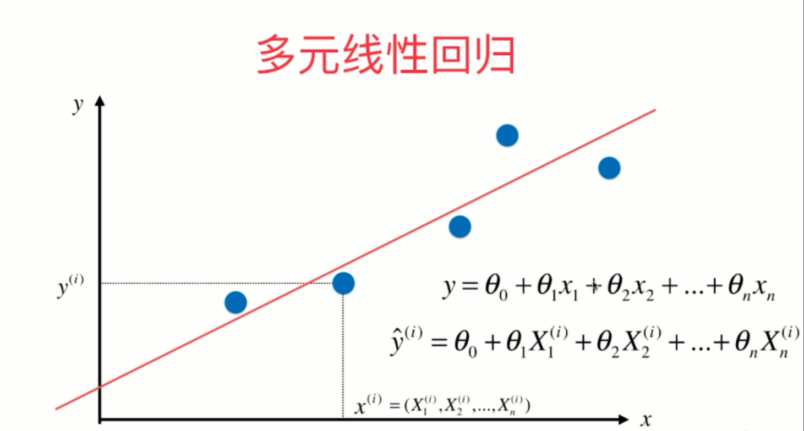

# 线性回归

## 简单线性回归

向量化

衡量标准

MSE

RMSE

MAE

MSE、RMES、MAE等评测指标，针对不同的问题没有唯一的衡量标准

R Squared

## 多元线性回归

## 总结

参数学习

# 梯度下降法

为了让最终的梯度与样本数量无关

向量化

由于训练的效果不是很好，分析数据中不同特征的分布存在比较大的区别，而这种区别往往会体现在梯度的计算结果中，导致更新的参数不是过大就是过小，过大不收敛，过小太耗时

