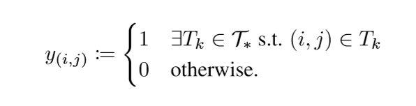
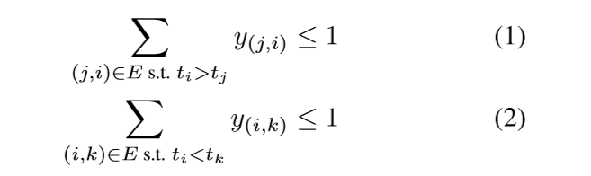
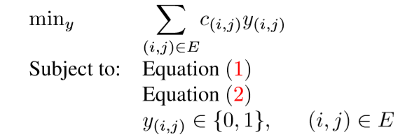
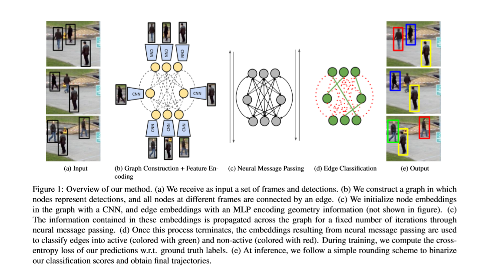
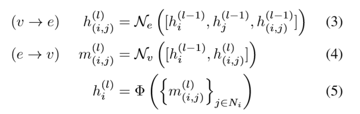
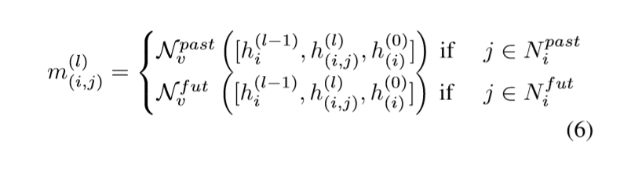
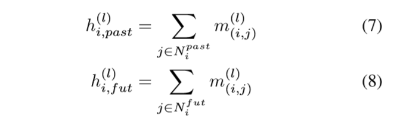
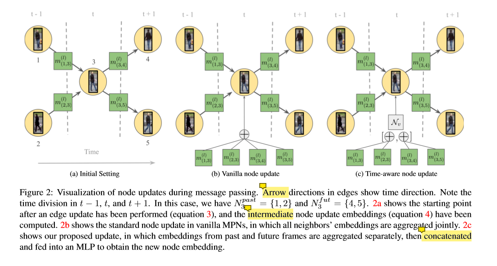

# Learning a Neural Solver for Multiple Object Tracking

**[[paper]](https://arxiv.org/abs/1912.07515v2)**  **[[code]](https://bit.ly/motsolv)**

## 背景

Graphs提供了一种很自然的方法在基于检测的范例下来定义多目标跟踪。但是他们也给学习的方法带来了很大的挑战。因为定义一个可以在这样的结构化领域上操作的模型是很重要的。因此，大量基于学习的工作致力于为MOT学习更好的特征。然后在此基础上去应用比较好的优化网络来进行MOT。

在本工作中，我们利用经典的MOT网络流来定义一个基于消息传递网络(MPNs)的完全可微分框架。通过直接在graph域进行，我们的方法可以从全局范围内分析所有的detection结果，并预测最终的解决方案。因此，在MOT的学习过程中，我们不需要局限于特征提取方面，我们还可以通过数据关联的方面进一步促进学习的过程。

## 引入

近年来，基于检测的多目标跟踪方法是一种比较有优势的方法，而且占据了SOTA的性能。它们往往包含两个部分：

* 获取到逐帧的检测  ---基于学习的方法进行解决

* 将检测与轨迹想关联 ---类似于图划分的技术

在graph中的MOT，由两部分组成，其中node表示的是检测到的一个目标，而edge连接了两个node。一个activate edge表示两个目标属于同一个轨迹。

在进行graph划分的时候，我们首先需要找到activate edge或者轨迹的集合。这个过程也可以被分为两个部分：

* 每个边上通过两个node属于同一轨迹的可能性来进行cost的分配

* 然后根据这些cost，结合图优化网络来获得最好的划分。

以往的基于graph的MOT算法可以很明显地划分为两大类：

* 集中于graph formulation

在这个类别中， 大量的研究致力于建立复杂图优化框架，该框架结合了多个信息来源，以编码提高检测之间的依赖。但是对于两个node之间的cost，他们甚至是由手工的方式获得的。

* 集中于学习更好的costs

在这个类别中，好多的方法采用的是极其简单的图优化框架，而主要集中于利用神经网络的方式来改善每条edge中的cost。通过Siamese卷积神经网络，它们可以在检测中编码更加可靠的成对的交互信息。

**我们的工作**

我们将上面提到的两种方案进行结合，形成了一个统一的基于学习的解释器，它可以：

* 为MOT学习特征

* 通过对全局进行分析，来得到最终的划分。

为了做到这一点，我们利用经典的MOT网络流来定义我们的模型。而且我们的方法直接学习来预测图像块是属于那一个轨迹。我们在普通的MOT domain 和graph domain，通过消息传递网络(MPN)来进行学习。其中，MPN在整个图中结合深度特征来得到更高层的信息。因此，即便是一个简单的graph的形式，但是我们的方法可以获取到全局检测的交互信息。

我们的方法极大地改善了性能，同时也更快。

**我们的贡献**

* 我们提出了基于消息传递网络的MOT解释器，这个方法可以针对问题所对应的图结构来进行特征的提取和最终结果的预测。

* 受到经典的图结构的MOT方法，我们提出了一个新颖的时间感知的消息传递更新步骤

* 在三个公开的benchmarks上，我们极大地改善了结果。

## Tracking as a Graph Problem

我们的方法的定义，是基于经典的最小成本流模型

### Problem Statement

在基于检测的跟踪问题当中，我们将检测到的结果作为输入，每一个检测通过一个oi来进行表示，oi = (ai, pi, ti)，ai表示的是边界框内的像素， pi表示的是二维图像的坐标，ti表示的是时间戳。轨迹被表示为一系列有时间顺序的检测的集合。MOT的目标是找到一组最合适的轨迹T，来解释我们得到的观测。

这个问题可以建模为一个无向图的问题，图中的结点表示的是检测，边主要用于前后帧之间的detections的连接。有了这些边之后，我们就可以在漏检的情况下恢复轨迹。

在 graph domain中，我们的任务就是将原始的检测分给不同的轨迹，而这些轨迹之间是互相独立的模块。

### Network Flow Formulation

为了表示图的划分，我们为图中的每一条边引入了一个二值的变量。在传统的最小化成本流的形式当中，当一条边连接的两个点：属于相同的轨迹、在时间上是连续的，两个条件均满足的情况下，label被定义为1，其余的都为0。

这个二值变量y(i, j)的定义如下所示：

当y(i, j)等于1的时候，边edge(i, j)被认为是active。轨迹一般都是无关联的，一个点不可能同时属于多个轨迹。因此y还需要满足以下两个条件：

这些不等式是流守恒约束的一个简化版本。在我们的设置中，它们强制每个节点通过活动边连接到，最多连接到过去帧中的一个节点和未来帧中的一个节点。

### From Learning Costs to Predicting Solutions

为了根据我们描述的框架获得一个graph的划分，标准的方法首先是将cost(i, j)与二值变量y(i, j)进行关联：

这样的一个问题，是可以在多项式的时间内进行求解的。

我们提出的方法，直接学习。然后预测图中的哪一条边是active，预测y最终的值。为了达到这样的效果，我们把该任务当做是一个分类问题，我们的label是二值变量y，总的来说，我们利用了我们刚刚提出的基本的网络流程公式，把MOT问题作为一个完全可以学习的任务来对待

## Learning to Track with Message Passing Networks

我们的主要贡献就是设计了一个可微分的框架，将多目标跟踪的问题训练为对于edge的一个分类问题。基于在前面提到的graph的定义，我们的模型被训练给图中的每一条edge预测一个二值的流变量y。我们的方法基于一个新的消息传递网络，这个网络能够捕获MOT问题的图结构。在我们提出的MPN框架中，外观和几何的线索在整个检测中进行传播，使得我们可以在全局的角度对整个图进行分析。

我们的pipeline包含了下面的四个重要的步骤：

* Graph Construction：检测与node对应，edges表示对应于不同节点间的连接

* Feature Encoding: 我们从应用在边界框图像上的卷积神经网络(CNN)初始化节点外观特征嵌入。对于在不同的帧之间检测之间的边而言，我们计算这些检测的特征编码了他们bbox的相对大小、位置和时间差到一个向量中，然后我们把这个向量送入多层感知机里面，最终返回一个几何的嵌入。

* Neural Message Passing：我们在graph中执行了一系列的消息传递，直观地，对于每一轮的消息传递，结点会与与它连接的边来共享外观的信息，而edge也会与它两端连接的nodes来共享几何的信息。这将为节点和边生成更新的嵌入，其中包含依赖于总体图结构的高阶信息

* Training: 我们使用最终的边缘嵌入来执行active/non-active边缘的二元分类，并使用交叉熵损失来训练我们的模型。

在测试阶段，我们使用我们的模型对每条边的预测作为目标流彼岸莲花的连续逼近，然后通过四舍五入的方式来得到最终的轨迹。

整个pipeline如下图所示：

### Message Passing Networks

在这个部分，我们对MPN会做一个简短的介绍。对于一个图G=(V,E)，MPNs的目标是学习一个函数来传播包含在节点和边缘特征向量的信息。这个传播的过程其实就是在对嵌入的node和edge的不断更新。这个过程也被称为信息传播的过程。

这个传播的过程是用来进行node和edge的更新的，它被称为是消息传播step。在以往的传播过程中，每个传播过程被分为两种更新，一种是从node到edge；另一种是从edge到node。这个更新的过程会进行L次迭代。

Ne和Nv都是可以进行学习的方法。比如MLP，他们在整个graph中是共享的

### Time-Aware Message Passing

以前的消息传递框架可以应用在任何的graph当中，然而，MOT graph 有一种非常特殊的结构，我们也正在探索它的具体结构。我们的目标是在我们的网络中编码一个特定的感应偏差，尤其是在node更新的过程中。

回想一下方程4和方程5中描述的节点更新，它允许每个节点与它的邻居进行比较，并聚合所有这些节点的信息，以使用进一步的上下文更新其嵌入。再回想一下我们的流守恒约束的结构(方程1和2)，这意味着每个节点最多可以连接到未来坐标系中的一个节点和过去坐标系中的另一个节点。可以论证的是，一次聚合所有邻近的嵌入使得更新的嵌入节点很难捕获这些约束是否被违反。

更普遍的是，将MOT图的时间结构明确地编码到MPN公式中，对我们的学习任务是有用的。为了实现这样的目标，我们把公式4和5进行了改进，将与当前结点邻近的点分为两个部分，以前的点和未来的点。然后我们也定义了对于过去和未来分别的MLP。对于node i，我们分别在两个分组内对它的相邻结点进行计算。

算完之后，我们对这些嵌入进行集合。

最后，我们将二者进行一个联合，联合后的结果再送入最后一个MLP中，得到最终的一个更新。

下图c就是我们的time-aware的更新。

### Feature Encoding

我们的MPN接收的作为输入的初始嵌入是由其他反向传播网络产生的。

Appearance 嵌入：CNN提取每个检测对应的图像块的特征。

Geometry 嵌入：我们试图获取一种编码的表示，其中涵盖了不同帧间检测的相对位置大小、距离以及时间的不同。

### Training and Inference

**Training loss**

我们的目标是对edge进行分类。我们构建了一个分类网络(MLP)，我们将当前迭代l中的对edge的嵌入作为输入，通过二值交叉熵来计算损失。

**inference**

在推理的过程中，由于模型的最后加了一层sigmoid函数，所以输出都基本保持在0-1之间，我们采用0.5为阈值，将所有的输出二值化到0和1，在time-aware的更新步骤下，我们的方法将满足超过98%的阈值在0.5时的平均压力。这个最理想的解决方案，甚至可以通过一个简单的线性程序来实现。

## 结论

我们演示了如何利用MOT的最小成本流公式来处理整个跟踪问题作为一个学习任务。我们提出了一个完全可微分的管道，其中特征提取和数据关联可以共同学习。在我们的算法的核心是一个消息传递网络与一个新的时间感知更新步骤，可以捕获问题的图结构。在我们的实验中，我们已经显示了一个明显的性能改进我们的方法相对于以前的SOTA。
