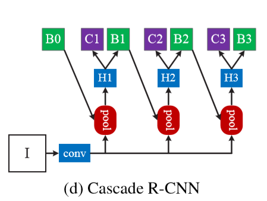
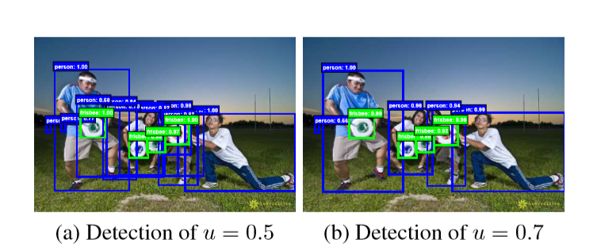
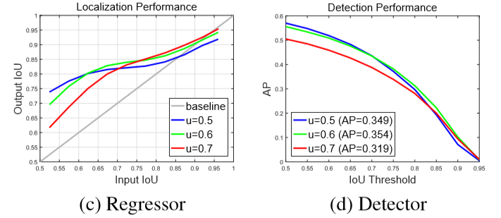
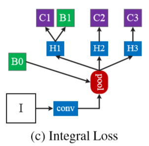
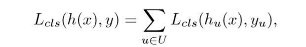
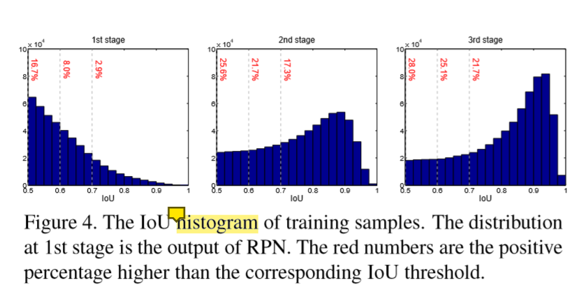

## Cascade RCNN 2018

### 目前在目标检测中存在的问题
在目标检测中，IOU是区分正负样本点关键。检测器以0.5为IOU的阈值时，它的检测性能不是特别好。 (FasterRcnn用的就是以0.5为IOU的阈值。)随着IOU阈值的增加，检测的能力在不断的降低。而导致这一问题出现的原因主要可以归结为以下两点：
* 在训练阶段存在过拟合的问题，当IOU的阈值稍微增加一点，正样本的数量就会急剧变化
* 检测器设定进行训练的IOU与我们在输入样本与真值之间的IOU在推理时间上的mismatch.

### 结构特点
* 多阶段的检测器  (每个阶段的IOU阈值不断增加，增加的阈值可以对某些误检的目标有一定的选择性)
* 一个检测器训练的结果作为下一个检测器的输入，同时保证了所有的检测器具有一组相同大小的正样本，从而在一定程度上避免了过拟合
* 推理时采用相同的级联过程，使得在各个阶段输入的IOU与检测器设定的IOU更加接近。

### 网络结构

### IOU的选择问题
在目标检测当中，我们需要通过IOU来区分正负样本，典型的IOU阈值一般取为0.5,但是通常情况下，**close false positives**的样本是可以通过IOU>=0.5的筛选，而当IOU<0.5的时候，样本虽然比较丰富，但是增加了检测器抑制误检样本的难度。

从图中，我们可以清楚地看到，当IOU值越小时，我们输入网络的内容会更多，更。丰富；而当IOU阈值比较高时，我们输入网络的内容更接近于真实值，但是数据量会大大减少。

**根据之前别人的工作，我们可以发现，单个检测器的性能只能在单个IOU阈值上达到最佳 **

**图中的三条线表示的是检测器的IOU阈值，分别取0.5、0.6、0.7，横坐标表示输入的候选区域的IOU阈值**

如上图所示，分别表示的是在不同IOU的取值下，回归以及检测精度的一个变化曲线，在左图中我们可以发现，在回归任务中，输入的IOU在经过回归之后总是会得到更大的IOU。

在上图中的左图，我们可以发现大致在输入的**IOU与检测器的IOU相一致的情况下，会得到最佳的表现**

在上图中的右图，我们可以发现在IOU 阈值较低的情况下，检测器的IOU取0.5的表现要由于0.6，但是在阈值过高的情况下，表现性能则恰恰相反。这就表明，**一个检测器最优的IOU阈值不一定适用于别的检测器 **。

通常情况下，要得到最优的检测器，就需要有最优的选择性输入。要得到最优的建议输入，就需要不断地提高输入数据的IOU阈值，可以依上右图可以看到，以0.7为阈值时，它的检测性能是在下降，因为它导致了数据分布的不平衡性。从而引发了两大相互矛盾的问题：
* 过拟合的问题(提高输入数据的IOU阈值 )
* 训练的IOU与我们在输入样本与真值之间的IOU在推理时间上的mismatch(IOU阈值过高)

而且**单个IOU的分类器难以满足多个IOU阈值水平上的分类效果**
而且通过选择性搜索或者RPN得到的建议区域一般是low qulity，它在一定程度上会影响最终分类的效果。

一个折中的方案就是取IOU为0.5，然后用多个分类器去对目标进行不同质量上的分类(多个分类器上拥有不同的阈值)。这种方式类似于下图所示的 `Integral loss`的结构

这种结构在计算分类损失的时候，使用如下形式：

但是这种结构无法满足随着IOU增加的过程中，正样本的数量急剧下降的问题，如下图中的第一个直方图。

所以在这种情况下，又存在两个问题：
* 大的IOU面临着过拟合的风险
* 在训练器上这么高的IOU，在推理过程中遇到更低质量的输入时，它肯定不是最优的。
### Cascade RCNN

* 一个多阶段的RCNN,顺序级联
* 训练的时候按顺序依次训练
* 第一个RCNN的输出作为第二个RCNN的输入，依次传递
* 有一个重采样的过程，能更好地发现**close false positives**，有效解决low qulity的现象

在这个Cascade RCNN中，级联了三个不同的检测器，前一个检测器的输出作为下一个检测器的输入，通过这样的结构，有效地解决了单一检测器阈值无法同时满足多个IOU阈值水平的问题。

* 它在每个检测器中都需要进行resampling,从而使得输入每一个检测器的输入的分布都是不同的。
* 它同时应用于train阶段和inference阶段
* 每个阶段分别通过resample得到的样本进行每个阶段的回归，

由上面第三张图中的左图可知，通过Cascade regression 可以增大输入样例的IOU值，使得经过回归后的样例相对应的IOU阈值增大，此时将增大的样例输入后一个regression的时候，相当于还是使用了初始的样例(即resample)，即没有因为检测器IOU阈值的升高而拿到low qulity的样本(如上图5的后两个图表所示，经过每个stage后，样本反而有着high qulity的趋势)，同时也有效地避免了过拟合的问题。

优点：
* 避免过拟合
* 级联的每个检测器中被优化的的IOU阈值越来越高=[enter description here](./paper/Cascade_RCNN.pdf)

