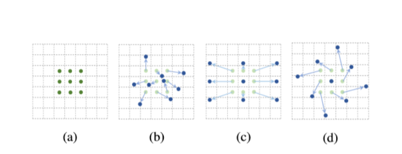
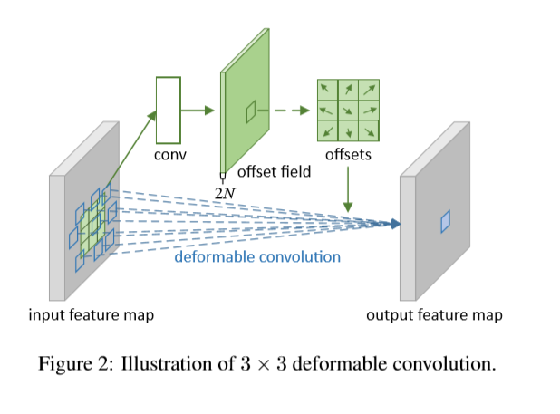
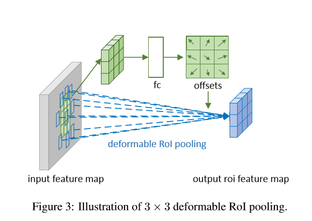
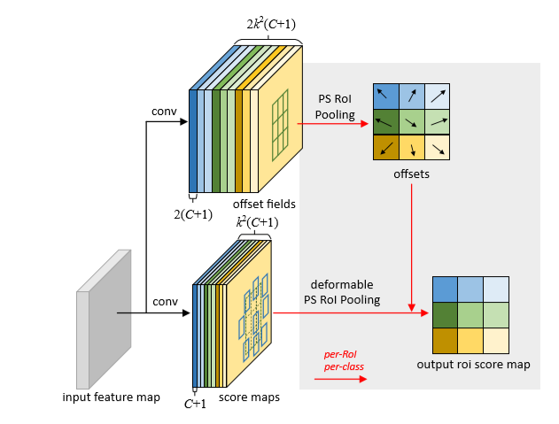
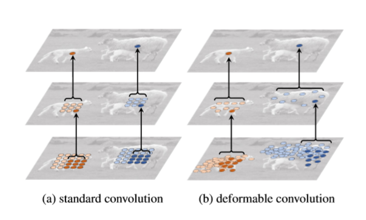
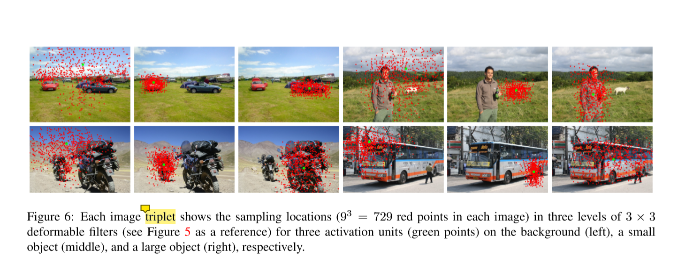
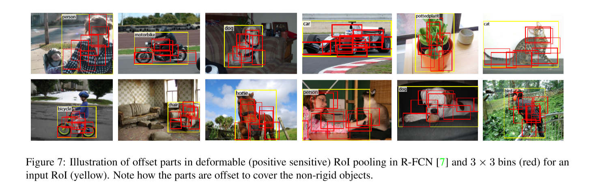

## [DCN v1](./attachments/DCN.pdf)

### 研究背景
卷积神经网络(CNNs)由于其构建模块中固定的几何结构，在本质上局限于模型几何变换。

### 我们的工作
我们引入了两个新的模块来增强CNN模型几何转换的能力，这两个模块分别是可变换的卷积( deformable convolution)和可变换的ROI pooling(  deformable RoI pooling)。这两种结构的思想均源于在模块中通过用额外的偏移量增加模块中的**空间采样位置**以及从目标任务中学习偏移量，不需要额外的监督。并且，我们提出的这两种结构可以很容易地替换掉原来的CNN网络中相对应的结构，而且也可以很容易地通过反向传播的思想进行端到端的训练。

### 逐步深入

**视觉识别的一个关键挑战**：是如何适应对象尺度、姿态、视点和部分变形的几何变化或模型几何转换。

**应对策略**:

* 构建具有足够数据变换的训练数据集
* 使用不随变换而变化的特征和算法。

**策略存在的缺陷**

* 在上面的联众方法中，几何上的转换被**假设**为是固定的，已知的，一些先验知识用于增强数据和设计特征与算法，而这些假设限制了模型在不知道的几何变换上的泛化能力
* 手工设计的不随变换而变化的特征和算法对于过于复杂的几何转换是不实用的

**CNN的应对模型几何变化的能力源自于**:大量的数据增强、大的模型容量以及简单的手工设计的模块

**CNN模型固有的缺陷**:

* 卷积单元对固定位置的输入特征图进行采样;
* 池化层以固定的比率降低空间分辨率
* RoIpooling 将RoI分成固定的空间大小
* 它在设计的时候没有一种应对几何模型变化的内部机制，
* 由于不同的位置可能对应于具有不同尺度或变形的物体，因此**自适应地确定尺度或感受野的大小**是精确定位的视觉识别所需要的。

### deformable convolution

它将二维偏移量添加到标准卷积的常规网格采样位置。它使采样网格能够自由变形。

如上图所示，图(a)表示的是普通的卷积结构，它的采样位置是固定的一些点。图(b)是我们提出的可变性的卷积，黑蓝色的点表示的是它进行采样的位置，浅色的箭头表示的是，这种可变性卷积在普通卷积上的偏移量。偏移量通过额外的卷积层从前面的特征图中学习。因此，变形的条件是固有的、密集的和自适应的。图(c)、(d)为(b)的两种变形。

如上图所示，通过在相同的输入特征特征图上应用卷积层来获得偏移量。卷积核具有与当前卷积层相同的空间分辨率和扩增率。通道维数2N对应于N个二维偏移量。在训练中，生成输出特征和偏移量的卷积内核是同时学习的。

### deformable RoI pooling
它为前一个RoI pooling 的常规bin分区中的每个bin位置添加一个偏移量.它为前一个RoI池的常规bin分区中的每个bin位置添加一个偏移量

如上图所示，首先会在输入的特征图的基础上生成一个简单的池化特征图，然后在此池化特征图上经过fc生成归一化的偏移量，然后通过具体的公式转化为我们最终所需要的偏移量

### Position-Sensitive (PS) RoI Pooling

它是全卷积的，与RoI Pooling不同。通过conv层，首先将所有输入的feature map转换为C+1维的k* k  得分图。池化的操作是在这个得分图上进行的。如下图的底下的分支所示。在顶部分支中，卷积层生成全空间分辨率偏移字段。这个PS ROI Pooling 与ROI Pooling的不同在于ROI Pooling的输入特征图x变成了针对不同类别的得分图。

### 优点
它们以一种简单、高效、深入和端到端的方式处理密集的空间转换。

### Deformable ConvNets

可变形卷积和RoI  Pooling模块的输入和输出与普通模块相同。在训练中，这些增加的用于偏移学习的conv和fc层初始化为零权值。我们知道这个可变形的结构由两个阶段组成。首先，深度全卷积网络在整个输入图像上生成特征图。其次，浅任务特定的网络从特征图生成结果。

如上图所示，(a)表示的是在标准卷积上固定的感受野大小，它的采样点在整个特征图上都是固定的。(b)表示的是在dcn上的适应性的感受野，它可以根据对象的尺度和形状进行自适应调整。

在上图中，每三个图为一组，经过三个3 * 3的dcn，我们可以发现有三个感兴趣的区域，一个是左图的绿点，一个是中间的小样本以及左边的大样本。每张图上有9^3个点。足以发现dcn可以根据目标的大小去适应性地改变。

上图展示的是可变性的ROI Pooling的作用，3 * 3的bin，覆盖了原先输入的整个黄色的ROI，相比于普通的ROI Pooling这种结构的局部性能力更强，定位能力也有增强适合检测一些固定不动的目标。