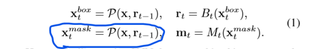

## [Hybrid Task Cascade](./attachments/Hybrid_Task_Cascade.pdf)

### 研究背景

级联的结构在许多的任务当中都提升了一定的性能，然而，将级联的结构引入到实例分割中来，依然是一个开放性的问题。仅仅将Cascade R-CNN和Mask R-CNN结合在一起，只能实现有限的提升。在探索更加有效的方法的过程中，我们发现了，在实例分割的过程中使用级联结构的一个关键在于要充分利用分割问题与检测的联系。

### 我们的工作

我们提出了Hybrid Task Cascade结构，它的**创新点**在于：

1)它不是对这两个任务分别执行级联细化，而是将它们交织在一起进行联合的多阶段处理;

2)它采用全卷积的分支来提供空间上下文，这有助于区分前景和杂乱的背景。

通过将各个阶段互补的特征结合在一起，这种结构能学到更具有区别力的特征。

**我们的贡献**：

* 我们提出了Hybrid Task Cascade结构，它通过交织检测与分割的特征将级联的结构集成到实例分割中，实现了一个联合的多阶段处理。

* 我们证明了空间上下文通过从复杂背景中区分前景对象对实例分割是有益的。

### 实例分割所面临的挑战，以及应对策略

问题：
* 视觉上的物体，尝尝伴随有变形、遮挡以及尺度的变化之类的问题
* 在复杂的背景中区分目标物体的难度比较大

应对策略：
* 我们需要一个对外观变化有弹性的健壮表示。
* 我们需要从复杂的背景中为目标提取丰富的上下文信息

Cascade RCNN的特点：
* 逐步地改善预测的效果
* 能够自适应地处理多种训练的分布

Cascade R-CNN 和 Mask R-CNN 的结合，在bbox AP上提升了3.5%，而在mask AP上的提升只有1.2%，造成这种巨大差距的一个重要原因是**不同阶段的mask分支之间的信息流不够理想**。

**为了弥补这一个大的差距，我们提出了Hybrid Task Cascade结构**

**关键思想：**

* 是通过在**每个阶段结合级联**和**阶段内多任务(bbox的回归与mask prediction的交织)** 来改善信息流，并利用空间上下文信息进一步提高准确性。

* 在每个阶段，边界框回归和mask预测都以一种多任务的方式结合在一起。此外，还介绍了不同阶段的mask分支之间的**直接连接**，表现为，前一个阶段的mask特征作为当前阶段的输入

* 通过增加额外的语义分割的分支，并将其结果与bbox  regression以及mask prediction相融合，以此来得到更多的上下文信息

如上图所示，每个阶段的MASK特征被结合在一起，然后传递到下一个阶段。这样的结构，**有效地加强了不同阶段间任务的信息流动**。

我们合并了一个全卷积的分支来执行像素级的实例分割。这个分支不仅对来自前景实例的上下文信息进行编码，还对来自后台区域的上下文信息进行编码，而且我们的实验也证明了，**利用上下文的信息，我们确实可以获取到更具有识别力的特征**。

### 我们的探索

#### Cascade Mask R-CNN

首先，我们设计了Cascade Mask R-CNN的结构，这个结构如上图中(a)所示，它仅仅是将Cascade R-CNN与Mask RCNN做了一个简单的结合，即在Cascade Mask R-CNN的每一个阶段引入Mask R-CNN结构。

这个结构有效地改善了bbox的AP

#### Interleaved Execution

上面的Cascade Mask R-CNN，虽然有好处，但是它也存在着比较大的缺点：bbox prediction与mask prdiction是并行执行的，两者之间没有交织，且均以上一个阶段的bbox prediction作为输入。为了解决上面结构的问题，我们设计了如上面第二张图中(b)所示的Interleaved Execution结构。

这种结构进一步改善了精度

#### Mask Information Flow
上面的Interleaved Execution结构，当前层的mask prediction仅仅依赖于x、当前层的bbox prediction以及ROIs，它没有不同阶层间mask分支上的信息流动，而这种信息流动恰恰能更大程度地提升mask预测的精度。针对当前的问题，我们仔细考虑了一下Cascade R-CNN的结构，我们会发现，bbox的回归的输入由两个部分组成，一个是backbone，一个是上一阶段的bbox回归的结果。受到这个方式的启发，我们设计了 Mask Information Flow的结构，如上面第二张图中(c)所示，将上个阶段的mask prediction作为当前阶段mask prediction的输入。

#### Spatial Contexts from Segmentation
为了更好地从复杂背景中将前景区分出来，我们吧空间的上下文信息作为线索，在Mask Information Flow的基础上，增加了语义分割的分支。这个分支采用了全卷积的结构，并且和其他的分支一起训练，新的结构如上面第二张图中(d)所示，也是我本篇文章所提出的最终结构。

#### Semantic Segmentation Branch

我们的语义分割分支的构造是基于FPN网络的输出的。我们知道在单个水平上的特征在语义分割的时候不能提供足够的区分力。因此我们设计了在多个水平特征图的一个相互组合来实现语义分割。如下图所示：

特征金字塔的每一层输出首先通过1×1的卷积层对齐到一个公共表示空间。然后低水平的特征图进行上采样，高水平的特征图进行下采样，以使不同尺度的特征图转化到相同的尺度。然后这些相同尺度的特征图进行融合(逐元素进行相加)，之后，我们在其上增加了四个卷积层，以进一步弥补语义上的差距。最后，我们简单地采用卷积层来预测像素方向的分割图。

#### Fusing Contexts Feature into Main Framework

我们提出将语义特性与bbox及mask特性融合，以允许不同分支之间进行更多的交互。通过这种方式，语义分割分支通过编码空间上下文直接帮助预测bbox和mask。我们使用RoIAlign从相应层次的特征金字塔输出中提取一个小的特征块(如7×7或14×14)作为表示。同时，我们将RoIAlign应用到语义分支的特征映射上，得到形状相同的特征块，然后通过元素求和的方式将两个分支的特征组合起来。(这里我理解的不是很清楚)
