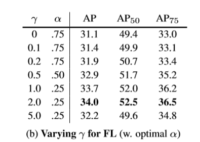
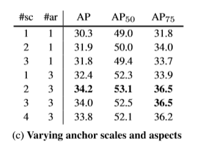

# RetinaNet - Focal loss

## 概述

目前看来，精度最高的检测器是基于two-stage的R-CNN的演化版本，他们的分类器往往作用于一些稀疏的候选目标位置。而one-stage的检测器则往往作用于对可能的目标位置进行有规律的、密集的采样，他们有潜力能够成为更快、更简单的检测器。然后one-stage detector的检测精度总是低于 two-stage detector。

本文，作者仔细地研究了one-stage detectors检测精度不高的问题，他们认为出现这样的问题的主要原因是在密集的检测器的训练过程中遇到的正负样本的极端不平衡。然后作者针对这个问题，对交叉熵损失函数进行了改进，以至于它可以降低较好分类样例的权重，这种新的损失函数称之为Focal loss。Focal loss在训练过程中专注于一些稀疏的难样本，同时防止了检测器在训练期间由于大量的简单负样本的存在而发生偏离。

为了评估我们新设计的损失函数的效果，我们设计和训练了一个我们称为RetinaNet的检测器。我们的结果显示，当使用Focal loss训练时，RetinaNet能够达到以前one-stage detectors的速度，同时超过所有现有的最先进的 two-stage detector的精度。

## 动机

在此之前，two-stage detectors，在第一阶段生成proposal，第二阶段在proposal的基础上进行具体的分类与回归，它们在Coco数据集上达到了最好的检测精度。

这个时候，一个比较自然的疑问就是：one-stage detectors 能否达到这样高的精度呢？

YOLO以及SSD的出现，给one-stage detectors带来了希望，它们不仅检测速度远远超越了two-stage detectors，而且再精度方面，也基本与two-stage detectors相差不是很远(差距基本在10%-40%以内)

而作者则加速了one-stage detectors在精度上超越two-stage detectors这一进程，我们提出了一个新的one-stage detector，它实现了one-stage detectors的精度与two-stage detector(FPN、 Mask RCNN)最好的精度基本匹配。**为了达到这样的结果，我们确定了在训练过程中的类别不平衡是阻碍one-stage detectors 达到最先进的精度的主要障碍，并提出了一个新的损失函数来消除这个障碍。**

### class imbalance

**问题所在**：输入detector的候选目标中，只有少量的目标是包含目标对象的，剩下的大部分都是简单的负样本，这样导致学习的都是没有意义的siginal；甚至最终会导致模型的退化。

**two-stage 解决方案**

* two-stage cascade

	* proposal stage: 快速缩小候选目标位置的数量到一个小的数目，过滤掉大部分背景样例

	* second stage: 固定前景与背景的比例为1:3  **（sampling heuristics）**、 OHEM(在线难例挖掘) 

**one-stage 解决方案**

他们必须对大量的规律地采集自同一张图中的目标位置进行处理。最终所有的要处理的目标达100K,它们密集地覆盖了所有的空间位置、尺度以及长宽比。虽然他们也会去考虑sampling heuristics， 但是在这里，基本上简单的负样本数据太多，sampling heuristics基本上是不起作用的。**sampling heuristics的无效性**成为了目标检测当中很经典的问题，，这些问题一般会通过bootstrapping或者难例挖掘的方式进行解决。

**本文的解决思路**

我们提出了新的损失函数Focal loss，它比以往的损失函数能够更有效地处理这个问题。

Focal loss 能够动态地计算交叉熵，其中涉及到的scaling factor会随着正类置信度的增加而逐渐衰减到0。如下图所示：

在训练过程中，这个scaling factor可以自动地降低简单样例贡献的权重，并快速地集中于难例。实验表明，我们提出的Focal loss使我们能够训练一个高精度的单级检测器，它的性能显著优于sampling heuristics或难例挖掘的训练方法。

我们注意到，Focal loss的确切形式并不重要，而且我们也展示了其他的一些实例也可以取得类似的结果。

为了说明Focal loss的有效性，我们提出了RetinaNet，一个新的one-stage detector 它的设计表现为高效的网络特征金字塔，并且是anchor-based。

### 细节

**Focal loss主要被设计于解决one-stage detector 中background与forefground的类别不平衡的现象**

首先，我们观察上面的那张图，我在下面可以重新给出：

这张图中的蓝色线条，即是最普通的CE loss，我们可以看得出来，即便是置信度极高，很容易可以直接分类的情况下，loss依然是比较高的。当把大量简单的例子加在一起时，这些小的损失值就会累积到特别大。这种情况很容易由于简单样本比较多而导致模型的退化问题。

#### 平衡CE

解决类别不平衡常用的方法是引入一个权重因子α，对CE的结果进行惩罚，而且是对于越容易分类的惩罚因子越大，loss越大时，惩罚因子有利于缩小loss

#### Focal loss

虽然上面的方法可以在一定程度上平衡了正负样例不均衡所带来的类别不平衡，但是它并没有解决简单样例与难样例之间的不平衡。所以在此，作者想着通过修改这个损失函数，然后降低简单样例的权重，使得网络在训练的过程中更多地去关注难样例。

于是我们得到了我们的Focal loss，其形式如下：

其中，调节因子为 (1 − pt)^γ ，且γ ≥ 0

我们可以发现：

* 当一个样例被误分类且Pt是小值时，这个调节因子接近于1，此时loss是基本上不受影响的。(难例)，当Pt接近1，这个调节因子接近于0，此时易分类的样例的损失被减小(简单样例)。

* γ平滑地调节比例，使得简单样本的损失权重不断降低。

当 γ等于0时，它就是普通的CE，且随着 γ的增大，调节因子也是增大的。**在实验中发现，当 γ取2时能达到最佳的效果**

直观上来看，调节因子减少了简单样本的loss，而且扩大了低 loss的范围(这些同样可以在上面的图中观察出来)。这反过来又增加了纠正错误分类的示例的重要性。

实际使用的时候，作者通过α来平衡Focal loss，其形式如下所示：

在实验结果中，作者发现，带α因子的精度要比不带α因子的精度高。最后，我们注意到损失层的实现将计算p的sigmoid操作与损耗计算结合起来，使得数值稳定性更大。

Focal loss的具体形式是不重要的，作者也尝试过其他形式的Focal loss，都可以取得相似的效果。

#### Class Imbalance and Model Initialization

二进制分类模型在默认情况下初始化为输出y =−1或1的概率相等。在这样的初始化下，在类别不平衡的情况下，由于频繁的类别如过多的简单样本而造成的损失会受到一定的影响，在早期的训练中造成不稳定。为了解决这个问题，我们引入了“先验”的概念，即在训练开始时，给稀有类别(前景)设置一定的先验，而且我们发现，先验值设为 π （π=0.01）的时候，会使得前景对应的loss比较低。这种在开始训练的时候设置先验的方式能够在CE或者FL的损失函数下，使得模型对于严重的类别不平衡更具有稳定性。

#### Class Imbalance and Two-stage Detectors 

Two-stage Detectors 在面临类别不均衡的情况时，往往不会采用带有α因子的CE或者作者提出的FL作为损失函数，而是采用的另外两种方式：

* a two-stage cascade （proposals）

*  biased minibatch sampling  （1:3）

### RetinaNet结构

RetinaNet是由一个主干网络和两个特定于任务的子网组成的单一、统一的网络。主干网络用的是现成的ResNet，而后面的两个子网络则分别进行分类以及bbox的回归。

这两个子网络的特点是设计简单，特别适用于one-stage dense detector.尽管这些组件的细节有很多可能的选择，但大多数设计参数对实验显示的精确值并不特别敏感。

**Feature Pyramid Network Backbone**

我们采用特征金字塔网络(FPN)作为RetinaNet的骨干网络。我们强调使用FPN骨干是因为，仅使用ResNet的最后一层的特征进行的初步实验得到的AP较低。

**Anchors**

我们使用平移不变的锚框，类似于FPN中RPN变量中的锚框。 在FPN中，每一个level的Feature map对应3个不同比例的anchor，但是为了更密集的网络，我们在FPN的基础上又增加了3中比例的anchor。它的特征图覆盖了原图32-813pixel的区域。

每个anchor分配一个长度为K的分类目标的一个one-hot，其中K为对象类的个数，一个长度为4的向量的box来回归目标的位置。

anchor与ground-truth的IOU超过0.5则保留，如果IOU在[0,0.4]之间，则认为它是背景。IOU在0.4到0.5之间的anchor在训练过程中直接忽略。

**Classification Subnet**

我们的分类子网络内部进行参数的共享，而且只采用3 * 3的卷积，FCN结构，A = 9(每一层9个anchors), C = 256

我们发现这些更高级的设计决策比超参数的特定值更重要。

**Box Regression Subnet** 

与分类子网络并列，用于完成bbox的回归。是一个小型的FCN，这个子网络的设计与分类子网络几乎是一样的，就是输出的地方，分类根据类别数，设定了输出为KA，而回归网络为4A，这4个值分别表示的是anchor与GT的偏移量。

我们不像最近的工作，我们使用一个阶级未知的bbox回归，或者使用最少的参数，我们发现是同样有效的。

#### Inference and Training

**Inference**

一张图片输入网络之后，经过Resnet-FPN的backbone之后，再经过分类子网络与回归子网络，得到最终的结果，在分类分支中，为了加快速度，我们只针对1K的最高得分的预测结果进行解码，置信度的阈值为0.05。将所有级别的最高预测合并，并使用阈值为0.5的NMS来产生最终的检测。

**Focal loss**

Focal loss最为分类子网络的损失函数。在训练过程中，Focal loss直接面向大约100K的anchor进行计算loss，而启发式采样(RPN)或者难例挖掘(SSD)则一次只能计算256个anchor。

我们通过分配anchor的数量来进行归一化，而不是完全anchor，因为大多数anchor都是简单负样本，在Focal loss下接收到的损失可以忽略不计。

Focal loss中的平衡因子α有一个固定的变化范围，与γ有关。α 会随着γ的增加而减少。最终实验得到**γ = 2, α = 0.25 works best**

**Optimization**

* SGD

* iterations:90K

* lr : 0.001然后在60k的时候除以10，然后在80k的时候再除以10

* data augmentation: horizontal image flipping

* loss: Focal loss for classify and  smooth L1 loss used for box regression 

## Experiments

实验的过程中，作者试图在初始化的过程中不做任何修改，然后网络一直是发散的，也就是由于样本不均衡所导致的，所以他们根据上述的研究，在初始化的过程中，给预测值一个先验π=0.01，巧妙地解决了这个问题。后续的实验中，先验π一直取0.01.

**在CE中加入α平衡因子**

**Focal loss**

我们将这个模型应用到大量的随机图像和样本中，其中包括∼10^7负窗口和∼10^5正窗口的预测概率。接下来，分别为正、负，我们计算这些样本的FL，并将损失归一化，使其和为1。考虑到规范化的损失,我们可以从低到高排序损失和绘制CDF图，正负样本分别设置不同的γ 。

在positive样例中，我们发现γ 的不同取值的影响并不是特别大，因为在不同的取值中，我们发现大约都有20%的 hardest positive samples 占据了loss的一半。且随着γ 的增加，更多的损失集中在前20%当中，但是影响不怎么明显。

而在nagetive样例中，随着γ 的变化，loss的变化是比较剧烈的。随之γ 的增加，loss慢慢都集中于难的负样本中。当γ =2时，绝大部分的损失只来源于一小部分的样例。**FL可以有效地降低简单负样例的影响，将所有注意力集中在难负样例上。**

**FL VS OHEM**

### Model Architecture Design

**anchor Density**

* two-stage detectors可以使用ROIPooing 对任何位置、尺度和纵横比的bbox进行分类.

* one-stage detectors 使用固定的采样网格，不同尺度和长宽比

* 我们在FPN的每一层，的每一个位置，进行不同尺度(4)以及长宽比(3)进行anchor的确定,**最后，我们注意到增加超过6-9个锚点并没有显示出进一步的收益**

**Speed versus Accuracy**

## Conclusion

在这项工作中，我们确定类别不均衡是阻碍one-stage detectors超越性能最好的two-stage detectors的主要原因。为了解决这个问题，我们提出了Focal loss，它应用可调节项调节CE，以便进行难例。我们的方法简单而高效。我们通过设计一个全卷积的one-stage detector来证明它的有效性，并做了大量的实验分析，证明了它确实达到了SOTA的精度和速度。