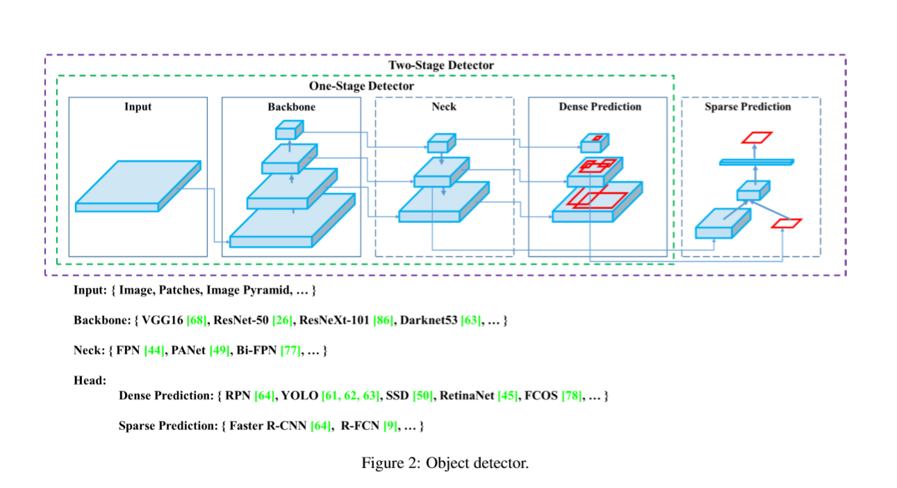
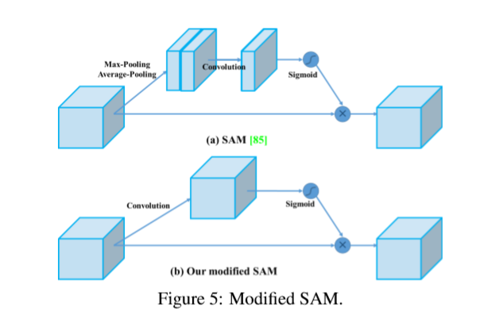
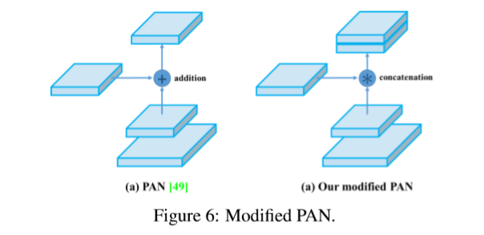
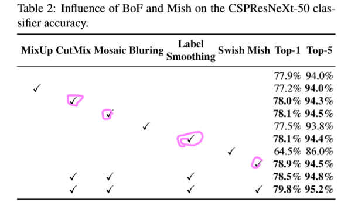
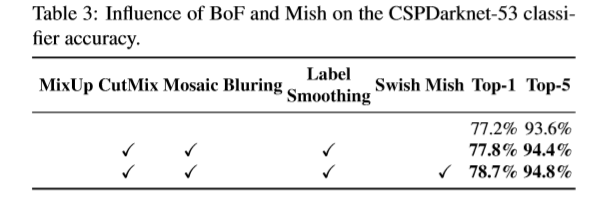
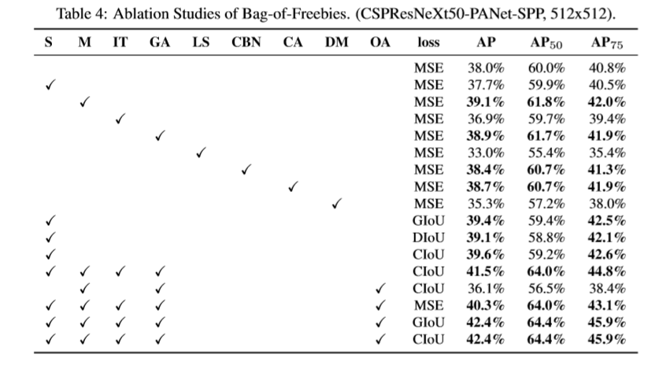
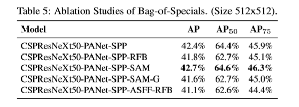
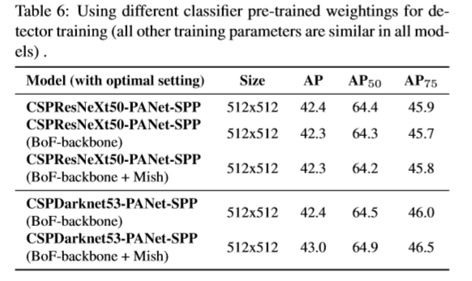
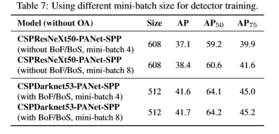
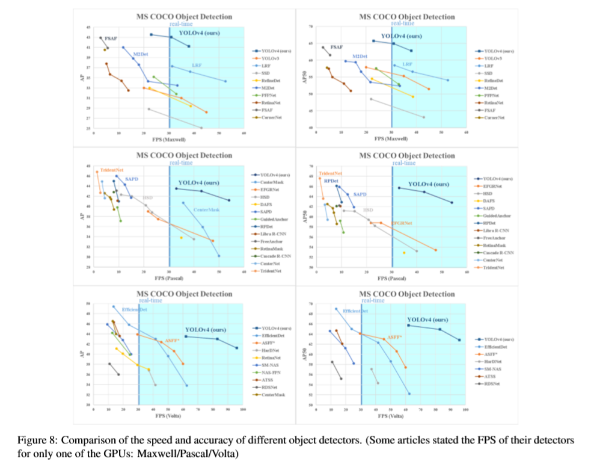

# YOLOv4:Optimal Speed and Accuracy of Object Detection 

## 概述

有很多特征可以提⾼卷积神经⽹络（CNN）的准确性。需要在⼤型数据集上对这些特征的组合 进⾏实际测试，并需要对结果进⾏理论证明。

* 某些特征仅在某些模型上运⾏，并且仅在某些问 题上运⾏，或者仅在⼩型数据集上运⾏；

* ⽽某些特征（例如批归⼀化和残差连接）适⽤于⼤多数模型，任务和数据集。

我们假设此类通⽤特征包括加权残差连接（WRC），跨阶段部分连 接（CSP），交叉⼩批量标准化（CmBN），⾃对抗训练（SAT）和Mish激活。

**我们使⽤以下新功能：WRC，CSP，CmBN，SAT，Mish激活，⻢赛克数据增强，CmBN，DropBlock 正则化和CIoU丢失，并结合其中的⼀些特征来实现新的结果。**

## 动机

提⾼实时物体检测器的精度不仅可以将它们⽤于提示⽣成推荐系统，还可以⽤于独⽴的过程管理和减少⼈⼯输⼊。
常规图形处理单元（GPU）上的实时对象检测器操作允许以可承受的价格对其进⾏运⾏。现在精确的神经⽹络⽆法实时运⾏，需要使⽤⼤量的GPU进⾏⼤量的mini-batch-size训练。

我们通过构建在常规GPU上实时运⾏的CNN来解决此类问题，并且该训练过程仅需要在⼀个传统的GPU上执行。

## 创新点

这项⼯作的主要⽬标是在产⽣式系统中设计⼀个运⾏速度快的⽬标探测器，并对**并⾏计算**进⾏优化。

创新点：

* 我们开发了⼀个⾼效且功能强⼤的⽬标检测模型。它使每个⼈都可以使⽤1080Ti或 2080TiGPU来训练超快、精确的物体探测器。 

*  我们验证了当前新的“免费袋”和“特殊袋”检测⽅法在探测器训练过程中的影响。 

*  我们修改了新的⽅法，使其更有效，更适合于单个GPU的培训，包括CBN、 PAN、SAM等。

## object detection 

## Bag of freebies

only change the training strategy or only increase the training cost， 在目标检测中经常应用的，且符合这样的定义的是数据扩充

数据扩充的目的是增加输入的可变性，使所设计的目标检测模型对不同环境下的图像具有较高的鲁棒性。

光学畸变和几何畸变是常见的数据扩充的方式，同时它们对于检测任务往往是有益的。

### some tricks

* 光学畸变：

	* 亮度

	* 对比度

	* 色调

	* 饱和度

	* 噪音

* 几何畸变

	* 尺度变化

	* 裁剪

	* 镜面翻转

	* 旋转

上面提到的这个数据扩充的方式都是基于像素级的扩充，而且像素本身的信息在调整的过程中往往可以保留下来。

* 一些从事数据扩充的研究人员把重点放在模拟物体遮挡问题上。

	* hide-and-seek
	
	* grid mask

* 一些研究者提出了将多幅图像结合在一起进行数据增强的方法。
	
	* MixUp

	* CutMix 
	
* style transfer GAN--这样的使用可以有效的减少CNN学习到的纹理偏差。

### 解决数据分布可能存在偏差的问题

#### 最重要的问题是存在不同类间的数据不平衡问题，

而这一问题通常是难例挖掘以及在线难例挖掘来解决的(**two-stage detector**)，这种方式不适用与**one-stage detector**，因为这种检测器属于密集的检测结构。

* focal loss：处理各个类之间存在的数据不平衡问题

#### 很难用一个one-hot表示法来表达不同类别之间的关联程度关系。

*  label smoothing 将硬标签转换为软标签进行训练，使模型更加鲁棒。

* knowledge distillation 设计标签细化网络，获得更好的软标签

### BBox regression

原来有的：

* {xcenter, ycenter, w, h}

*  {xtop left, ytop left, xbottom right, ybottom right}.

* IOU:就是我们所说的交并比，是目标检测中最常用的指标，他的作用不仅用来确定正样本和负样本，还可以用来评价输出框（predict box）和ground-truth的距离。如果两个框没有相交，根据定义，IoU=0，不能反映两者的距离大小（重合度）。同时因为loss=0，没有梯度回传，无法进行学习训练。

改进：

* 直接估计BBox中每个点的坐标值，就是把这些点当作自变量，但实际上并不考虑对象本身的完整性.

* GIOU:包括了物体的形状和方向，并将其添加到覆盖区域。

* DIoU:它还考虑了物体中心的距离，

*  CIoU :考虑重叠区域、中心点之间的距离和纵横比

s
## Bag of specials

对于额外加入的模块和后处理方法，只增加了少量的推理成本，但可以显著提高目标检测的准确性，这些方法就可以称为Bag of specials。

* 增加的模块

	* 增强模型中的某些属性

	* 扩大感受野 SPP、 ASPP、 RFB

	* 引入注意力机制

		* channel-wise attention

		* point-wise attention

	* 增强特征的融合能力

* 后处理： 筛选模型预测的结果，这个在anchor-free中使不需要考虑的

## Methodology

其基本⽬标是在⽣产系统中对神经⽹络进⾏快速操作，并针对并⾏计算进⾏优化，⽽不是低计 算量理论指示器。

*  对于GPU，我们使⽤少量的组（1-8）卷积层：CSPResNeXt50 / CSPDarknet53 

*  对于VPU, 我们使⽤分组卷积，但是我们不再使⽤SE块,特别是这包括以 下模型：EfficientNet-lite / MixNet / GhostNet / Mo-bileNetV3 .

### Selection of architecture

我们的目标：

* 是在输入网络分辨率、卷积层数、参数数量和层输出数之间找到最佳平衡。

* 选择额外的块来增加感受野，并从不同的主干主干网络为不同的检测器水平选择最佳的参数聚合方法

A reference model which is optimal for classification is not always optimal for a detector. In contrast to the classifier, the detector requires the following: 

* 更高的输入网络图像的大小(分辨率)——用于检测多个小型对象

* 更多的层——一个更大的感受野，以覆盖增加的输入网络的图像的大小

* 更多的参数——在一个模型中拥有更大的能力去检测多物体不同大小的图像

感受野的大小的作用：

* 达到对象大小——允许查看整个对象

* 达到网络大小——允许查看对象周围的上下文

* 超过网络大小——增加图像点和最终激活之间的连接数

**我们的做法**

* 我们在CSPDarknet53上添加了SPP块，因为它显著增加了感受野，分离出了最重要的上下文特性，并且几乎不会降低网络运行速度。

* 我们使用PANet作为不同检测层的不同主干层的参数聚合方法，而不是YOLOv3中使用的FPN。

**YOLOv4**：

* **backbone**:CSPDarknet53 

* **additional module**: SPP

* **path-aggregation neck**: PANet

*  **head**: YOLOv3 (anchor based) head 

### Selection of BoF and BoS

* **activation method** : PReLU and SELU are more difficult to train, ReLU6 is specifically designed for quantization network. so no consider.

* **regularization method**: we choosed DropBlock

* **normalization method**: since we focus on a training strategy that uses only one GPU, syncBN is not considered

### Additional improvements

为了使设计的检测器更适合单GPU上的训练，我们做了如下的附加设计和改进:

* 我们介绍一种新的数据增强Mosaic 和 Self-Adversarial Training (SAT)

* 应用遗传算法选择最优超参数

*  我们修改了一些现有的方法，使我们的设计适合于有效的培训和检测- modified SAM, modified PAN, and Cross mini-Batch Normalization (CmBN)

**Mosaic** : 这允许检测正常上下文之外的对象。此外，BN计算4个不同的图像在每一层。这大大减少了对大型mini_batch处理大小的需求。

**Self-Adversarial Training (SAT)**：表示一种新的数据增强技术，它在两个前向和反向阶段操作。在第一阶段，神经网络改变原始图像而不是网络权值。通过这种方式，神经网络对自己执行一种对抗性攻击，改变原始图像，以制造图像上没有期望对象的假象；在第二阶段，神经网络以正常的方式检测修改后的图像。

我们将SAM从 spatial-wise attention 修改为pointwise attention，并将PAN的shortcut connection 替换为串联，如下所示：

### YOLOv4

* Bag of Freebies (BoF) for backbone:

	* CutMix

	* Mosaic

	* DropBlock

	* Class label smoothing

* Bag of Specials (BoS) for backbone:

	* Mish activation

	* Cross-stage partial connections

	*  Multiinput weighted residual connections (MiWRC) 

* Bag of Freebies (BoF) for detector:

	* CIoU-loss

	* CmBN

	* DropBlock regularization

	*  Mosaic data augmentation

	* Self-Adversarial Training

	*  Using multiple anchors for a single ground truth

	* 余弦退火调度程序

	* ,Optimalhyperparameters

	* Random training shapes 

* Bag of Specials (BoS) for detector:

	* Mish activation,

	* SPP-block

	* SAM-block

	* PAN path-aggregation bloc

	* DIoU NMS

## Experiments

### classifier accuracy

### detection accuracy

### Using different classifier pre-trained weightings for detector training 

我们注意到，在检测器精度方面，具有最佳分类精度的模型并不总是最佳的。

* although classification accuracy of CSPResNeXt50 models trained with different features is higher compared to CSPDarknet53 models, the CSPDarknet53 model shows higher accuracy in terms of object detection

* using BoF and Mish for the CSPResNeXt50 classifier training increases its classification accuracy, but further application of these pre-trained weightings for detector training reduces the detector accuracy. However, using BoF and Mish for the CSPDarknet53 classifier training increases the accuracy of both the classifier and the detector which uses this classifier pre-trained weightings. 

**The net result is that backbone CSPDarknet53 is more suitable for the detector than for CSPResNeXt50.**

### Influence of different mini-batch size on Detector training

我们可以发下，在增加BoF和BoS策略之后，mini_batch基本不会影响detector的精度。**这一结果表明，在引入BoF和BoS之后，不再需要使用昂贵的gpu进行训练。**

## Results

我们的yolov4定位在 pareto optimality curvev 上，在速度和精度上都优于最快、最精确的检测器。

## Conclusions

我们提供了最先进的检测器，更快(FPS)和更准确(MS COCO AP50…)超过了所有可用的替代探测器。这个检测器可以在传统GPU上训练，这使其广泛使用成为可能。基于anchor的one-stage detector的概念已经被证明是可行的。

