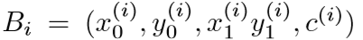
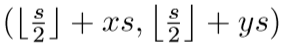
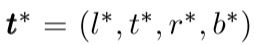
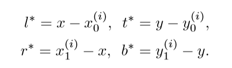
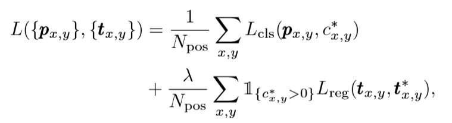
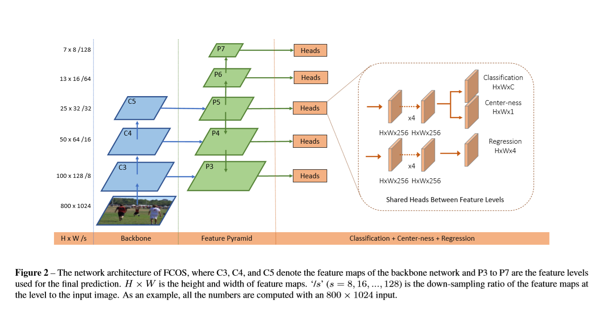
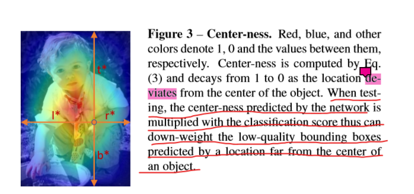
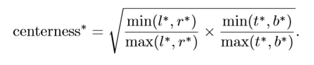

# Fully Convolutional One-Stage Object Detection

**[[paper]](http://xxx.itp.ac.cn/pdf/1904.01355v5) [[code]](tinyurl.com/FCOSv1)**

## 背景

比较经典的目标检测方法，都是anchor-based的，比如Faster RCNN、SSD、Yolo系列。而本文作者则提出了一个anchor-free的方法。使用类似于分割的方法，逐像素地进行预测，从而达到检测的效果。相较于anchor-base的方法，我们的方法减少了复杂的计算量，比如重叠区域的计算等等，重要的是，我们还避免了所有与anchor相关的超参数，这些超参数通常对最终的检测性能非常敏感。在只有后处理NMS的情况下，FCOS利用ResNeXt-64x4d-101，在单模、单尺度的基础上实现了44.7%的AP，在保持模型简洁的基础上超越了以前的one-stage检测器。

## 引入

anchor-base的目标检测器，虽然取得了很大的成功，但是它们同样存在着一些问题：

* 检测的性能对于anchor 的bbox的大小、长宽比以及数量。

* 因为anchor bbox的尺度和长宽比是固定的，所以在面对大的形变的时候，它往往是处理不到的，尤其是小物体。

* 为了实现高的召回率，它们往往需要在image上放置密集的anchors，但是这样就导致大量的anchor对于训练而言是负样本，加重了训练中正样本和负样本的不平衡。

* 设计一些复杂的计算，比如IOU

基于FCN的深度学习任务中，语义分割、关键点检测等一些任务都已经实现了，而唯独在目标检测任务中，由于anchor box的存在，阻碍了基于FCN的检测的实现，那么到底能不能基于FCN来实现目标检测呢，答案是肯定的。

在我们的实验过程中发现，这种简单的基于FCN的检测器可以实现比anchor-based检测器更好的性能。

我们结合了FPN网络，因为我们发现，FPN网络可以消除因为多个bbox重叠而导致的难以消除的歧义性(在重叠框很多的情况下，对于一个具体的像素而言，他可能会不清楚自己应该向哪一个bbox进行回归)，此外，我们观察到，我们的方法可能会在远离目标对象中心的位置产生许多**低质量**的预测bbox。为了抑制这些低质量的bbox，我们引入了一个**center-ness**分支来预测一个像素到其对应边框中心的偏差，利用该预测得分对检测到的质量较差的边界框进行降权重，并将检测结果合并到NMS中。这种简单而有效的center-ness分支使得FCN-based的检测器超越了anchor-based的检测器。

## 创新点

* 基于FCN的检测网络被构建了出来，它跟其他的视觉任务有了统一的结构

* anchor-free、proposal-free，很明显地减少了参数量，而且也避免了调节超参数的麻烦

* 减少了计算量，使得训练的过程更加快

* 只需要在我们的工作上稍加修改，就可以用于解决实例分割、关键点检测的问题

## Our Approach

我们首先以逐像素预测的方式重新制定目标检测，然后我们将展示如何利用多尺度的预测来改善召回率并解决由重叠框导致的歧义性，最后我们提出了我们的center-ness分支，它有助于抑制低质量的检测bbox，并大幅提高整体性能。

### Fully Convolutional One-stage Object Detector

* Fi：表示的是backbone第i层的特征图

* s：表示到当前层的总共的步长

* Bi：表示的是当前输入图像中的GT box，它包含了下面的坐标：

    其中依次表示的是左上角坐标、右下角坐标以及类别
	
对于feature maps上的一个点(x, y)，我们通过下面的式子将其映射回输入图像中，

这个位置接近于点(x, y)所对应的感受野的中心。然后我们直接在点(x, y)上对最终的bbox进行回归。换句话说，我们的检测器，直接将feature map上的点作为训练样例，而不是像anchor-based中的anchor。

如果当feature map上的点(x, y)对应回输入图像中的点落入GTbox时，且这个位置的类标签c与ground-truth框的类标签相同时，它就被认为是正样例。

除了用于分类的label外，我们还有一个4D的向量

用于为这个(x, y)回归最终的目标。，其中l*、t*、r*、b* 表示的是从当前点(x, y)到bbox四条边的距离。如果一个点落入到了多个bbox当中，它会被认为是模棱两可的点。我们简单地选择面积最小的bbox作为回归目标。

如果点(x, y)与一个box Bi 相关联，则训练的时候，回归目标的位置就可以通过下式进行计算：

值得注意的是，FCOS可以尽可能多地利用前景样例来训练这个回归器。这点与anchor-based的方法有些不一样，anchor-based的方法往往需要通过IOU来选择正样例去训练回归器，作者认为，这可能也是anchor-free在性能上优于anchor-based的一个主要原因。

**Network outputs**

对应于训练目标，我们的网络的最后一层预测了一个分类标签的80D向量(COCO)和一个4D向量表示坐标到bbox的距离。我们训练的不是一个多类分类器，而是C二进制分类器。在主干网的特征图之后，我们分别添加了四个卷积层，用于分类和回归分支。此外，由于回归目标总是正的，我们使用exp(x)将任何实数映射到回归分支顶部的(0，∞)。值得注意的是，FCOS的网络输出变量比流行的anchor-based的检测器(每个位置9个锚盒)少9倍。

**Loss Function**

这是我们训练过程中的损失函数。其中，分类分支用的是focal loss，回归分支用到的则是类似于UnitBox中所用的IOU loss。公式中的Npos表示的是正样例的数量，λ在本文中取的是1，为了平衡回归部分的权重。

**Inference**

FCOS的Inference很简单。给定一个输入图像，通过网络的前向传播，得到特征图Fi上每个位置的分类分数p和回归预测t，我们选择p>0.05的点(feature map上的点)作为正样例。

### Multi-level Prediction with FPN for FCOS

在此，我们展示了如何通过FPN来解决提出的FCOS中两种可能的问题。

**BPR**

在一个CNN中，最后的feature map中较大stride(如16倍)会导致较低最好的召回率(BPR)。对于anchor-baesd的方法而言，由于大的stride所带来的低的召回率可以通过降低选取正样本时的IOU阈值来进行补偿。而对于FCOS，乍一看，人们可能认为BPR可以比anchor-based的探测器低得多，因为大的stride的存在，想要召回一个没有在feature map上出现的目标是不可能的。

在这里，我们以经验为主地展示了尽管有一个大的stride，基于FCN的FCOS仍然可以生成一个好的BPR，而且它甚至要比在Detectron上官方实现的anchor-based的RetinaNet更好，因此BPR通常不是FCOS的问题。此外在FPN多层预测之下，BPR可以被改善，从而达到RetinaNet可以达到的最好的BPR。

**Multiple GT bbox**

如果feature map上的点，对应回输入图像是，落在了多个GT bbox 的重叠区域，那么这个点最终需要回归哪一个bbox就是一个有歧义的问题，这会显著性地降低FCN-based的检测器的性能。在本文中，我们发现多个预测层可以有效地解决这样的一个歧义性的问题。

我们使用了FPN网络中的五个尺度，分别是{P3、P4、P5、P6、P7}，对于这6个feature map而言，他们所对应的stride，分别为、8、16、32、64以及128。

我们首先计算回归目标l∗，t∗，r∗和b∗对于所有特征层的每个位置，如果有一个位置满足max(l∗，t∗，r∗，b∗)>mi或者max(l∗，t∗，r∗，b∗)<mi-1，它就会被当做是一个负样本，之后也再不需用它来进行回归运算。这里mi是特征级别i需要回归的最大距离。在这个工作中，m2、m3、m4、m5、m6和m7分别为0，64，128，256，512。

因为不同大小的对象被分配到不同的特征级别，而且大部分重叠发生在大小相当不同的对象之间。如果一个位置，即使使用多层预测，仍然分配给多个GT box，我们只需选择面积最小的GT box作为目标。

经过我们的实验证明，这个FPN网络的加入，确实能够在很大的程度上对前面提到的歧义性进行缓和，从而进一步改善FCN-based的检测器的性能。

因此，我们没有使用标准的exp(x)，而是使用exp(si,x)和一个可训练的标量si来自动调整特征级别Pi的指数函数的基础，这略微提高了检测性能。

### Center-ness for FCOS

FCOS采用多级预测后，与anchor-based的检测器在性能上还存在差距。我们观察到，这是由于远离对象中心的位置产生了许多低质量的预测边框。

为此，我们引入了单层的分支，与分类分支平行，来预测对于一个location的**center-ness**，**center-ness**描述了从location到该位置所负责的对象中心的归一化距离，给定一个location的回归目标l∗，t∗，r∗和b∗，中心目标被定义为:

我们使用根号来减缓center-ness衰退的速度。**center-ness**在0到1之间，因此使用二元交叉熵(BCE)损失进行训练。这个损失会被加入到上面的loss函数当中。在测试阶段，最后的得分是由分类的得分乘以预测得到的**center-ness**值，因此，**center-ness**可以降低远离物体中心的bbox的分数。因此，在最终的非最大抑制(non-maximum suppression, NMS)过程中，这些低质量的bbox很有可能被滤掉，显著提高了检测性能。

## Experiments (略)

## Conclusion

作者提出了anchor-free的one-stage检测器FCOS，而且它可以顺利地在第的设计复杂性的基础上，打败YOLO、SSD、RetinaNet，它完全避免了与anchor相关的全部计算以及超参数的调节过程，实现了逐像素地进行预测和回归bbox的方法。性能达到了SOTA，作者也实验发现，在Faster RCNN中，通过增大magin，可以将FCOS应用于RPN当中，从而超越Faster RCNN原本的性能。作者也相信，FCOS将会是anchor-based的最好的替代品。
