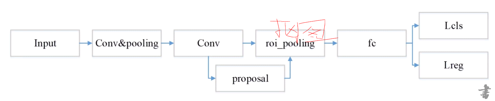

**感受野（Receptive Field）的定义是卷积神经网络每一层输出的特征图（feature map）上的像素点在输入图片上映射的区域大小。再通俗点的解释是，特征图上的一个点对应输入图上的区域**

# 目标检测

## 定义

 目标检测是在图片中对**可变数量**的目标进行查找和分类
 
 ## 难点
 
* 目标种类与数量问题

* 目标尺度问题

* 存在环境干扰问题

## 目标检测方法的变迁

### 传统的目标检测方法

原理：基于传统的手工特征和滑动窗口的方式来进行目标检测和定位

* Viola-Jones算法,采用积分图特征，结合Adboost分类器，用于人脸检测

	* Haar特征提取(纹理特征的一种)
	
		* 特征就是像素点的计算结果
		
		* base core all三种共14个候选框
		
		* 白区域的像素值之和-黑区域的像素值之和
		
	* 训练人脸分类器(Adboost算法)
	
		* 结构：多个级联的强分类器，一个强分类器对应多个级联的弱分类器，一个弱分类器对应多个弱特征结点
		
		* 强分类器的作用：判决(通过特征与阈值的比较来进行分类判决，其中若有多个强分类器，那个这些强分类器的阈值判决都必须符合判决条件才能进行正确分类) x1>t1 and x2>t2 and x3>t3
		
		* 弱分类器的作用：计算强分类器中的特征 x2 = sum(y1,y2,y3) y1，y2,y3为弱分类器的特征
		
		* opencv中一个弱分类器由3个haar特征组成，一个haar特征对应一个弱特征结点
		
		* 弱特征结点的计算 
		
			 1.node1  haar1 > nodeT1  z1 = a1
			 2.node1  haar1 < nodeT1  z1 = a2
			 
		* 弱分类器的特征：
		
			 1.Z = sum(z1+z2+z3)>T y1 = AA
			 2.Z = sum(z1+z2+z3)<T y1 = BB
			 
		* adboost的训练过程
		
			* 初始化权值分布(需要通过某种计算公式进行计算，初始化时的权值应相同)eg:苹果（ 0.1）  苹果（ 0.1）  苹果（ 0.1）  香蕉（ 0.1）
			
			* 遍历阈值  得到误差概率p  其中minP = t
			
			* 权重系数的计算
			
			* 更新训练数据的权重分布(0.2  0.2  0.2  0.8)
			
			* 训练终止条件: for count  ;  p(概率的阈值)
			
	* 滑动窗口(候选框)
	
* HOG+SVM用于行人检测

	* SVM
	
		* 本质：寻求一个最优的超平面进行分类
		
		* 核：line
		
	* HOG 主要用于灰度图像
	
		* 特征的计算：
		
			* 模块划分 image>win>block>cell
			
				* image
				* win窗口 特征计算最顶层的单元(obj) -->step  win size = 64 * 128
				* block块  -->step(如何在win中滑动)  win窗口的大小是block大小的整数倍 block size = 16* 16
				* cell(不可滑动)  -->bin  size = 8 * 8
				
			* 根据HOG特征模板计算梯度和方向  模板
			
				* 梯度计算的是每个像素的梯度，包含大小和方向，而方向一般是0-360，如果按照N度进行划分，那么360/N即为bin
				* HOG特征的维度：可以描述一个obj的所有信息，所以`维度=（win中block的个数）* 一个block中cell的个数 * 一个cell中bin的个数`维度比较大，所以在计算的过程中，会使用PCA降维
				* HOG特征是一个win中所有像素的梯度共同构成
				* 像素梯度的计算，也是有模板的，其中水平方向：[1 0 -1]，竖直方向：[[1]  [0]  [-1]]
					* 水平方向 a = p1 * 1 + p2 * 0 + p3 * (-1) 左右像素之差
					* 竖直方向 b = p1 * 1 + p2 * 0 + p3 * (-1)  上下像素之差
					* 角度 = arctan(a/b)
					
			* bin投影 -- 一般cell中需要包含完整的信息，所以一个cell中必须包含360/N个bin
			
				* 上面提到的bin的概念中，每个bin的角度是N，但是在分布的过程中，这N个角度可能并不是连续的，位于bin中心的角度可以完全投影到该bin上，但是如果角度不在bin的中心，则它可能会投影到相邻的两个bin中去。
				
			* 计算每个模块的特征
			
				* cell的复用
				* 判决：会用到SVM分类器，分类器经过训练之后产生一个与HOG特征维数相同的向量，然后这个向量跟HOG特征维度相乘会的得到一个值，用这个值与判决门限进行比较，若值大于判决门限,即可 确定目标
				
* DPM，基于HOG特征的一种变种
	* 特征提取（有符号梯度与无符号的梯度在一起统计，维度会比较大，在这里会采用一种逼近PCA的方式对它的维度进行融合--相加的方式）：
		* 有符号梯度：在统计直方图的过程中，统计了0-360度，完整的一圈的维度
		* 无符号梯度：在统计直方图的过程中，没有完整的记录一圈，可能只统计了0-180度这样的一个范围
 *  NMS(非极大值抑制算法)
	 *  目的：为了消除多余的框，找到最佳的物体检测的位置
	 *  思想：选取那些领域里分数最高的窗口，同时抑制那些分数低的窗口
	 *  改进：Soft-NMS
		 *  相邻区域内的检测框的分数进行调整而非彻底抑制，从而提高了高检索率情况下的准确率
		 *  在低检索率时，仍能对物体检测性能有明显的提升

**问题：特征难以设计，同时设计的特征会存在各种各样的问题，比如对一些特定的环境可能会不适应，或者设计的特征往往会不鲁棒，效率也会存在一定的瓶颈，使用滑动窗口对目标进行定位，并判定的过程会比较耗时**

### 基于深度学习的检测算法时期

#### Two-stage

常见的算法：

* RCNN
* Fast RCNN
* Faster RCNN
* Faster RCNN变种

核心组件

* CNN
	* CNN网络设计原则：
	
		* 从简到繁再到简
		
		* 多尺度特征融合网络
		
		* 更轻量级的CNN网络
		
* RPN
	* 区域推荐（Anchor机制）
	
	* ROI Pooling提取候选目标and resize(是RPN网络的一个层)
	
		* 输入：特征图、rois以及ROI参数(如果图像下采样了8倍，那么将当前的尺度值设置为1/8)
		
		* 输出：固定尺寸的feature map
		
	* 分类和回归

改进的方向

	* 更好的网络特征
	
	* 更精准的RPN
	
	* 更完善的ROI分类
	
	* 样本后处理
	
	* 更大的mini-Batch 

#### One-stage

**使用CNN卷积特征**

**直接回归物体的类别概率和位置坐标值(无region proposal)**

**准确度低、速度相对two-stage快**

常见算法：
	* YoloV1/V2/V3
	* SSD/DSSD等
	* Retina-Net
	* 等等

核心组件：
	* CNN网络
	* 回归网络
		* 区域回归(置信度、位置、类别)
		* Anchor机制(SSD)

回归网络预测过程(Yolo)

One-stage VS Two-stage

#### SSD(Single Shot MultiBox Detector)算法介绍

* Wei Liu在ECCV2016提出

* 直接回归目标类别和位置

* 不同尺度的特征图上进行预测

* 端到端的训练

* 图像的分辨率比较低，也能保证检测的精度

>主干网络：VGGNet，也可以使用ResNet、MobileNets

>多尺度Feature Map预测
	1.不同层的feature map
	2.Prior box:类别概率和坐标(x,y,w,h),类似Two-stage中的anchor机制，这个Prior box也就是bounding box,分别取预测相应的类别及位置
	
>Default bounding boxes的类别分数、偏移量

>将VGG最后的两个FC改为卷积，并增加4个卷积层

**Prior Box Layer**
* feature map的size = m * n ，将feature map中的每个像素点看做一个cell,则会有m * n 个cell，这个cell可以理解为Two-stage网络中的Auchor。

* 每个cell上生成固定scale和aspect ratio(长宽比)的box

	* 假设每个cell对应k个default box,每个default box预测c个类别score和4个offset(与位置相关)
	
	* 那么这个Prior Box layer会有（c+4）* k * m * n个输出

**样本构造 #3F51B5**

* 正样本

	* 从GT box出发给找出最匹配的prior box 放入候选正样本集
	
	* 从prior box 集出发，寻找与GT box满足IOU>0.5的最大prior box放入候选正样本集
	
* 负样本

	* 难例挖掘
	
	* 正负样本比：1:3

**损失函数 #3F51B5**

 * 分类loss+回归loss
 
 * 分类loss:Softmax Loss
 
 * 回归loss:Smooth L1 Loss

基本思路：让每一个prior box回归到GT box，这个过程的调控我们需要损失层的帮助，它会计算真实值和预测值之间的误差，从而更好地进行反向传播。

SSD算法使用细节：

* 数据增强时，Crop采样大小需要注意一下

* 多任务网络的权重

* 正负样本的比例

* 难例挖掘方式默认只取64个最高predictions loss来从中寻找负样本

### SSD系列算法优化及扩展

#### DSSD

* 2017年的CVRR, WeiLiu

* SSD算法对小目标不够鲁棒的最主要的原因是浅层feature map的表征能力不够强。

	* 加入上下文信息
	
	* **更好的基础网络(ResNet)和Deconvolution层**，skip连接来给浅层feature map更好的表征能力

#### DSOD 

* 2017年的ICCV2017

* DSOD可以从0开始训练数据，==不需要预训练模型 #F44336==，而且效果可以和fine-tune的模型媲美

* SSD + DenseNet = DSOD

	* 可以从零开始训练得到一个号的目标检测网络吗？
	
	* 如果可以，设计这样的网络有没有什么原则可以遵守？

**DSOD设计原则**

>基于候选区域提取的方法无法从零开始训练，不收敛，只有proposal-free方法可以从零开始训练并收敛（ROI Pooling)

>DenseNet中更多的skip connections实现supervised signals传递

>增加dense blocks数量区别原先的固定数量

>Stem Block 优化（3个3×3卷积层和1个2×2最太池化层）

>6个尺度特征图进行目标检测，再融合（如何利用特征图）

#### FSSD设计原则（上采样）：

* 借鉴了FPN的思想，重构了一组pyramid feature map，使得算法的精度有了明显的提升，速度也没有太降

* 把网络中某些feature调整为同一szie再contact，得到一个像素层，以此层为base layer来生成pyramid feature map

* Feature Fusion Module

#### RSSD设计原则：

* rainbow concatenation方式（pooling加deconvolution)融合不同层的特征，在增加不同层之间feature map关系的同时也增加了不同层的feature map个数。

* 这种融合方式不仅解决了传统SSD算法存在的==重复框 #F44336==问题，同时一定程度上解决了small object的检测问题。

## 人脸业务场景综述

* 判断是否存在人脸，如果存在人脸则定位到人脸的位置

	* 标准的目标检测问题（针对人脸目标）
	
		* 姿态和表情的变化
		
		* 不同人的外观差异
		
		* 光照、遮挡的影响
		
		* 不同视角
		
		* 不同大小、位置

**人脸标注方法--矩形标注**

* 传统的方法都是用一个矩形框将画面中的人脸区域包含在内

* 这种标记方法很难给出一个恰好包含面部的矩形框

**人脸标注方法--椭圆标注**

*  人脸天然呈现为椭圆形，采用椭圆形来表征是一种较为准确的方法

*  可以对侧脸与转动后的面部进行描述

**判断算法性能好坏**

* 检测率、报错率

	* 每一个标记只允许有一个检测与之相对应
	
	* 重复检测(一个人脸与多个label相对应)会被视为错误检测

* ROC曲线、PR曲线
