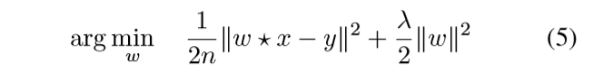
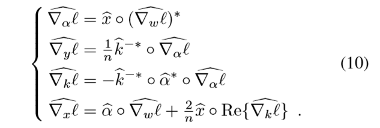

# CFNet

## 背景

相关滤波器是一种训练线性的模板，然后对图像中的目标进行跟踪的算法。它很适合做跟踪，因为它涵盖的计算方式在傅里叶域里面可以被很快的被解决。而且他能够针对每一帧中的检测进行重训练。

然后以前在使用相关滤波器的时候，收集到的特征要么是手工标注的，要么就是在其他的任务上迁移过来的。

作者首次通过想相关滤波器的学习者进行解释，还有一种封闭式的解决方案，比如深度神经网络中的可微层，能够克服这种局限性。这样就可以学习与相关滤波器紧密耦合的深层特征。实验也证明了我们的方法在保证模型轻量化的同时，可以在高帧率的条件下实现SOTA。

## 介绍

**存在的问题**

深度神经网络在计算机视觉应用中学习图像的表现以及内部特诊的非常有力的工具。然后，在线训练深度网络，为了去捕捉到以前从没见过的类别的目标是急剧挑战性的。但是这种情况在目标跟踪的领域是很常见的，目标跟踪领域的目标就是以视频序列的第一帧中bbox的内容作为GT，然后在后续的帧中对目标新的位置进行预测，并捕捉到目标。在这样的任务当中，**最主要的问题就是对要跟踪的任意目标缺乏先验知识**。

**解决思路**

* **SGD**

面对这样的问题，最简单的解决方式就是直接无视先验知识的缺乏，并且采用经过预训练的CNN网络来适应目标，比如SGD,这样一个任务量巨大的深度网络优化器。

训练数据有限、参数量巨大本身就使得这是一个困难的学习问题，此外，使用SGD在线进行适应性的调整的代价也是极其大的。

* **Siamese 结构，不需要在线学习**

解决这些缺点的一个可能的办法是没有网络的在线适应。最近的工作集中在学习可以用作通用对象描述符的深度嵌入.。这些方法用到了Siamese的卷积网络结构，它在离线阶段进行训练、在线进行测试，测试两个图像块中有没有包含相同的目标。它的思路就是通过相似性对目标进行检测，完美地绕开了在线学习的问题。然而，使用固定的度量标准来比较外观会阻止学习算法利用任何有助于辨别的视频特定线索。

* **CF，在线学习**

另一种解决办法就是使用在线学习的方法，比如相关滤波器。这个相关滤波器的算法是一种高效的算法，它通过极其有效地解决一个大的脊回归问题来学会从周围的图像块中区分出一个目标图像块。这种方法已经被证明是目标跟踪中很成功的一个算法了。它的效率使跟踪器能够在每一帧动态地调整对象的内部模型。它的速度归功于傅里叶域公式，它允许脊回归问题的解决只需要快速傅里叶变换(FFT)的少数应用和简单的元素计算就可以完成。

这样的一种解决方案的设计，要比SGD更加有效。与深度学习方法相反，该鉴别器仍然可以针对特定的视频进行定制。

* **CF + CNN**

现在面临的一个挑战就是，如何将CF在线学习的有效性与CNN在离线阶段训练的有区别力的特征结合起来，有已经实现的方案，证实了他们二者之间效力的互补性。

在将CNN与CF结合起来的方案中，CF被简单地应用到了CNN特征的顶部，并没有进行深入的融合。在深度网络中，端到端的训练往往要比一个不分一个部分的训练要好得多，因为在端到端的训练过程中，不同模块的自由参数可以相互配合，以至于达到更加理想的性能，所以，很自然地，就会有人想问，CNN和CF加在一起之后能不能进行端到端的训练？

要与CNN一起进行端到端的训练，关键的一点就是将CF看做可微的CNN层，这样就能将误差从CF传递到CNN中，但是难度在于，CF本身也是一个学习问题的解决思路。因此，这需要微分一个大型线性方程组的解。

本文提供了一个在封闭条件下CF的倒数计算，除此之外，我们证明了我们的方法在训练CNN架构端到端上的实用性。

经过我们进一步的调查发现，将CF合并进入到全卷积的Siamese网络中时，CF并没有在很深的网络中改善跟踪的结果。然而，我们的方法使拥有几千个参数的超轻量级网络能够在高帧率运行的同时，在多个benchmark中实现SOTA。

## Method

### Siamese FC

使用siamese结构，它有两个分支，分别对应模板分支和检测分支，他们经过完全相同的CNN特征 提取的过程，分别得到对应各自的feature map，然后在两个feature map上进行互相关操作，最终确定目标在搜索图片中的位置。

这样的siamese结构是在离线阶段训练好的。

### 跟踪算法

网络本身只提供了一种方法来计算两个图像块的相似性。为了把这个网络用于目标跟踪，需要将描述跟踪器逻辑的程序与网络结合起来，我们采用一种简单的跟踪算法来评估相似函数的效用。

在SiameseFC当中，虽然搜索区域每次取的时候是以上一帧中估计的目标位置为中心去取，且搜索区域大致是模板的4倍，但是在判断相似性的时候，每次搜索区域都要跟初始的模板进行比较。

在我们今天的文章中，我们在每一帧都会计算一个新的模板，然后将新的模板与之前的模板使用一种moving average的方式进行结合。

### CF Net

**结构**
 
在原来siameseFC的结构上，在模板图像x和互相关操作之间增加了一个CF block,如下图所示：

这样的话，我们进行相似性判别的方法也需要做相应的改变，下面就是我们针对新结构构建的一个新的计算方法：

CF block当中，w = ω(x)计算的是一个标准的CF模板，x来源于siamese结构的模板分支，ω()主要的作用就是在傅里叶域内解决了一个岭回归的问题而得到的。这个模块的作用可以理解为是精心设计了一个对于平移更加鲁棒的判别模板。需要引入标量参数s和b (scale和bias)，使评分范围适合logistic回归。

* 在训练图片上给CF提供大范围的上下文信息是重要的。

* 为了减小圆形边界的影响，特征图x要预先乘一个余弦窗口，最后模板要被扣下来。

最后发现在上图的前向传播过程中，正好对应了以前的标准的使用CNN特征的CF跟踪器的操作，但是之前的这些方法都没有进行端到端的训练。

**本文的新颖之处**在于计算CF模板对其输入的导数，这样就可以对包含CF的网络进行端到端的训练。

## CF

接下来，我们将展示 如何通过相关滤波器有效地解决以闭合的形式通过傅里叶域反向传播梯度。

**Formulation**

对于给定标量值的图像x，相关滤波器得到的模板为w, w与经过环形位移的x之间的内积要尽可能的接近他们的响应y，即求下式的最小值：

U是图片domain，然后u是U中的一个，y[u]是u对应的标签  且δτ[t] = δ[t − τ].， 我们用 * 表示卷积操作，☆代表互相关操作。在其基础上为了防止过拟合现象的发生，我们加入正则化项。如下所示：

其中n表示样例图片中起效果的图片的数目。

在优化w的时候，我们采用拉格朗日对偶的形式，经过计算得到下面的方程组：

k可以解释为定义循环线性核矩阵的信号，α是由约束优化问题的拉格朗日乘子组成的信号。上面的(5) 和(6)是等价的。

在傅里叶域中，(6)可以被这样计算：

元素乘的逆是元素乘的标量逆，在(7)中的计算往往是更有效的，因为在傅里叶域中，只需要进行简单的元素相乘就可以实现时域中的卷积的操作

**Back-propagation**

我们通过构建了在CF中的计算图，来完成反向传播过程中梯度的计算。具体的计算的话就是针对矩阵，求矩阵对应的微积分，他里面用到了一个内积的性质：

 
 
 下面的方程组，对应于方程(6)的微积分：
 
 
 
 经过了一系列看不懂的计算过程，最终得到了反向传播中需要用到的微分倒数：
 
 
 
 有了反向传播之后，我们的整个网络就可以通过优化loss的方式进行参数的学习了，**但是实验证明，学习到的参数，要比在CF中给定参数值的泛化能力要差。**
 
 ## 实验
 
 ## 实验标准
 
 我们在VOT和OTB上给我们得网络分配了测试集和验证集，其中，验证集中的部分视频序列也可能出现在测试集当中。
 
 在OTB数据集当中，我们通过所有的帧中的IOU来衡量跟踪器的性能。
 
 在OTB评估的时候，一旦目标丢失，后面的帧的IOU都会置0，但是我们在每个视频序列中等距离取了三个点，且会从每个点开始跟踪，直至最后，这样的设置会更合理。
 
 尽管我们有大量的视频，但是在训练过程中，Siamese结构还是会有很大的变化。为了缓和这种大幅度的变动，我们分别进行了55，60，···，95,100等不同epoch的训练，用这样的方式来减少方差	
 
 ## Comparison to Siamese baseline
 
 **不同网络深度下，两种网络性能的对比**
 
 
 
 结果表明，使用浅层网络计算特征时，CFNet的性能明显优于Siamese baseline。在深度超过两层之后，CF的性能就基本上趋于饱和了。
 
 
 
 上图就表明，更新模板对于两种结构都是有用的。

### Feature transfer experiment

这项工作的动机是假设在训练期间合并CF会产生更适合用CF跟踪的特性。现在，我们将端到端训练好的CFNet与使用来自替代来源的特性的变体(Baseline+CF和ImageNet+CF)进行比较。如下图所示;

对比CFNet和baseline+CF的曲线，我们可以发现，在网络深度只有1和2的时候，CFNet的效果还是很明显的，也即CF参与离线训练确实提高了性能，但是当继续增加网络深度的时候baseline+CF的性能逐渐追上甚至超越了CFNet的性能。而将在ImageNet上用于分类的特征与CF相结合的效果特别差，其实这也是不足为奇的，毕竟这种特征对于位置而言是不敏感的。

 ### Speed and practical benefits
 
 在这里，我们用不同层(不同网络深度)的CFNet和Siamese-baseline进行对比，如下图所示：
 
 
 
 这个图表明，对于需要高帧率操作的精确跟踪算法的从业者来说，双层CFNet可能是最有趣的变体。即使是单层CFNet仍然具有竞争力，它的参数少于五层基线的1%，并且需要小于100kB的存储空间。
 
 
 ## Conclusion
 
本文提出了相关滤波网络，一个不对称的架构，通过在线学习算法反向传播梯度来优化底层特征表示。通过建立一个有效的循环方程组的解的反向传播映射，这是可行的。我们的实际研究表明，对于一个足够深的siamese网络，添加一个相关滤波层并不能显著提高跟踪精度。然而，在训练过程中，在浅的Siamese网络中加入CF确实能达到与与较慢、较深的网络相匹敌。