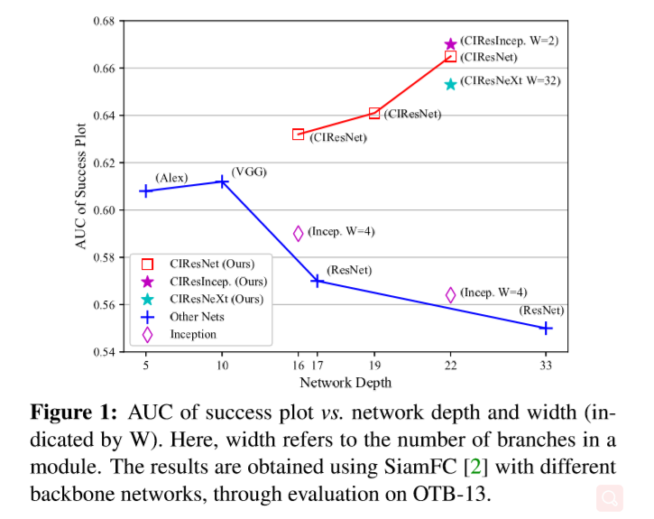
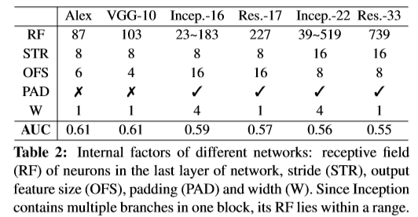
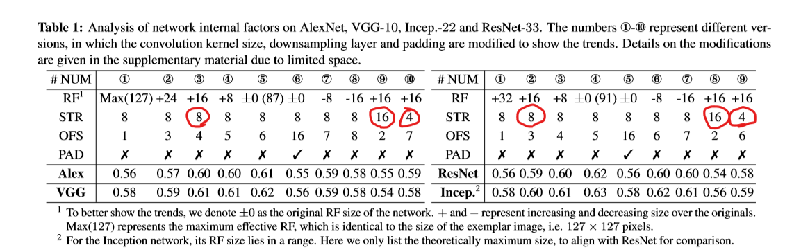
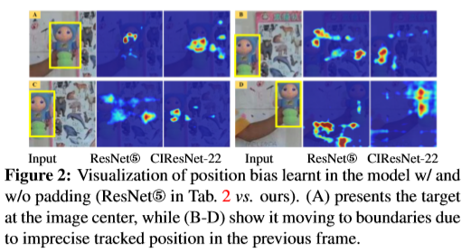
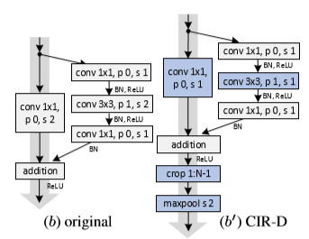
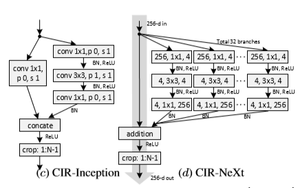
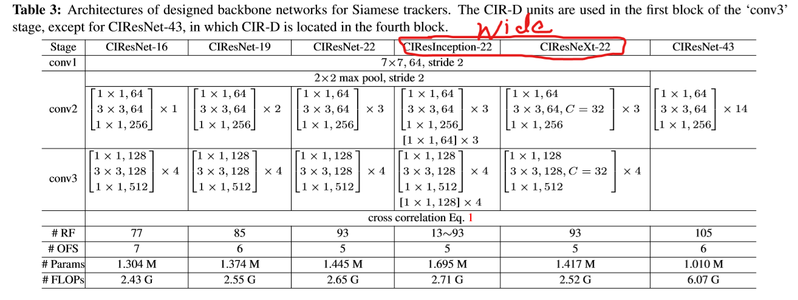

#  Deeper and Wider Siamese Networks for Real-Time Visual Tracking 

## 背景

常规的Siamese结构的网络，都是只采用AlexNet作为backbone，这种网络结构相对于那些优秀的深度网络比如VGG、ResNet、Inception等而言，就是浅层网络，它没有充分利用深度神经网络的优势。

然后本文的作者，就去研究，如何能将更深、更宽的网络应用到Siamese当中，从而提高trackors的鲁棒性和精度。有了这样的一个想法之后，作者也就很快开始动手实施了起来，他们直接将ResNet、VGG、Inception的更深、更宽的网络应用到Siamese结构当中。但是这并没有真的带来性能上的改善、与之相反的是，这样的改动在很大程度上降低了trackors的性能。

然后作者对这样的结果的产生原因进行了分析，然后发现：

* 感受野的大幅度增加导致特征识别能力和定位精度降低

* 卷积的网络中的padding使得卷积过程中增加了位置的偏差

为了解决这些问题，作者又进一步提出了：

* 新的残差模块用来消除padding的负面影响

* 设计了新的结构， 这个结构使用上面构建的新残差模块来控制感受野大小以及网络步长

**优点**： 轻量化的，而且当将这些模块应用于SiamFC和SiamRPN的时候，能够保证实时的跟踪速度。

## 概述

将Siamese结构当中的backbone直接换成现在比较流行的深度网络之后，性能反而是下降的，如下图所示：

作者分析，这其中的原因：这些更深以及更宽的网络，它们一开始都是为分类任务而设计的，所以可能对位置信息不太敏感。然后为了分析清楚具体的原因，他们认真地观察了Siamese的结构，然后发现，问题可能出现在下面三个地方：

* 感受野的大小: 感受野决定了用于计算特征的图像区域。较大的接受野提供较大的图像背景，而较小的接受野可能无法捕捉目标物体的结构

* 网络的步长: 网络步长对定位精度的影响很大，特别是对于小尺寸物体。同时，它还会影响输出特征图的大小，而特征图的大小往往会影响特征识别能力和检测精度。

* 特征的padding：这个padding使得在训练的卷积过程中，无形增加了一定的位置的偏移，它可能导致某些目标移动到了搜索区域的边界，从而难以做出精确的预测。

然后，在本文中，我们通过设计新的残差模块和架构来解决这些问题，这些模块和架构允许更深更广的backbone在Siamese跟踪器中能够完全释放他们的力量。

* 我们提出了一组基于原生ResNet结构中的bottleneck 的CIR模块，这个CIR模块可以在特征图中裁剪掉受padding影响的特征。因此阻止了卷积核对于位置偏移的学习。

* 我们通过堆叠上面的CIR模块，设计了更深、更宽的网络结构，在这些新的网络中，网络的步长和感受野，都能够增强定位的精度。

* 我们将上面的这种新的backbone结构应用于SiamFC和SiamRPN中，均取得了性能的提升。

## 性能退化原因分析

在上面，我们说到，直接将AlexNet替换为更深的backbone的时候，性能是在急剧降低的，接下来，我们会结合一些实验结果，来进一步分析其性能退化的原因。

**定量分析**：

首先，我们来看看这些网络结构的不同，如下表所示：

可以发现，他们除了深度和宽度的区别之外，还有包括RF(感受野)、STR(步长)、OFS(输出特征大小)、PAD(padding)等。然后我们通过设置实验，一步步探究这些网络结构中真正导致性能退化的原因。实验的一些结果，如下图所示：

* STR：在AlexNet和VGG中，我们观察⑩③⑨，发现STR从4->8的时候，性能是略微有提升的，而从8->16的时候，性能则大幅度下降；在Inception和ResNet中，观察⑨②⑧可以发现有相同的表现。这就表明在Siamese结构中，网络更喜欢mid-level的特征

* RF： 对于RF而言的优化往往局限在一个很小的范围之内，比如于AlexNet而言，它的感受野最好要保持在-8到+16之间，Incep需要保持在-16到+8之间。我们可以发现，这些最优的感受野的大小一般是模板图像的 **60%-80%** 之间，而且这个比例在我们研究的多个网络中时 **鲁棒的**， 而且这个比例对于网络的结构而言是 **不敏感的**。

	* RF的大小对于在Siamese结构中提取特征来说是极其重要的。因为RF表示的是，用于计算特征的图像区域。
	
	* 较大的感受野可以覆盖图像中大量的上下文信息，这将导致在提取到的feature map中，包含目标的区域会是不敏感的。

	* 较小的感受野则有可能捕获不到目标完整的结构信息

	 * 感受野理想的大小跟输入模板的大小是有关系的

* OFS：据观察，太小的OFS(OFS ≤ 3)不会提高跟踪的精度，因为太小的feature map缺乏了对于目标足够的空间结构描述，座椅在相似性 计算的时候是不鲁棒的。

* PAD:观察上表中的对于Alex与VGG中的⑤⑥、Incep与ResNet中的④⑤，然后我们发现PAD对于最终的精度有比较大的负面影响

**定性分析**

在网络中包含PAD之后呢，模板的特征提取与搜索区域的提取是不一样的，模板在提取的时候，它的周围都有0填充，而在搜索区域上计算卷积的时候，有一部分靠近边缘的结果中，是包含0填充的，但是在搜索区域内部的卷积，提取到的就是正常的特征。正是因为这样，在相似性计算的时候，就会有精度上的损失。

上图展示了一个可视化的模板与搜索区域不一致的的测试结果，它展示了。当 目标接近了图像的边缘的时候，峰值图像上就不能够精确地表示目标的位置，这是由于跟踪器的漂移导致的。

## Guidelines

根据前面的分析，我们整理了下面的Guideline来缓和网络结构中结构因子所带来的负面影响：

* Siamese跟踪器，它更需要的是一个相对较小的**步长**，这个步长会影响感受野中两个相邻的输出特征的重叠面积，因此，他会影响定位精度的偏移程度。所以当网络层数增加的时候，步长不应该相应去增加。对于精度和效率而言，我们给出一个步长的经验值，4或者8

* 输出特征的感受野的设置应该要根据感受野与模板图像的比例来确定。最好的比例范围是60%-80%之间，适当的比例允许网络提取一组特征，每个特征捕获目标对象不同空间部分的信息。这也使得这些提取到的特征在进行相似性计算的时候，有更好的鲁棒性。**感受野的大小一定不能比模板图像更大，否则会导致急剧的性能损失**

* 步长、感受野以及特征输出的大小，应该被当做一个整体来进行考虑。这三个因素不是相互独立的。如果有一个改变了，那么另外两个也会相应地进行改变。

* 对于全卷积的Siamese结构的网络，处理两个网络流之间的感知不一致问题是至关重要的。这里我提供两个合理的解决方案：

	* 移除padding

	* 增大模板图片以及搜索区域的大小，然后将受padding影响的特征给crop。

## Deeper and Wider Siamese Networks

我们设计了新的模块，CIR单元，用它来消除潜在的位置的偏移，然后，我们通过堆叠这些CIR单元，构建了更深、更宽的backbone。根据上面给出的guidelines，网络的步长跟感受野能够被很好地控制。

### Cropping-Inside Residual(CIR)Units

残差模块由于易于优化，而且有着强大的表现力，所以它往往就是我们新构建的网络结构的一个关键模块，它包含了3个卷积层、分别是1 x 1 , 3 x 3 , 1 x 1。其中1 x 1 的模块主要是用于改变通道数的。3 x 3的卷积层中加了size=1的zero-padding，使得最终有一个与short-cut分支相兼容的输出。CIR的结构如下图中(a)所示：

**CIR Unit**

因为padding会带来最终预测时的位置偏差，所以我们一定要想办法去掉受padding影响的特征，我们最后的决定就是在残差模块的两个分支进行叠加之后进行裁剪操作，如上图中(a')所示。其实在真正的裁剪过程中，减掉的只有feature map中边上的那一圈。

**Downsampling CIR(CIR-D) Unit **

这个包含下采样的残差单元是进行后期网络搭建的另一个关键的模块，他主要是为了减少feature map的空间尺寸的，，与此同时feature map的通道数会增加一倍。

下图中的(b)表示的是普通的下采样模块、而(b')则表示的是我们在普通下采样的基础上进行了修改，减去了受padding影响的那一部分。将bottleneck中的stride和short-cut部分的stride全部由2改为1，然后在两个分支相加之后，进行Crop操作，crop之后，又加了一层max pooling，对feature map 进行空间下采样。这一个空间下采样的操作主要是为了使得输入图像的边缘的上下文信息进行了一个保留，防止被后续的下采样给移除掉。

****

**CIR-Inception and CIR-NeXt Units**

为了使得CIR单元能够应用于多分支的结构，从而构建一个宽的网络，类似于Inveption和ResNeXt，我们使用了特征转换的方式，实现了CIR-Inception 和 CIR-NeXt，分别如下图(c)、(d)所示。在CIR-Inception结构中，我们插入了一个1 x 1 的卷积层在shortcut连接中，并通过**合并通道**的方式来将特征结合起来。在CIR-ResNeXt当中，我们将bottleneck层分为32个转换的分支，最终用加的方式将他们合并。在这两种结构中的下采样操作，都类似于(b')。

### 网络结构

通过堆叠CIR单元，我们构建了更深、更宽的网络。在整个设计的过程中，结构完全按照上面的guidelines来完成。首先，我们确定了网络的步长，stride=8，可以用于构建一个3阶段的网络，stride=4，一般用于构建2阶段的网络。我们控制这个CIR模块的数量以及在每个stage中下采样的位置。这样做的目标主要是为了确保最后一层感受野的大小是在一个固定的范围之内(60%-80%的模板图片大小)，最后，当网络深度增加的时候，感受野可能会慢慢超越这个范围，所以我们将stride减半为4，来控制感受野。

我们使用CIR和CIR-D单元来组建这个更深的网络，这个结构跟ResNet是比较相似的。不同的地方就在于步长、感受野以及构建块。

我们主要通过CIR和CIR-D来构建了深的网络，比如CIResNet-16、 CIResNet-22 、 CIResNet-43；通过CIR-Inception and CIR-NeXt 构建了更宽的网络。比如：CIResInception-22和CIResNeXt-22。网络结构如下图所示：

## 结论

作者主要的出发点就在于，以往的基于Siamese的跟踪器，他们的backbone都是用的浅的，比较老的AlexNet，然后作者就想，能不能使用现在比较主流的深度网络对siamese结构中的backbone进行一个替换，加强跟踪的鲁棒性，然后在实验的过程中，通过仔细的分析发现，导致无法用先进的backbone替换AlexNet的根本原因在感受野、步长以及padding上，所以，作者提出了CIR模块来对构建新的网络，最终新构建的backbone强有力地提升了SiamFC和SiamRPN的性能。达到了SOTA.