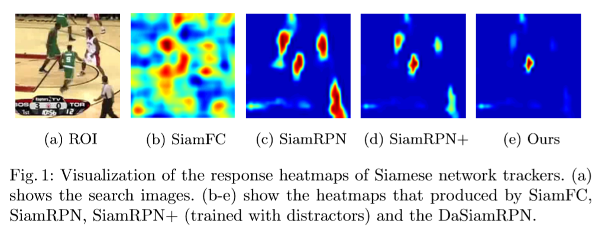
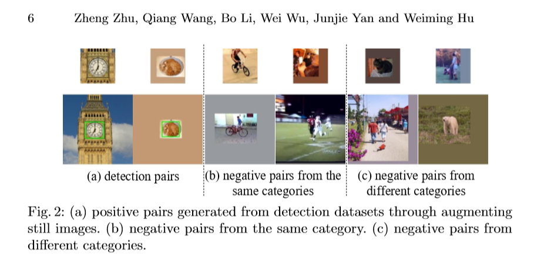
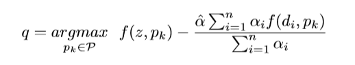
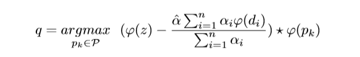
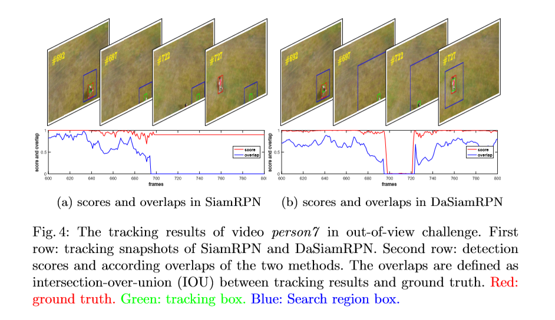

# Distractor-aware Siamese Networks

## 背景

Siamese网络由于可以很好地平衡精度和时间。然而在大多数Siamese跟踪方法中使用的特征只能区分前景和非语义背景，而包含语义的背景总会被当做是一个障碍，它在很大程度上降低了Siamese结构的鲁棒性。

**本文中，我们专注于为精确而且长时跟踪的任务，学习一个能够感知障碍的Siamese网络。**

我们从传统的Siamese网络出发，一步步进行分析。

* 我们观察到，训练数据的不平衡分布使得学习到特征的区分性较差

我们的改进：

* 在离线训练阶段，引入了一种**有效的采样策略**来控制这种分布，使模型关注语义干扰。

* 在推理过程中，设计了一种**新的干扰感知模块**进行增量学习，可以有效地将一般的嵌入转换到当前的视频域。

* 此外，我们通过引入一种简单而有效的**局部到全局的搜索区域策略**来扩展所提出的长期跟踪方法。

## 引入

近年来，采用相似度比较策略的Siamese网络因其良好的性能受到了视觉跟踪界的广泛关注。

其中：

* SiamFC、RASNet等，学习一个先验的深度Siamese相似函数，并在运行时以固定的方式使用它。

* CFNet、DSiam等，分别通过运行平均模板和快速转换学习模块在线更新跟踪模型。

* SiamRPN，在Siamese网络之后引入一个RPN网络，，因此可以把这个跟踪视为一个one-shot的局部检测任务。

这些Siamese结构的网络基本上都对精度和速度进行了一个平衡，但是他们仍然存在着三个问题，有待于去解决：

* 在大多数Siamese跟踪方法中使用的特征只能区分前景和非语义背景。而且当背景杂乱时，性能不能得到保证。

* 大多数Siamese跟踪器不能更新模型，虽然它们的简单性和固定模型的性质导致了高速，但这些方法失去了在线更新外观模型的能力，而在线更新对于在跟踪场景中急剧变化的外观通常是至关重要的。

* 最近的Siamese跟踪器采用了一种局部搜索策略，不能处理完全遮挡和视野外的挑战。

在这篇论文中，我们探索学习感知障碍的SiameseRPN来进行精确和长期的跟踪。SiamFC采用加权损失函数来消除正例和负例的类不平衡。但是，由于训练过程中仍然充斥着容易分类的背景例子，因此效率低下。本文认为，训练数据中非语义背景和语义干扰的不平衡是表征学习的主要障碍。

高质量的训练数据对于端到端学习的跟踪器的成功而言是至关重要的，我们也经过总结得出，网络表征的质量很大程度地依赖于训练数据的分布。

除了从现有的大规模检测数据集中引入**正对**外，我们还在训练过程中明确生成了不同的语义**负对**。同时，为了更进一步地增大网络的区分能力，我们还在这些数据上进行了数据增强。

离线训练之后，网络的表现可以很好地泛化到大部分的目标，这也 使得网络有能力去跟踪任意的目标。

Siamese结构的缺陷：

* 在推理阶段：经典的Siamese跟踪器只使用最近邻居搜索来匹配正向模板，当目标出现显著的外观变化和背景混乱时，可能会表现不佳。尤其是相似目标的出现，会给跟踪任务带来更大的困难。

**为了解决这一问题，周围的上下文和时间信息可以提供关于目标的额外线索，并有助于最大限度地提高识别能力。
在本文中，一个新奇的障碍感知模块被设计，他可以有效地将这个通用的跟踪器嵌入到当前的视频域当中，并在推断期间逐步捕获目标外观的变化。**

* 除了上边谈到的问题之外，大部分最近的跟踪器是专注于进行短期的场景。在这种场景中，目标通常都是一直存在的。这些作品只集中在几十秒的短序列上，不能很好地代表从业者的需求。

* 长期的跟踪问题中，超出视野以及全遮挡的问题也是十分严重的。

卷积的Siamese跟踪器往往缺乏辨识度很高的特征，而且他们往往适应于局部搜索的小范围。他们往往解决不了上面的这种长期跟踪中存在的问题。

DaSiamRPN的优势：

* 为了进行long-time的跟踪，我们使用了一个简单而有效的**local-to-global**的搜索区域的策略，这么做有效地改善了我们的跟踪器在超出视野以及全遮挡挑战下的性能。

## 我们的贡献

* **详细地分析了来自卷积Siamese跟踪器的特征，然后发现了在训练数据集中，非语义背景和语义干扰的不平衡是学习的主要障碍**

* **我们提出了一种新奇的感知障碍的SiameseRPN，使得他能够在离线训练的时候学习感知障碍的特征，明确地抑制在线跟踪推理过程中的干扰因素**

* **我们在DaSiamRPN的基础上引入 local-to-global的区域搜索策略，有效地改善了我们的跟踪器在超出视野以及全遮挡的挑战下的性能**

我们的方法，在short-time和long-time上的性能都达到SOTA，而且能够达到实时的性能。

## Distractor-aware Siamese Networks

### 传统的Siamese结构当中存在的缺点

在SiamFC和SiamRPN当中，训练数据中的pairs来源于相同视频的不同帧，而且对于搜索图像来说，没有语义信息的背景占据了大部分图像的内容，而包含语义的实体或者干扰占据的空间就比较少。这种不平衡的数据分布，使得最终的模型很难学习到实例水平的表现，而是偏向于学到的是前景与背景之间的区别。

在推理过程中，使用最近邻搜索搜索区域中最相似的对象，省略第一帧标注的背景信息。可以有效利用跟踪序列中的背景信息提高识别能力，如图下图中的e所示所示。

为了消除这些问题，我们提出在离线训练过程中主动生成更多的语义对，并明确抑制在线跟踪中的干扰因素。

### Distractor-aware Training

高质量的训练数据是视觉跟踪中端到端表示学习成功的关键。我们引入了一系列的策略来提高学习特征的泛化和消除训练数据的不平衡分布。

**Diverse categories of positive pairs can promote the generalization ability**

之前的训练数据：

* SiamFC是在ILSVRC检测数据集上进行训练的。

* SiamRPN不仅仅使用了ILSVRC，还使用了Youtube-BB稀疏标注的数据集。

它们存在的问题：

* 这些数据集中包含的类别数比较少，这就导致想要训练一个高质量的以及泛化能力强的特征是不足够的。

* 除此之外，SiamRPN中的bbox分支在遇到新的类别的时候，它总是会得到比较差的预测。

我们的在DaSiamRPN中采用的数据集：

* ILSVRC

* Youtube-BB

* ImageNet + COCO 的检测数据集 ，通过数据增强的技术，可以使用检测数据集中的数据生成图像pairs 为我们的网络训练所用

正pairs是有能力改善跟踪器的区别力，以及回归精度的。

**Semantic negative pairs can improve the discriminative ability**

我们认为在SiamFC和SiamRPN二者的训练数据中存在两种程度的不平衡。

* 稀少的存在语义的负pairs：背景占据的面积比较大，或者就全部是背景，这样下来，网络学会的更多地是区分前景和背景的能力。但是语义对象之间的损失被大量的简单否定抵消了。

* 同类之间的干扰，在跟踪过程中，那些通常表现为难样本。

我们本文的做法：

语义级别的负pairs被加入到了训练过程中，构造的负pairs由同一类别和不同类别的标记目标组成。如下图中的(b)和(c)

* 来自不同类别的pairs可以在目标离开视野甚至全遮挡的时候，避免漂移现象的产生。

* 来自同一类别的pairs可以让跟踪器捕捉细粒度的特征

**Customizing effective data augmentation for visual tracking**

为了真正释放Siamese网络的全部潜力，我们自定义了多个数据增强的策略。

除了基本的平移、尺度变化、亮度的改变外，我们观察到浅层可以很容易地模拟运动模式，所以我们在图像增强的策略中引入 了运动模糊。

### Distractor-aware Incremental Learning

在最后的章节中的训练策略，能够在离线训练的过程中很明显地改善网络的区别能力。但是区别这种两个包含相似属性的目标还是很难的。

SiamFC和SiamRPN用了一个consine窗口的方式来抑制这种干扰。但是使用这种方式遇到物体的运动比较混乱时，性能是没法保证的。

许多基于Siamese结构的方法在遇到快速运动的物体时通常都会表现出差的性能

我们提出了一个**干扰感知模块**，以有效地转移一般表示到视频领域。

* 它还是Siamese结构的，所以还是有两个分支：模板分支和检测分支。然后在特征图上进行互相关操作，最终确定目标的位置。

* 为了充分利用标签信息，我们将目标上下文中的难例(干扰物)整合到相似度度量中。

* NMS被用于在每一帧中选择潜在的干扰物。然后我们确定了一个干扰的集合。

我们最终在每一帧中得到了17 * 17 * 5 个proposals，然后我们通过NMS去减少候选的目标，然后，得分最高的proposal被当做是跟踪对象，剩下的超过阈值的proposals被当做是干扰。

我们引入了一个新的干扰感知目标函数来对与样本有top-k相似性的proposals P 进行重新排序。最终选中的对象记为q(最大的干扰，感觉是):

这个权重ˆα控制干扰物学习的影响学习,αi是用来控制每个干扰物di的影响的权重。值得注意的是，通过直接计算，计算复杂度和内存使用量增加了n倍。

然后我们采用互相关操作来进行代换，从而得到下面的式子：

这样使得跟踪器在运行的时候，有着跟SiamRPN类似的速度。

这个感知干扰的跟踪器可以适用于将那些已经存在的相似性度量，转换到对一个新的领域的相似性度量。

所以这样的相似性度量(用模板当做正样例，干扰当做负样例，训练出来的度量)是由于普通的那些相似性度量方法的。

### DaSiamRPN for Long-term Tracking

在这个章节中，DaSiamRPN框架被扩展到long-time跟踪当中。

除了在short-term跟踪当中面临的那些挑战之外，long-time跟踪过程中，我们还会面临比如超出视野、全遮挡这样的问题，如下图所示：

从图中我们可以看到，当物体消失、再现之后，SiamRPN就已经跟踪不到它了，而我们新的DaSiamRPN却依然可以继续跟踪到目标。

我们提出了一个简单却有效的方法，在short-term跟踪阶段与跟踪失败之间，那就是**local-to-global**的搜索策略，他可以在跟踪失败后重新检测目标。

为了识别跟踪失败的开始与结束。由于干扰感知训练和推断可以获得高质量的检测分数，因此它可以用来表示跟踪状态，如上图所示。

在跟踪失败之后，我们通过local-to global的策略来增加搜索区域。也就是说，搜索区域的大小通过迭代的方式，以一个常量值不断扩大。值得注意的是，我们的跟踪器使用bbox回归来检测目标，因此可以抛弃耗时的图像金字塔策略

## 实验

### 实验细节

* 具体的设置数据、进行增强，以及某些系数的设定，

* 在跟丢之后，local-to global的迭代次数为1就已经是足够的了

* 搜索区域的大小，在short-term正常情况下为1，跟丢之后变为767，也即满足上面的一次迭代

## 结论

在这个文章中，作者提出了一个感知干扰的Siamese结构，实现了精确的，以及long-term的跟踪。在离线训练阶段，感知干扰的特征学习机制被提出，这个机制可以有效地提升网络对于跟踪过程中，同类目标之间一个区别力。在推理阶段，这个感知干扰的策略，可以有效地将普通的相似性比较方法结合到当前视频中。此外，我们还将提出的方法通过引入local-to-global的策略扩展到了long-tern跟踪情景当中。我们的结构在short-term以及long-term的情景中综合而言达到了SOTA，而且其速度仍然可以超越实时的。