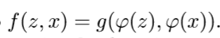
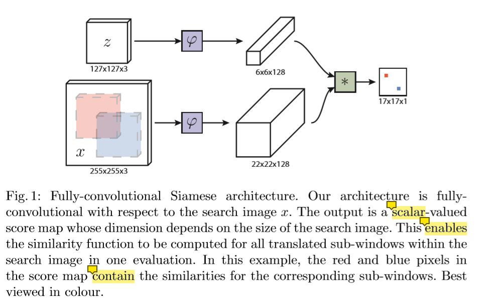
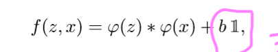
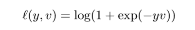
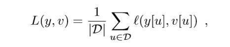
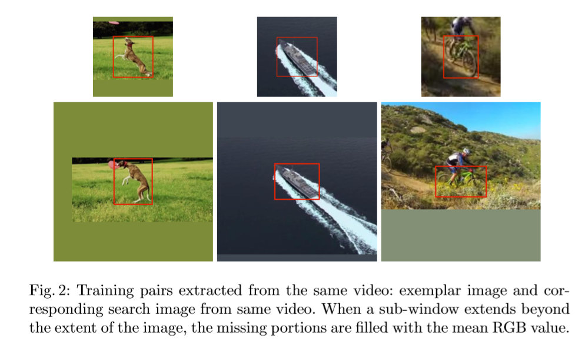
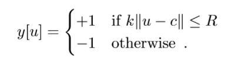
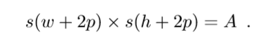

## [Fully-Convolutional Siamese Networks for Object Tracking](./attachments/Fully-Convolutional_Siamese_Networks_for_Object_Tracking.pdf)

### 研究背景

对于任意目标的追踪问题，一直在通过在线学习的方式(在线学习目标外表的模型)进行处理，这种方式将视频本身作为唯一的训练数据，这种方法的代表有KCF、TLD以及Struck。这种方式虽然取得了一定的成功，但是在线学习它在本质上限制了模型进行学习的能力(丰富度较差)。

近年来，人们曾多次尝试利用深度卷积网络的表达能力。然而，当我们要追踪的目标在开始之前是不知道的情况下，我们准备的数据不一定正好就标定了这种目标，而且只为单一的目标去设计专门的检测器也是极其不合理的，这种情况下，使用深度学习的方法就必须要在线执行SGD来适应网络的权重，而这种方式严重影响了系统的运行速度，此外，深度学习的方法一般需要大量的有标签的数据。有标签数据的缺乏以及实时操作的不可能性导致我们为每个视频中训练一个检测器的不可能性。

好多个近期的工作都在为解决深度学习方法中存在的问题而设计，他们都使用了一个与当前追踪任务不同的，或者与之相关的一些预训练的卷积网络。这些方法可以大致分为两种派别，一种是“shallow” methods比如相关滤波器，使用网络内部的表现作为特征，这种方式不能充分利用端到端网络的有点；另一种则是执行SGD去微调网络中的多个layers，这种方式虽然可以实现最好的结果，但是不可能达到实时性。

在本文中，我们提出了一个在ILSVRC15数据集上，采用端到端训练的全卷积Siamese网络，实现了一种基本的目标跟踪算法。在离线阶段，我们的算法主要去解决一个相似性学习的问题，得到一个相似性函数f，然后在线对学习到的函数f进行评估。

### 创新点

本文的主要贡献在于证明了该方法在远超过帧速率要求的速度下，在现代跟踪基准中获得了非常有竞争力的性能。而且我们训练了一个Siamese网络来在更大的搜索图像中定位范例图像。这个Siamese网络在搜索图像中也是全卷积的。

在目标追踪领域，相似性学习基本上可以被忽视，其原因主要是：

* 跟踪社区没有大量标记的数据集 --- ILSVRC15数据集的出现解决了这个问题

* 训练和测试使用同一领域的视频跟踪的深度模型的公平性是一个争议点  ---  我们在ILSVRC15上训练，在OTB/VOT进行测试

### 细节

#### 一、Siamese结构

我们解决追踪任意目标的问题，是通过相似性学习的方式来完成的。在相似性学习当中，我们主要学习的是一个相似性的判别函数f(z,x)	,它比较任一与模板图片大小相同的图片与模板图片之间的相似性。为了找到在新的图片中目标对应的位置，我们详细地测试了所有可能的位置，并返回相似得分最大的位置作为结果。一般模板图像是我们在追踪的视频当中目标第一次出现的位置。相似性函数f将从已经标记了目标运动轨迹的视频数据集中学习。

相似性学习，一般都是采用Siamese结构。Siamese网络对模板与输入图像采用完全相同的转换，然后借助函数g来实现具体的相似函数的功能，函数g可能通过简单的距离或者相似性度量。

#### 二、全卷积Siamese结构

全卷积网络的优点是，我们可以提供一个比模板图片大得多的搜索图像作为网络的输入，而不是一个大小相同的候选图像，它将在一次评估中计算稠密网格上所有已转移的子窗口的相似度。网络最终的输出是一个得分图(这个得分图具有空间位置的信息)，得分图上的每一个点对应于大搜索图片中的某一个sub-window，如下图所示：

我们的得分图最终是包含了位置信息的，其主要的原因在于相似性函数，如下：

后边的b,包含了当前输入的x的位置的一些信息。

在整个追踪过程中，我们的搜索图像都是以上一帧的目标位置为中心的(**我们认为，考虑以目标为中心的搜索图像是有效的，因为最困难的子窗口和对跟踪器性能影响最大的子窗口可能是那些与目标相邻的子窗口**)，即通过Siamese结构后得到的得分图中，最大分数相对于分数图中心的位置，乘以网络的步长，得到目标从一帧到另一帧的位移。

当然，**在较大的搜索图像上，利用互相关结合特征图对网络进行一次评价，在数学上等价于利用内积结合特征图对每个被翻译的子窗口分别进行评价**。，并且互相关层提供了一种非常简单的方法，可以在现有的卷积库框架内有效地实现这种操作。

#### 三、使用大的搜索图片进行训练

采用判别法，对正、负对网络进行训练，采用逻辑损失函数：

其中v是真实的得分值，y是真值，取值为 [-1,+1]，我们将分数图的损失定义为个人损失的平均值

我们的实验中的pairs，包含一个模板图像和一个以目标为中心的搜索图片，搜索图片中间的帧数相差最大为T。每个图片中目标的尺度会被归一化，但是归一化的过程中不能影响目标的长宽比

真值取值的推算公式：

#### 四、数据集

`The 2015 edition of ImageNet Large Scale Visual Recognition Challenge [10] (ILSVRC) introduced the ImageNet Video dataset as part of the new object detection from video challenge.`

训练集和验证集一共包含了4500个视频，超过一百万的标注的帧。VOT、OTB、ALOV一共的数据加起来才不到500个视频。

它不止数据量大，而且它所描述的场景以及目标都是与其他的benchmarks不同，这样就不用担心训练好的模型在测试阶段产生过拟合的现象。

#### 五、实际中的顾虑

1. 图像的大小

模板图像 127 * 127
搜索图像 255 * 255

模板图像的大小： bbox + added margin for context  =  fixed area

其中s是缩放因子，p是margin，w和h分别是bbox的宽和高，A = 127。 

**离线提取每个帧的示例和搜索图像，以避免在训练期间调整图像的大小。**

2. 追踪算法

我们使用一个非常简单的算法来执行跟踪。与更复杂的跟踪器不同，我们不更新模型或保持对过去外观的记忆，我们不合并其他线索，如光流或颜色直方图，我们也不使用边界盒回归来完善我们的预测。

离线学习相似性度量的方法；在线我们设置了一些限制性的条件：我们只在大约四倍于先前大小的区域内搜索该对象，一个余弦窗口被添加到得分图中，以惩罚大位移。任何规模的变化都会受到惩罚，当前规模的更新也会受到影响。

