# High Performance Visual Tracking with Siamese Region Proposal Network 

## 研究背景

现在，很多基于深度学习的trackors在多个benchmark上都能达到很高的精度，但是他们却很少能够在满足实时的情况下达到那么高的精度。

本文作者提出了Siamese region proposal network，它是在离线状态下对large-scale的pairs进行了端到端的训练。

SiameseRPN包含了两个子网络：

* Siamese subnetwork：提取特征

* region proposal subnetwork：classification and regression

在Inference阶段，这个RPN的子网络的目标可以看做是一个局部的检测任务；我们可以预先计算Siamese子网络的模板分支，并将相关层表示为不重要的卷积层来进行在线跟踪。

受益于proposal的细化，传统的多尺度测试和在线微调可以被抛弃。

## 概述

目标跟踪是计算机视觉领域很基础的构成部分。它广泛应用于无人驾驶以及视频监控领域。但是与此同时，它也面临着多种多样的挑战，比如由光照、形变、遮挡以及运动导致的外观上的差异以及其运行速度。

现在的目标跟踪算法大致可以分为两类：

* 基于相关滤波器

	* 利用循环相关的性质并在傅里叶域中进行运算来训练回归函数。

	* 在线跟踪，在线实时更新滤波器的权重

	* 近年来，有人在基于相关滤波器的方法中用深度网络的特征去改善跟踪的精度，然而这种方式再model更新的时候有着比较大的时间损耗。

* 基于深度网络

	* 不进行模型的在线更新

	* 没有使用领域内的特定信息，跟踪的表现始终不如基于相关滤波器的方法

### 结构

在本文中，作者证明了离线训练的基于深度学习的跟踪器在适当的设计下可以获得与SOTA的基于相关滤波器的方法相比具有竞争力的结果。其中的关键点就在于 Siamese-RPN的结构。

受到**Faster-RCNN中RPN网络**的影响，我们在相应的feature map上执行proposal 的提取。不同于标准的RPN， 我们使用两个分支的相关特征图来提取proposal 。

在跟踪任务中，我们没有预先定义的类别，因此我们需要模板分支将目标的外观信息编码到RPN feature map中，以区分前景和背景。

在Inference阶段，我们把网络可以理解为local one-shot detection framework，其中第一帧作为唯一的模板。我们将模板分支重新解释为参数，以预测像这样的元学习器的检测内核。

* meta-learner以及检测分支只在RPN的监督下进行端到端的训练。

* 模板分支：在在线跟踪过程中，对模板分支进行修剪以加快初始帧后的速度。

**这是第一次将在线跟踪的任务当做one-shot detection**

### performance

我们分别在VOT2015、VOT2016、VOT2017上对我们提出的结构进行了校验。我们的结构都实现了领导性的表现。其主要原因有一下几点：

* 我们的方法可以利用图像对离线训练，可以利用大规模的训练数据。更多的数据可以帮助获得更好的性能

* 我们发现RPN子网络通常能准确预测proposal的规模和比例，从而得到紧凑的bbox，如下图所示：

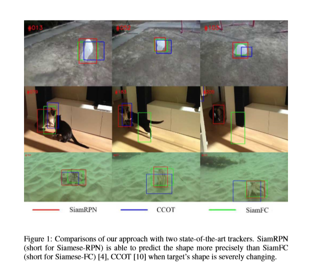

### 创新点

* 提出了Siamese RPN，可以在离线阶段使用大规模的数据pairs端到端地训练来完成跟踪的任务

* 在在线跟踪过程中，将proposal framework 转化为一个local one-shot detection 任务，可以细化方案，抛弃昂贵的多尺度测试。

* 可以在实时的挑战赛中实现领先的表现，160FPS ，准确率和相率都很优。

## 细节

Siamese-RPN framework 包含了两个部分，分别为Siamese 子网络和region proposal 子网络，整个网络是端到端的。如下所示：

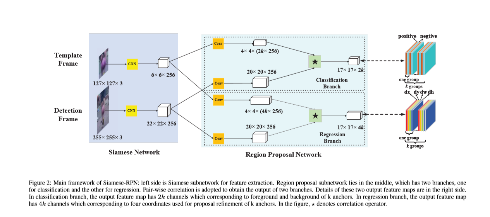

#### **Siamese subnetwork**

* 特征的提取

* 我们使用了一个全卷积的网络，没有padding(具体用到的是AlexNet其中从conv2开始到conv4的部分被移除了)。

* 这个子网络又包含了两个分支(这两个分支在CNN中共享参数，使得两个分支进行的输入经历相同的编码，方便在后续的任务中进行使用)：

	* 模板分支：将前面帧中的对象块作为输入

	* 检测分支：将当前帧中的对象块作为输入

#### **proposal subnetwork**

proposal的生成

它里面包含了两个模块，分别是 a pair-wise correlation section and a supervision section

**supervision section**

* 前景与背景的分离

* proposal的回归

如果存在k个anchor，网络需要有2k个channels去进行前景与背景的分类，需要4k个channel进行bbox的回归。

**pair-wise correlation section**

增加来自Siamese中模板分支产生的φ(z)的通道数，并分为分类和回归两个分支；与此同时，来自Siamese中的检测分支的φ(x)也同样被分成了分类和回归两个分支但是φ(x)的channel数在此过程中不发生改变。

然后在分类和回归两个分支中，φ(z)分别以2k个group和4k个group在φ(x)class和φ(x)reg上进行卷积，得到了相应的feature map Aclass 和 Areg

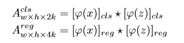

The template feature maps [φ(z)]cls and [φ(z)]reg are used as kernels and ⋆ denotes the convolution operation.

在最终的Acls中，一个点包含了2K个channel，这个向量表示的是每个anchor对应于原始图片中的图像块是背景还是前景。在分类分支中采用Softmax进行最终的分类。

在最终的Areg中，一个点包含了4K个channel，这个向量表示的是每个anchor与相应GT之间的差距，分别为dx、dy、dw、dh

训练网络的过程中，我们采用CE作为分类的loss函数,坐标归一化的smoothL1作为回归的loss函数。

最终，我们需要优化的损失函数为：

其中λ作为超参数，用于平衡分类和回归的损失

####  **Training phase: End-to-end train SiameseRPN**

训练过程中，样本pairs选自ILSVRC(有随机间隔)，和Youtube-BB(连续的)，模板分支与检测分支提取的两帧图像是来源于一个视频序列的。我们使用了ImageNet上的预训练模型，并且使用SGD优化函数。在训练回归分支的时候，我们采用了例如仿射变换的图像增强的技术。

我们注意到视频当中，相同的目标在邻近的几帧中的变化不是很大。所以在确定anchor的时候，我们只采用了一个尺度，加了5种不同的ratio，来生成我们的anchor。

在我们提出的结构中，正负样本的选择也是同样重要的，我们采用IOU阈值的方式进行正负样本的筛选，其中，正负样本的比例为1：3，所有样本的数量不超过64。

####  Tracking as one-shot detection

在本节中，我们首先将跟踪任务表示为局部一次检测任务。

**Formulation**

One-shot learning的目的是从感兴趣的类的单个模板z中学习参数W。这个W能够最小化预测函数φ(x;W)的the average loss L，这个average loss的计算是在监督学习的方式下进行的。计算方式如下所示：

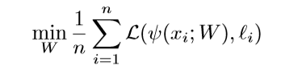

在One-shot learning的过程中，有一个很大的挑战，就是如何找到一种机制将类别信息融入学习者的学习中。为了解决这个难题，我们提出了一种利用元学习过程从单个模板z学习预测器参数W的方法。比如设置一个前馈的函数，w = (z;W')，它与W想对应。其中z是模板样例，然后我们的average loss可以写成如下形式：

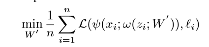

类似于上面的这种形式，z用来表示模板块，x用来表示检测块，φ表示Siamese特征提取子网络，ζ 表示RPN子网络。然后one-shot检测任务可以被定义为如下形式：

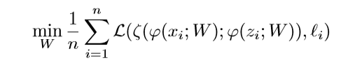

现在我们重新定义Siamese的模板分支它的作用就是训练参数，然后**局部一次检测**任务中进行预测。这就是典型的 learning to learn process.

在这样的模式下，这个模板分支主要用来编码类别信息到kernel中，然后检测分支用编码好的信息执行检测。

**在训练过程中，元学习器，不需要其他的标注信息，只需要pair-wise的标注信息**。

**而在推理阶段**，Siamese framework 除了初始的帧外，只需要保留检测分支。这样就会带来速度的提升。初始化的第一帧中的目标块被送入模板分支，对检测分支中的kernel进行预计算，这样使得我们可以在后续的其他帧中执行one-shot detection。正是因为**局部检测**的任务所需要的类别信息仅仅只来自于初始帧中的模板，所以可以把它认为是一个one-shot detection

#### Inference phase: Perform one-shot detection

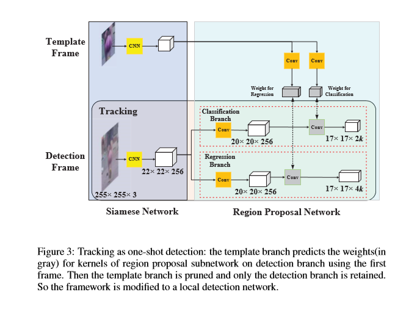

在检测分支进行卷积操作获取到feature map之后，继续前向传播就需要进行classify和regression的输出了，在这个过程中，我们需要得到最好的M个proposal。

* 我们通过点集的方式来表示the classification and regression feature map，如下所示：

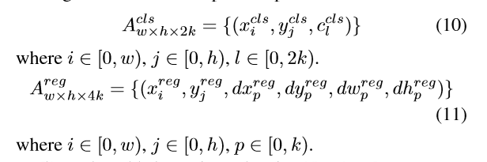

* 由于分类特征图上的奇通道表示正激活，我们在Acls中选择了Top K 个点，我们使l是奇数，

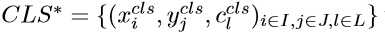

* 其中 I,J,L表示下标的设置。i,j用来表示对应anchor的位置信息。l则表示了对应anchor的比例信息。这样其实我们已经可以得到anchor的一种表示方式，如下所示：

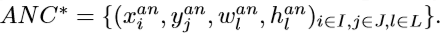

* 然后我们再通过anchor来得到最终regression的位置的表示，如下所示：

REG* = 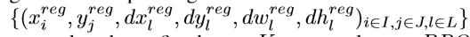

* 到最后，我们得到的Top K proposal可以表示为：

PRO* = 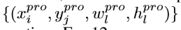

它里面具体的值可以通过下面的计算过程得到：

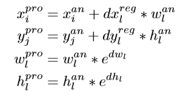

#### Proposal selection

为了使得one-shot detection框架满足追踪的任务，我们提出了两种策略去选择proposal。

* first：丢弃由anchor产生的离中心太远的bbox。由于相邻帧总是没有大的运动，丢弃策略可以有效地去除离群值。

我们在Acls的feature map上确定中心gxg的区域，然后在上面找到gxgxk个anchor。，如下图所示

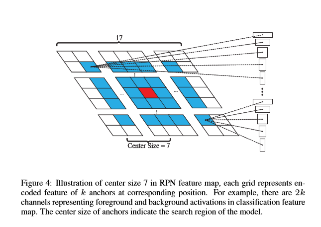

* second：我们使用余弦窗口和尺度变化惩罚重新排序的proposal的得分，以获得最好的一个。

	* 余弦窗口可以抑制大的位移

	* 惩罚项可以抑制在大小和长宽比上有大的变动

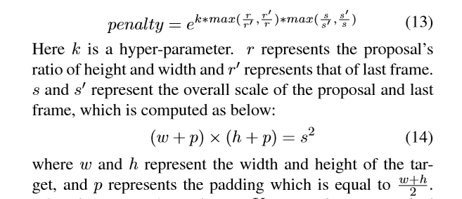

这些操作之后，排名前K的proposal在分类分数乘以时间惩罚之后重新排序。,NMS再筛选最终跟踪的bbox，**在最终的bbox被选择之后，target size会通过线性插值的方式进行更新，**以保证shape平滑地改变。

### 实验

#### Implementation details

**Network**

我们使用修改过的AlexNet，以及在ImageNet上预训练得到的参数去固定前三层的参数，并在Siamese-RPN中微调后两层，这些参数是通过在优化Siamese-RPN中的损失得到的。优化函数使用SGD、epoches取50，以及学习率从le-2到le-6之间衰减。

**数据**

我们从VID和Youtube-BB中获取图像pairs，选择帧间相差小于100帧的对象，如果目标的边界框大小记为(w,h)，我们以历史帧为中心裁剪模板patch，使模板的大小为AxA，定义如下:

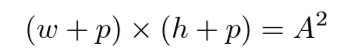

p = (w+h)/2.

用相同的方式，检测块在当前帧进行裁剪，大小为模板大小的2倍。

#### Result on VOT2015

VOT2015数据集包含了60个视频序列。

评测指标：

* EAO： Expected Average Overlap：考虑了精度和鲁棒性。

* EFO：the speed is evaluated with a normailized speed

评测结果;

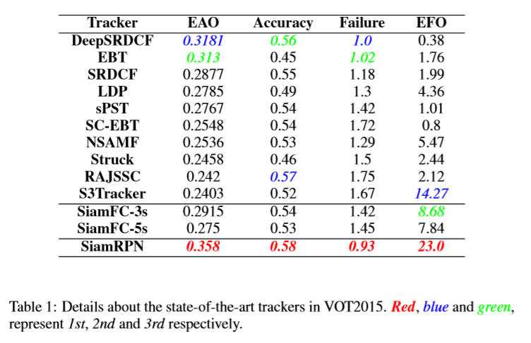

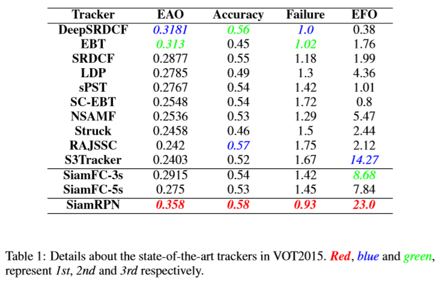

Siamese-RPN可以在160帧/秒的速度下进行，几乎是Siamese-FC(86帧/秒)的两倍，而EAO相对增加23%。

#### Result on VOT2016

在VOT2016挑战赛中，序列与VOT2015相同，而bbox被重新标注。性能评测与VOT2015相同。

评测结果：

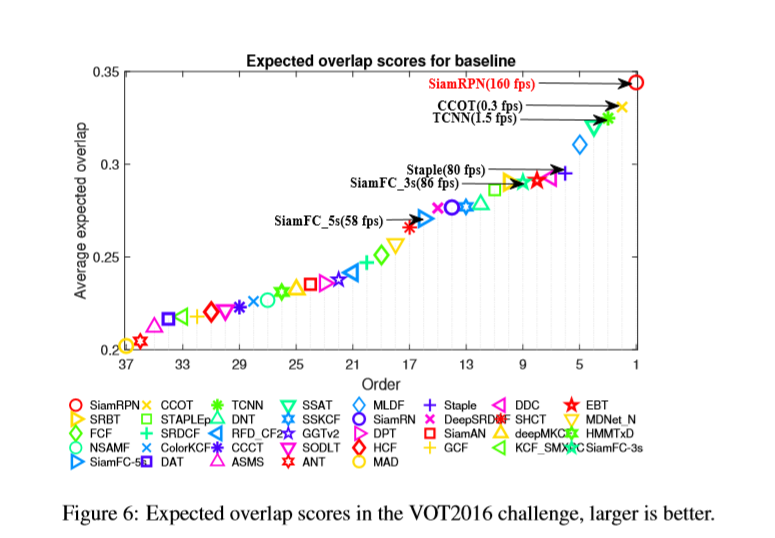

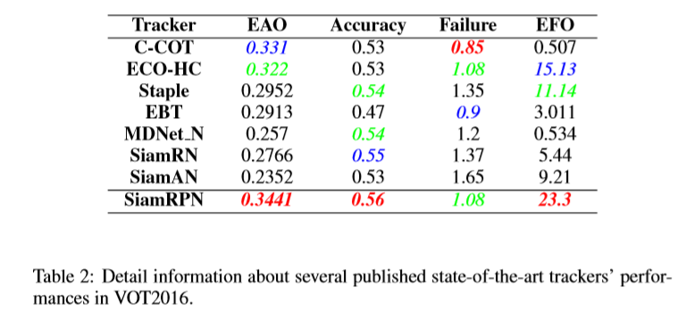

the performance and speed of the state-of-the-art trackers：

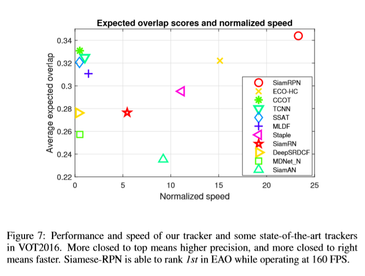

#### Result on VOT2017 real-time experiment

在VOT2017中，最少10个具有挑战性的序列被替换为10个更困难的序列。此外，还进行了一个新的实时实验，这里要求跟踪器需要处理实时的视频流在至少25FPS的速度下。这意味着如果跟踪器无法在40 ms内处理结果，评估器将使用最后一帧的边界框作为当前帧的结果。

在无速度限制条件下，原始EAO排名前10位的跟踪器在实时实验中EAO值较低。

评测结果如下所示：

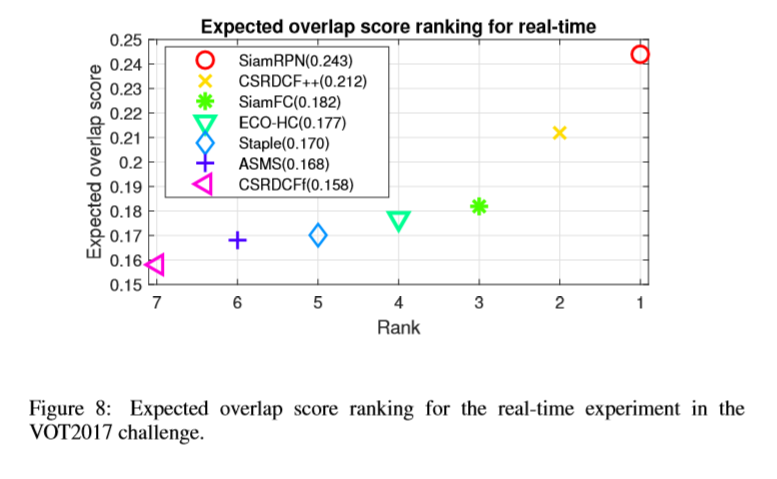

#### Result on OTB2015

OTB2015包含从常用的跟踪序列中收集的100个序列。评估基于两个指标:精度和成功图。

* 精度图显示了跟踪结果在距离目标20像素范围内的帧数百分比。

* 成功图显示了阈值从0到1变化时成功帧的比率，其中成功帧表示其重叠大于给定阈值的帧。利用成功图的曲线下面积(AUC)进行排序跟踪算法

评测结果：

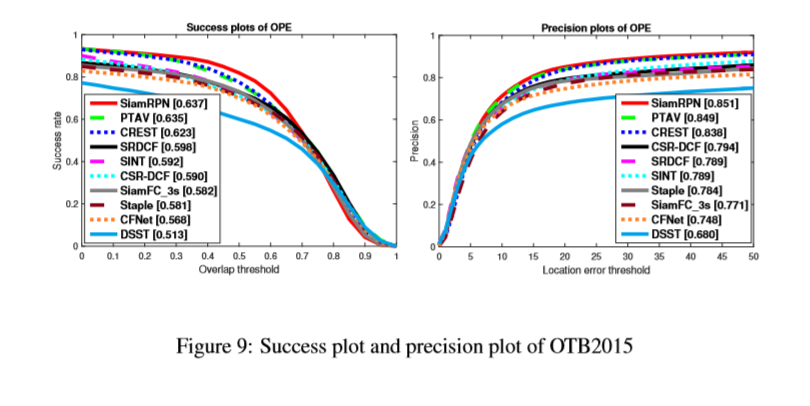

## Conclusion

在这项工作中，我们提出了Siamese-RPN网络结构，该网络使用来自ILSVRC和YoutubeBB的大规模图像对进行端到端的离线训练。Siamese-RPN通过应用box细分程序可以得到更精确的bbox。在在线跟踪过程中，将提出的框架描述为一个局部检测任务。在实验中，我们的方法可以在VOT2015、VOT2016和VOT2017实时挑战中取得领先的性能，同时以160帧/秒的速度运行。