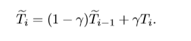
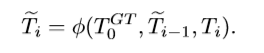
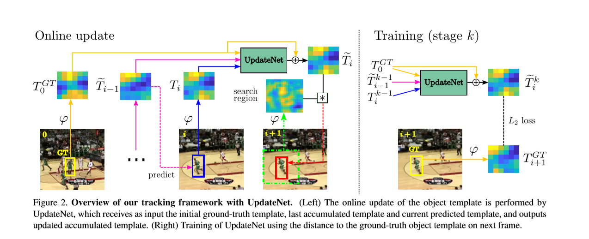
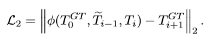
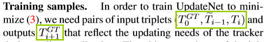
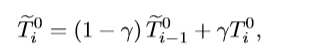
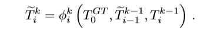

# Learning the Model Update for Siamese Trackers

**[[paper]](https://arxiv.org/abs/1908.00855)**  **[[code]](https://github.com/zhanglichao/updatenet)**

## 背景

传统的基于Siamese结构的目标跟踪任务的基本思路是，将视频第一帧中的目标Crop出来作为模板，然后在后续帧中，以当前帧中的目标位置为中心，找一个搜索区域，然后将模板与搜索区域丢入到Siamese网络当中进行特征的提取，得到特征图之后，将二者进行一个互相关操作，从而根据最大得分来确定后续帧中目标的位置。

然后，在这样的结构中，就存在着一个比较明显的缺陷，因为被跟踪的目标可能在后续的帧中由于运动而产生形变、遮挡等各种各样的姿态上的变化，而模板确一直沿用第一帧作为模板，所以在后续计算相似性的时候，真实目标与模板之间的相似性值可能会比较低，这个时候就可能使得我们跟踪任务发生错误。

在比较传统的基于相关滤波器的方法中，由于一直存在一种在线模板更新的方式，在每一帧中都对模板进行更新。所以后续就有一部分人去研究在Siamese中的模板更新算法。他们沿用在线更新的策略，在当前帧内提取一个模板来定位下一帧中目标的位置。一般而言，当前帧的模板是通过前面帧的模板的线性组合而形成的，这样做呢，会导致来自第一帧的信息在传递的过程中存在一定的损失。

虽然，他们的更新模板的算法，使得结果有了一定的改善，但是那些方法过于简单，从而限制了通过学习更新可能获得的潜在结果。所以作者就提出了一种基于学习的方式来进行进行模板更新的方式。作者用了一个叫做**UpdataNet**的卷积神经网络。这个网络通过结合初始模板、累积得到的模板以及当前帧中的模板三者来对下一帧的模板进行一个估计，旨在确定一个最优的模板。

作者的这个UpdateNet是一个高度集成的小模块，可以很方便地增加到当前已经存在的Siamese网络当中。

## 逐步引入

**Siamese 的优势**

我们的出发点就是要在基于Siamese的跟踪器上进行改进，因为现在基于Siamese的跟踪器往往能够实现令人映像深刻的计算效率，同时达到可竞争的精度要求。这个siamese的基本原则就是通过目标的外观模板与后续帧中所确定的搜索区域中的特征表现进行相关操作，然后进行目标位置的确定。而且，Siamese结构的跟踪器，都是通过离线进行训练的，这种离线训练的方式也给跟踪任务提供了优秀的视觉描述符。

**Siamese的缺陷**

然而，在跟踪任务中，目标一般都是运动的，所以在跟踪的过程中，经常会有大的外观的改变，如果不进行模板的更新，很容易导致最终跟踪任务的失败。

**线性更新策略**

也正是处于这样的问题，所以最近有许多Siamese跟踪器，通过用一个固定学习率的运动平均值实现了一个简单的**线性更新策略**。这一策略假设视频中所有帧以及不同视频中的外观变化速率都是恒定的。

**线性更新策略中存在的问题**

但是在现实当中，目标模板更新要求因不同的跟踪情况而有着很大的不同，这些要求往往取决于外部因素的复杂组合，比如运动、模糊以及背景混乱。

所以简单的线性更新方式通常难以满足不断变化的更新需求以及所有能够遇到的情况。同时，这种线性更新的方式在所有的空间维度中也是固定的，而且它不允许进行局部性质的更新。这样的方式，对于部分遮挡的目标而言是十分危险的。因为在这种情况下，模板只有一部分需要进行更新。

**只使用初始帧的问题**

过分依赖初始帧，可能导致很严重的漂移，而且在跟踪失败之后难以恢复。

## 创新点

我们提出了让模板自己通过学习的方式来更新自己，我们的学习更新策略利用了目标以及图片的信息，使得它对于特定的情况，总能适应与当前的环境。

在我们的方法中，这个更新后的模板可以通过函数计算：
 
 * 初始的真值模板

* 从前面的帧中累积得到的模板

* 以及在当前帧中预测得到目标所在位置的特征模板。

因此，这个新生成的累积模板包含了对于当前目标外观的历史性总结，因为它是持续使用最近的信息进行更新。

我们上面提到的更新方法是通过卷积神经网络来得到的，我们称这个网络为**UpdataNet**，这个网络是一个极其精简的网络，它可以与任何Siamese网络进行结合，来提高它们在线跟踪的能力。它足够复杂，以学习有效模板更新的细微差别，并具有足够的适应性，以处理大量的跟踪情况。

我们将UpdateNet与SiamFC、DaSiamRPN网络进行结合，通过大量的实验，证实我们的模板更新策略确实使得它们的性能得到了提升。

## Update the object template

接下来，我们将具体介绍这个方法，如何在在线更新的过程中学习来更新目标的模板。在开始之前，我们首先来回顾一下在目标跟踪问题中标准的一些更新方法。然后看看它们存在哪些缺点。然后我们引入我们的方法来克服它们的缺点。我们的论文主要是集中于Siamese网络进行设计，而我们的方法可以应用到其他的算法当中。

### Standard update

最近的几种跟踪方法使用简单的**平均策略**来更新给定一个新的数据样本的物体外观模型，这种策略来源于早期的跟踪方法，由于它带来的可以接受的结果而一直被作为在线更新方法的一个标准。

模板更新为一个运行平均值，其权重随时间呈指数衰减。指数权值的选择将产生以下用于更新模板的递归公式：

在这里，i表示的是帧的下标，Ti是仅用当前帧计算得到的新的模板样本，Ti(~)表示的是累积的模板，这个γ是更新率，通常设置为一个固定的小值，比如0.01。因为我们假设在连续的帧之间，目标外观的改变是比较平滑的。T在DCF跟踪器当中表示的是相关滤波器，而在Siamese网络当中，则表示的是通过全卷积网络提取得到的一个模板图像的特征。

**本文中，作者说SiamFC没有做模板更新，但是SiamRPN和DaSiamRPN却利用这个平均的策略来做了更新？**

**缺陷**

* 它在更新的时候，用到了一个固定的更新率，但是在一个视频中，对于不同帧中有着各种各样的因素会导致我们跟踪的失败，只设置一个常量的更新率显然不能满足真实场景的需求。

* 模板的所有空间维度上的更新也是恒定的，包括channel维度。这可以防止只更新模板的一部分，这在部分遮挡下是可取的。

* 一旦发生漂移，是没有办法恢复的。

* 更新函数被限制为以前外观模板的非常简单的线性组合。这极大地限制了更新机制的灵活性。当目标经历复杂的外观改变时，这个灵活性往往是十分重要的。

###  Learning to update

我们通过提出一个模型，这个模型可以学学习一种适应性的更新策略，然后我们用这样的策略来解决上面的**平均策略**中存在的缺点。因为我们的论文主要是针对Siamese跟踪器，T在这里表示的是目标外观的模板。我们提出了新的通用的更新函数，如下所示：

其中，这个更新函数的计算是基于初始框模板、累积的模板、以及当前帧被定位的目标位置的模板三者的信心来预测下一帧中的模板。由于在每一帧中都考虑初始的模板，所以可以有效地处理漂移的问题。整个更新函数的实现是通过卷积神经网络来进行的，我们称这个网络为UpdateNet。

### Tracking framework with UpdateNet

接下来，就主要来谈一下UpdateNet的结构，以及它是如何应用到在线跟踪中的。

在上图中的左侧，我们可以很清晰地看到我们的UpdateNet的整体结构，我们使用类似于SiamFC中的特征提取器来从图像区域中提取深度特征。我们在初始帧中对应位置提取到Tgt， 在前i-1的累积模板的基础上，对第i帧中目标的位置进行预测，在预测的位置上提取Ti，Ti-1(~)是UpdateNet在上一帧的输出。我们将以上三者联合在一起，作为UpdateNet的输入，从而来预测新的累积模板Ti(~)，在初始化的时候，我们将Ti 、Ti-1(~)都设置为Tgt，因为在初始的时候不存在前一帧。

UpdateNet中使用的唯一的真值信息其实就是视频第一帧中包含目标的位置。其他的那些输入都是在跟踪过程中预测得到的。所以Tgt是唯一一个实际的信号，可以用来决定更新的方向。针对这样的一个原因，我们采用了一个残差学习的策略，在这个策略当中，UpdateNet学习如何去修改这个Tgt的模板来适应当前的帧。具体实现的时候是通过一个跳跃连接的方式，将Tgt直接短接到网络输出的地方。

这种方法仍然考虑到更新对象的历史外观集，但是这种更新以最精确的样本为中心。

### Trainin UpdateNet

在训练的时候，我们预测得到的Ti(~)应该要与T(i+1)GT相对应。如上图右侧所示，我们假设T(i+1)GT是在后续帧中寻找目标的最理想的模板。为了实现这样的目的，我们训练这个UpdateNet网络，通过最小化模板与真值之间的欧式距离。这也就是我们网络的损失函数，如下：

**Training samples**

为了在训练UpdateNet的过程中，最小化上面的损失函数，我们一共需要三个值，如下

其中两个真值的模板可以通过提取对应位置的特征来获得，而当前帧的模板，假如我们使用真值的位置来代替在实际中很少出现的情况，即在当前帧中位置的预测是非常准确的。这种不现实的假设使更新的偏差倾向于期望对Ti是非常小的，因此UpdateNet不能学习特别有用的信息。因此，我们需要在第i帧中使用不完美的定位方法提取Ti样本进行训练。我们可以使用累积的模板来模拟这种情况，理想化地提供在训练过程中的位置误差。

**Multi-stage training**

在理论上，我们可以通过UpdateNet的输出，使用精确的Ti-1(~)，然而这将使得训练是循环往复的，使得程序笨重，而且几乎是没有效用的。所以我们将我们的训练程序分为几个阶段，反复地对UpdateNet进行微调。

第一阶段，使用标准线性更新方法对训练数据集进行初始跟踪

这将为每一帧生成累积的模板和实际的预测位置。我们将更新速率设置为跟踪器的推荐值。这相当于跟踪Inference期间UpdateNet可能输入的第一个近似值,尽管使用的是不那么复杂的线性更新策略。在后续的训练阶段中，我们使用在前面训练的UpdateNet模型来得到累积的模板，以及目标定位预测的模板，如下公式：

这些训练的数据样本与推理时数据的分布是十分类似的，因为他们是UpdateNet的输出。我们研究了一个合适的值为总阶段的K在试验段

## 实验(略)

## Conclusions

Siamese跟踪器通常使用简单的线性更新规则来更新它们的外观模板。我们指出了这种线性更新的一些缺点，并提出将更新步骤作为一个优化问题来学习。我们采用了一个被称为UpdateNet的网络来完成这个学习任务。它将了解如何在给定第一个框架的外观模板、当前框架和前一步的累积模板的情况下更新当前累积模板。我们的目标是形成一个对于Siamese网络所通用的模块，可以加入到任何一个Siamese网络结构中，实验也进一步证明，我们的更新方法比标准的线性更新方式有着更加明显的性能。