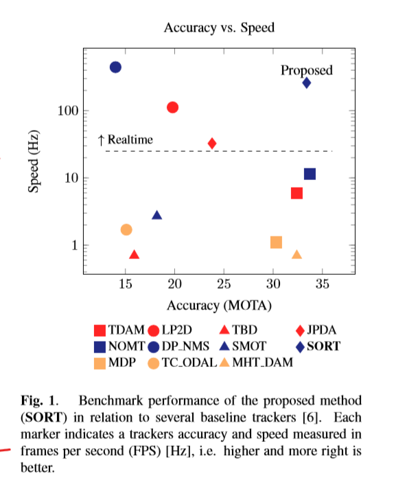
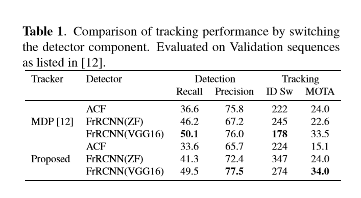
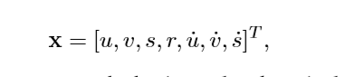

## [SIMPLE ONLINE AND REALTIME TRACKING](../目标检测/attachments/soft.pdf)

### 概述

本文探索了一种实用的多目标跟踪方法，其主要关注于在**在线和实时**应用程序有效地关联目标。为此，**检测质量被确定为影响跟踪性能的关键因素**，其中更换检测器可提高跟踪性能达18.9%。尽管只使用了熟悉的技术(如卡尔曼滤波和匈牙利算法)的基本组合来构成跟踪组件，但这种方法的准确性可与最先进的在线跟踪器相媲美。

### 动机

本文提出了在多目标跟踪问题上基于tracking by detection框架的低耗而高效的实现。每一帧中，先进行目标检测，并以bbox的形式将目标展现出来。

和传统的JPDA、MHT等基于整个视频batch的跟踪方法相反，我们的工作主要是针对于上一帧与当前帧两帧的检测来进行轨迹的跟踪。而且，我们强调实时跟踪的效率以及促进在自动驾驶以及行人跟踪应用中更多的利用率。

MOT问题可以被看做是一个数据关联的问题，他主要的目的是为了在视频序列中依据帧的先后顺序进行数据的关联。为了促进数据关联的进程，跟踪器用了各种各样的方法为场景中的目标的运动以及外观信息进行建模。

本文所采用的方法是通过对最近建立的视觉MOT benchmark 进行观察而得到的：

* 成熟的数据关联技术正在复兴，比如MHT、JPDA等

* 唯一不使用聚合通道过滤器(ACF)检测器的跟踪器也表现出了好的性能，这表明检测质量可能阻碍了其他跟踪器的发展

准确率与速度的权衡

作者为了遵循Occam's Razor，跟踪时忽略检测组件以外的外观特征，仅使用bbox位置和尺寸进行运动估计和数据关联。此外，由于遮挡问题发生的次数少而且它们确实为跟踪问题引入了不可描述的复杂性，所以关于短期和长期遮挡的问题也被忽视。而且，作者认为，将复杂性以对象重新标识ID的形式合并到跟踪框架中会增加大量开销--即，不适合实时的应用。

**本文工作的重点是有效和可靠地处理常见的帧与帧之间的关联。我们的目标不是增强对检测错误的鲁棒性，而是利用视觉对象检测的最新进展来直接解决检测问题。卡尔曼滤波和匈牙利方法分别处理跟踪问题的运动预测和数据关联。**

### 创新点

* 在MOT的背景下，我们利用了基于CNN的目标检测。

* 提出了一种基于卡尔曼滤波和匈牙利算法的实用跟踪方法，并在最近的MOTbenchmark上进行了评估

### 具体方法

该方法主要包括**检测、将对象状态传播到未来帧、将当前检测与现有对象关联以及管理被跟踪对象的生命周期**等几个方面。

#### detection

* Faster RCNN（FrRCNN(ZF) 和 FrRCNN(VGG16)）

	* 两个阶段参数共享

	* 网络体系结构本身可以切换到任何设计，使不同体系结构的快速实验，提高检测性能。

	* 参数采用学习自PASCAL VOC challenge的参数

	* 只做行人检测，且只将检测结果大于50%的目标传递给器

在我们的实验中，我们发现在比较FrRCNN检测与ACF检测时，检测质量对跟踪性能有显著的影响。以及MDP与我们方法性能的对比，如下所示：

#### Estimation Model

在这里我们描述对象模型，即表示和运动模型，用于传播一个目标的身份到下一帧。我们用一个不依赖于其他目标和摄像机运动的线性等速模型来近似每个物体的帧间位移。目标的状态可表示为：

其中u和v分别表示目标中心的水平和垂直像素位置，而scale s和r分别表示目标bbox的比例(面积)和高宽比。

当检测与目标相关联时，检测到的bbox用于更新目标状态，其中速度分量通过卡尔曼滤波框架优化求解。

#### Data Association

在对现有目标分配检测时，通过预测目标在当前帧中的新位置来估计每个目标的bbox的几何形状。然后将cost matrix 计算为每个检测与现有目标的所有预测bbox之间的IOU距离。联合的算法采用**匈牙利算法**，若某个detection与target的IOU小于最小的IOU，则放弃将它进行关联。

我们发现边界盒的IOU距离**隐式**地处理了由传递目标引起的短期遮挡。具体来说，当目标被遮挡对象覆盖时，只检测遮挡者，因为IOU距离适合于相似尺度的检测。这允许两个遮挡目标被校正与检测，而被覆盖的目标是不受影响的，因为没有与之关联。(不是特别理解)

#### Creation and Deletion of Track Identities

当对象进入和离开图像时，需要相应地创建或销毁他们唯一对应的标识。对于创建跟踪器，我们认为任何重叠小于最小IOU的检测都表明存在未跟踪的对象。

跟踪器是初始化使用bbox的几何形状与且它的速度设置为零。由于速度在这一点上是不可观测的，速度分量的协方差初始值很大，反映了这种不确定性	

此外，新的跟踪器还需要经过一段试用期，在此期间目标需要与检测相关联，以积累足够的证据，以防止误报跟踪。

如果在Tlost帧内没有检测目标则终止跟踪。这可以防止跟踪器数量的无限制增长和定位错误，这些错误是由于长时间的预测造成的，而没有对探测器进行修正。

Tlost一般被设置为1：

* 恒速模型不能很好地对动态的物体进行预测

* 我们主要关注帧与帧之间的跟踪，其中对象的重新标识超出了本工作的范围

### CONCLUSION

本文提出了一种简单的在线跟踪框架，着重于帧对帧的预测和关联。结果表明，跟踪质量与检测性能密切相关。该框架在速度和精度方面均达到了最佳的类性能。
