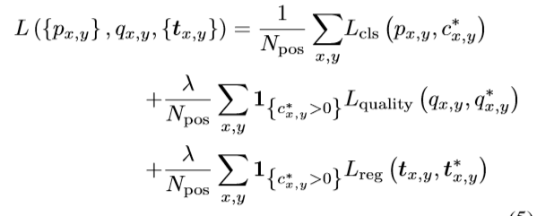

# SiamFC++ Towards Robust and Accurate Visual Tracking with Target Estimation Guidelines

**[[paper]](https://arxiv.org/abs/1911.06188) [[code]](https://github.com/MegviiDetection/video_analyst)**

## 背景

在目标跟踪的任务中，我们需要有效地同时进行**鲁棒性的分类**和**精确的目标状态评估**。以前的方法中已经提出了各种各样的状态评估算法，但是很少有能够将目标跟踪问题的特殊性考虑进去。

经过一个细致的分析，我们为高性能通用目标跟踪器的设计提出了一套实用的目标状态估计准则。根据这些准则，我们通过引入：

* G1：分类以及目标位置评估分支

* G2：无歧义的分类分数

* G3：没有先验的跟踪

* G4：评估质量得分

经过分析以及消融实验的验证，证明了我们所提出的准则的有效性。而且我们的方法在五个数据集(OTB2015, VOT2018，La-SOT，GOT-10k，TrackingNet)上达到了SOTA的性能。

## 引入

跟踪任务可以看做是分类任务和评估任务的一个结合。分类任务对目标进行一个粗略的定位，而评估任务则是在分类的基础上通过bbox对目标进行精准的定位。虽然现代的跟踪器已经实现了很大的进展，但是他们的方法对于评估任务而言，却有着很大的不同。基于这个 方面，以前的方法可以大致分为三个类别：

* **DCF、SiamFC**使用野蛮的多尺度测试，这种方式大多是不准确的，而且是低效的，而且，它们遵循一个先验的假设，即目标尺度、长宽比在相邻帧中以固定比率变化，通常在现实中并不成立

* **ATOM**通过梯度升序迭代细化多个初始的bbox，进而去评估目标的bbox，这在精度上带来了一个明显的改善。这种方式不仅带来了严重的计算负担，也使得有许多额外的超参数需要进行调优。

* **SiamRPN家族**通过使用RPN网络来进行精确而有效的目标状态的评估。然而预定义的anchor设置，不仅引入了模糊的相似度评分，这严重阻碍了健壮性，还需要访问之前的数据分布信息。这显然违背了通用对象跟踪的精神。

## Guidelines

** G1 分类与状态估计分解 **

将任务划分为两个子任务，分类任务可以使跟踪器从背景以及干扰物中区分出目标， 而评估任务则会给跟踪器带来更高的精度

** G2 非模糊的得分 **

分类分数应该直接代表目标存在的置信度分数，但是基于anchor的方法，在anchor于GT匹配的时候，往往容易存在假阳性的现象

** G3 没有先验**

 跟踪方法应该没有像尺度、长宽比分布这样的先验知识，
 
 ** G4 评估质量估计 **
 
 在以前的研究当中，发现将分类置信度直接用于选择边界框会导致性能下降。应该使用独立于分类的估计质量分数，就像之前许多关于目标检测和跟踪的研究一样
 
 在遵循上述Guidelines的情况下，我们基于全卷积的Siamese跟踪器，设计了SiamFC++。这样得到的特征图中的每一个像素会对应于搜索图像中的一个子窗口。我们然后在与Classification head平行的位置上加入了一个Regression head(G1)，因为把anchor的设置给移除了，所以匹配的假阳性现象(G2)以及先验信息(G3)也被移除掉了。最后，我们增加了一个质量评估的分支，给予了高质量的bbox特权。
 
 
 ## Contribution
 
* 通过分析跟踪的独特特性，为现代跟踪器设计设计了一套实用的目标状态估计指南。

* 我们根据我们提出的Guidelines设计了一个简单的却强大的SiamFC++，并通过实验验证了我们Guidelines的有效性。

* 我们的方法在5个benchmark 上达到了SOTA  并达到90fps 

## SiamFC++

我们根据提出的Guidelines对SiamFC进行进一步的细化，得到了SiamFC++，如下图所示，这个SiamFC++包含了一个用于提取特征的Siamese子网络和RPN子网络进行分类和回归。

### Siamese-based Feature Extraction and Matching

Siamese网络主要用于特征提取，然后在特征图上进行相关操作，从而对搜索图像上的目标进行前景与背景的分类，以及目标位置的回归。在我们的SiameseFC++当中，用于分类与回归的特征图的大小是相同的。从上图中也可以看出来。

### Application of Design Guidelines in Head Network

基于SiamFC，我们根据四个Guidelines逐步对我们的跟踪器进行细化。

**G1**

在相关操作之后，我们设计了分类分支和回归分支，features map上的每一个像素，对于Classification head 来将经过两层卷积后的特征图φcls作为输入，然后判断它所对应的图像块是前景还是背景。对于Regression head 来将经过两层卷积后的特征图φreg作为输入，然后输出额外的偏移量回归来改进边界盒位置的预测。

对于分类而言，特征图φcls中的某一像素点(x,y)如果它对应的**下面坐标**在输入图片中位于GT bbox当中，他就被认为是一个正例。

这里的s是整个backbone的步长，本文中取8。

对于回归而言，特征图φreg中的某一像素点(x,y),最后一层预测从**上面的点**到真值的四条边的距离，表示为一个4D的向量，具体可以表示为：

其中(x0, y0)(x1, y1)分别表示的是与点(x,y)相关的GT bbox左上角和右下角的坐标。

**G2**

也就是说，features map上的点(x, y)表示的是在输入图中以下面坐标为中心的图像块。

我们直接对对应的图像块进行分类和回归。

换句话说，SiamFC++直接将特征图上的点作为训练样例，而anchor-based的方法，将输入图像上的位置视为多个锚框的中心，在相同的位置输出多个分类分数，并针对这些锚框输出targetboundingboxwithtboxes，导致锚和对象之间的不明确匹配。这种方式虽然带来了一定的性能提升，但是在我们的实验中发现，它也同样带来了许多的问题。在我们的逐像素预测方式中，在最终的feature map中，每个像素只做一个预测。因此，对于每一个像素，都有一个目标存在于相应子窗口中的一个置信度。

**G3**

由于SiamFC+对位置进行分类和回归，它没有预定义的anchor，因此没有关于目标数据分布的先验知识。

**G4**

在前面，我们没有考虑目标的状态评估质量，而是直接用分类的得分值来选择最终的box。这可能导致定位精度的退化。

根据对该文[Understanding the effective receptive field in deep convolutional neural networks.]的分析，一个子窗口中心附近的输入像素对相应的输出特征像素的重要性要大于其他像素。因此，我们假设物体中心周围的特征像素比其他特征像素具有更好的估计质量。我们通过在1 x 1的分类层的平行位置加入了一个简单而有效的1 x 1的质量评估分支。这个分支的输出是为了评估Prior Spatial Score(PSS)，我们将其定义为：

这个PPS不是质量评估的唯一选择，我们也可以通过IOU来进行评估。

在推理过程中，通过将PSS与相应的预测分类分数相乘来计算用于最终框选择的分数。通过这种方式，跟踪的精度进一步被改善。

### Training Objective

我们训练过程中，主要是需要优化的目标是：

## 实验

### 实现细节

**Model settings**

在这个工作中， 我们实现了两个版本的跟踪器，他们的区别主要在于backbone不同，其中，一个用的是修改过的AlexNet，即SiamFC中用到的那个网络；另一个用的是GoogleNet。这两种网络在更低的计算量消耗下在跟踪的benchmark上实现了与基于ResNet-50相同甚至更好的性能。

**Training data**

* ILSVRC-VID/DET

* COCO

* Youtubr-BB

* LaSOT

* GOT-10k

我们根据搜索图像的均匀分布进行**随机移动**和**缩放**作为数据增强技术。

**Training phase**

对于**AlexNet**版本， 我们冻结来自conv1和conv3的参数，然后微调conv4和conv5的参数。对于没有预训练的层，我们采用以0为均值，0.01为方差的高斯分布，对它们进行初始化。

warm up ：前5个epochs，lr线性增加，从le-7到2 x le-3

cosine annealing： 剩余的45epochs

每一个epoch的数据量 600k image pairs

优化方法：SGD

对于**GoogleNet**，我们冻结stage1 和stage2， 微调stage3和stage4。并将基础的学习率调节至2 x le-2

每个epoch的数据量减少到300k image pairs， 总共的epoches减小到20，其中，前5个用于warm up,在第10个epoch的时候，对参数进行解冻，从而来避免过拟合。

**Test phase**

我们的模型的输出是一组具有相应置信度分数的bbox。分数是根据对应框的尺度、长宽比例变化和最后一帧中预测的到目标位置的距离来进行处罚的。最终，最高分所对应的bbox用来更新目标的状态。

## Conclusion

本文通过分析视觉跟踪任务的独特特点和现有跟踪器的缺陷,提出了一系列在跟踪问题中对于目标状态评估的Guidelines。遵循这些Guidelines，我们提出了我们的方法，为分类和目标状态估计(G1)提供有效的方法，给出无歧义分类分数(G2)，无先验知识跟踪(G3)，并意识到估计质量(G4)。我们通过广泛的消融研究来验证所提出的Guidelines的有效性。我们展示了基于这些Guidelines的跟踪器在5个挑战性的基准上达到了最高的性能，同时仍然以90帧每秒的速度运行。

## 复现结果

* **GPU**: Tesla V100 * 2

* **backbone**: googlenet V3

* **dataset**
	* train: LaSOT
	* test: VOT2018
* **result**

| Tracker Name             | Accuracy | Robustness | Lost Number | EAO   |
| ------------------------ | -------- | ---------- | ----------- | ----- |
| siamfcpp_googlenet-lasot | 0.450    | 0.609      | 130.0       | 0.147 |