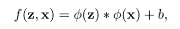
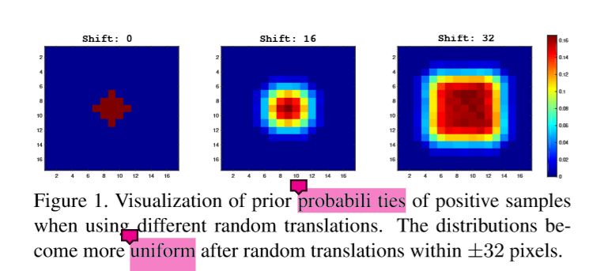
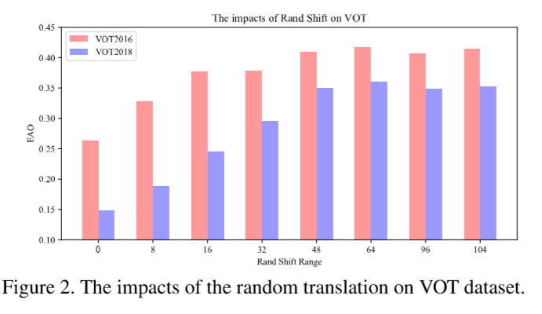
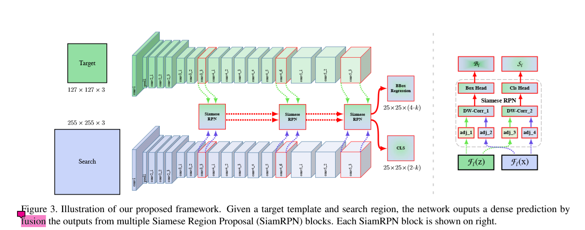
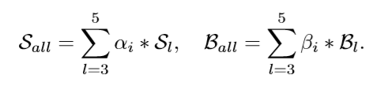
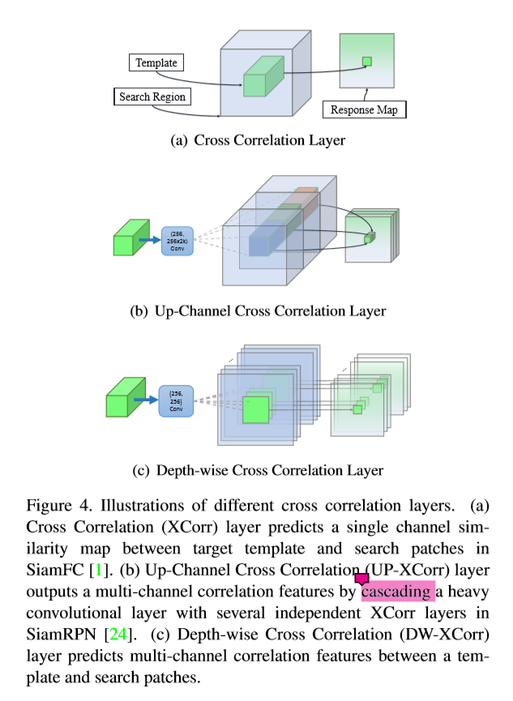
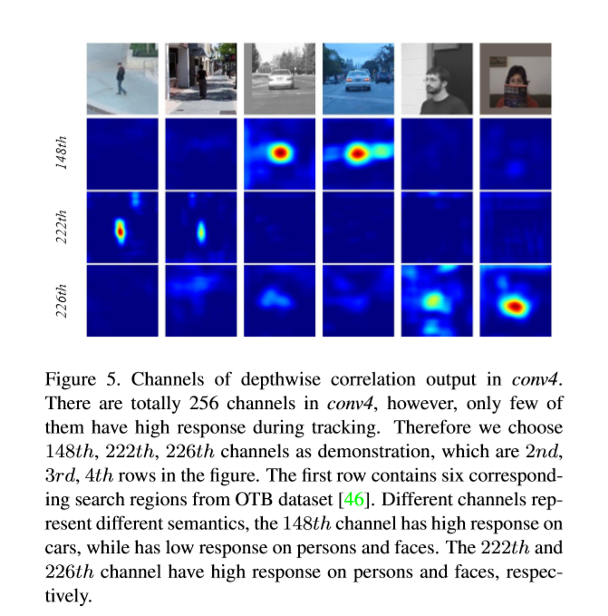
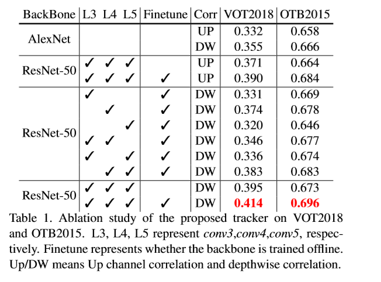

# SiamRPN++ Evolution of Siamese Visual Tracking with Very Deep Networks

## 背景

基于Siamese网络结构的跟踪器，它其实就是一个在模板和搜索区域的卷积特征的基础上，进行互相关操作，最终确定在后续帧中目标位置的方法。

这种普通的Siamese结构它存在一定的问题：

* 他们的**精度**和SOTA相比，仍然有着一定的距离。

* 他们不能利用来自深度网络得到的特征。(ResNet50等，或者更深)

作者发现了问题，随即找到了出现这种问题的核心的一个**原因**就是：**缺乏严格的平移不变性。**

经过广泛的理论分析与实验验证，我们通过：

* 一个简单而有效的**空间感知采样策略**来打破这种限制，并且成功的训练了由ResNet驱动的Siamese跟踪器。而且实现了明显的性能的提升

* 提出了一个新的模型结构，去执行逐层的特征聚合以及深度可分的思想，这种结构不仅改善了模型的精度，同时也减少了模型的大小。

我们进行了广泛的消融研究，以证明所提出的跟踪器的有效性，在五大跟踪benchmarks中，我们的结构获得了目前最好的结果

## 贡献

* 本文对Siamese跟踪器进行了深入的分析，证明了在使用深度网络时，由于严格的平移不变性的破坏，导致了精度的下降.

* 我们提出了一个简单而有效的采样策略来打破空间不变性的限制，成功地训练了一个由ResNet架构驱动的Siamese跟踪器。

* 提出了一种**基于分层的特征聚合结构**进行互相关操作，这有助于跟踪器从多个层次上学习特征来预测相似度图。

* 我们提出一种**深度可分**相关结构(Siamese两个网络分支的参数数量高度不平衡)来增强互相关，以产生与不同语义相关联的多个相似映射。

还观察到一个有趣的现象，即在同一类别的物体对相同的channels有较高的响应，而其余channels的响应则被抑制。

我们开发了一种高效的目标跟踪模型，它在跟踪精度方面达到了SOTA，同时以每秒35帧的速度高效运行。

## Siamese Tracking with Very Deep Networks

这项工作最重要的发现是，如果使用更深层次的网络，基于Siamese网络的跟踪算法的性能可以显著提高。然而，简单的直接用ResNet去训练Siamese跟踪器并不能得到好的额性能的提升。我们发现潜在的原因主要涉及到Siamese trackers它固有的一些缺陷。

首先，我们的Siamese结构最后都要通过一个相似性的判断来确定目标的位置，我们采用的相似性比较的函数如下所示：

这个相似性匹配函数对于设计一个Siamese跟踪器内在地包含了两个固有的限制：

* Siamese跟踪器中使用的收缩部分和特征提取器对于严格的平移不变性有一个内在的限制，而这个平移不变性能够 保证有效的训练和推理过程。

* 收缩部分对结构的对称性有一个固有的限制，而结构的平衡性确是对相似性学习有着一定的好处的。

通过详细的分析，我们发现使用deep network来防止Siamese tracker的核心原因与这两个方面有关：

* 具体来说，原因之一是深层网络中的padding会破坏严格的平移不变性。

* 一个是RPN需要非对称特征来进行分类和回归

### 克服第一个问题：padding会破坏严格的平移不变性

**假设： 违反这一限制将导致空间偏差**

**实验**

**Shift**定义为数据增量中均匀分布产生的最大平移范围。

首先，将目标设置为分别与图像中心偏移（0，16，32），我们分别设计三个连续的实验来进行训练，当模型逐渐收敛之后，我们将在测试数据集上生成的热力图进行聚合，然后在在下图中进行结果的展示：

在第一个零位移模拟中，边界区域的概率被降低到零。结果表明，尽管实验对象出现了，但仍然存在很强的中心偏差。证明了我们的假设是正确的。

另外两个模拟结果表明，增加位移范围将逐渐防止模型出现这样大的偏差。

* 这种定量结果表明，32-shift的聚集热图更接近于测试数据集上目标的位置分布。

* 实验证明，该策略有效地缓解了填充网络对平移不变性的破坏。

为了避免将强中心偏置作用于目标上，我们采用了空间感知采样策略，使带有ResNet-50主干的SiamRPN进行训练。，下图是不同Shift所对应的EAO的变化：

我们可以发现最合适的Shift取64

### ResNet-driven SiameseTracking

基于上面的实验可以说明，中心偏差的影响可以通过空间感知采样的方式消除，只要选取合适的Shift，就可以将padding所带来的影响降到最低。

一旦我们能消除这部分的影响，那我们就可以使用现成的网络来作为目标跟踪的backbone，此外，我们还可以自己构建网络，逐步探索深度网络在目标跟踪上的性能。

在这里，我们主要来谈一谈如何将深度网络加入到我们的跟踪算法当中。以**ResNet50**为例。

原始的ResNet有一个32像素的步长，这对于密集的Siamese的预测是不合适的。所以我们通过将conv4和conv5修改为单元空间步长，来将后面两个块的步长分别由16像素和32像素改为8，而且增加还通过空洞卷积的方式增加了它的感受野。

每个block的结尾都会加上一个1x1的卷积层来将每个块的输出减少到256

因为所有layers都包含了paddings，模板特征的大小增加到了15，这使得在后续互关联的时候增加了一定的计算量。所以我们在这个模板特征的基础上进行裁剪操作，只取其中7x7的区域作为模板的特征。而这7x7的特征中的每一个cell都可以对应到整个目标区域。

我们使用**互相关层**和**全卷积层**的组合来组装用于计算分类分数(记为byS)和bbox regression(记为B)的head模块。Siamese RPN块记为p。

### Layer-wise Aggregation

利用深度如ResNet-50之后，聚合不同的层变成了可能。直观地，目标跟踪需要丰富的特征表现，从低层到高层、尺度从小到大，分辨率从细到粗。

尽管在深度的卷积网络中，但是一层的表现仍然是不足够的，对不同层的表示进行组合和聚合，可以改善识别和定位的推理过程。

AlexNet中不同的层不能提供非常不同的表现，但是在ResNet当中，由于不同层之间感受野变化是比较大的，所以它往往能够提供非常不同的特征。

我们假设，利用这些不同层之间丰富的信息，对跟踪任务是有很大的帮助的。

在该网络中，通过提取多分支特征来协同推理目标定位。，比如在ResNet50当中，我们将最后3个block的特征进行聚合。分别将这三个层的输出表示为F3(z),F4(z)和F5(z),这三个层的输出分别送入三个RPN模块当中。如下图所示：

由于**三个模块的输出大小具有相同的空间分辨率**，因此直接对RPN输出采用加权和。加权融合层结合所有的输出

由于分类和回归的时候，对应的域是不同的，所以权重也会针对不同的问题而分开，如上所示：

而且这些权重的优化过程是在离线状态，与整个网络端到端地完成的。

和以前的工作不同，我们的方法没有直接结合卷积层的特征，而是分别用每一层的特征经过RPN网络去进行分类和回归，

**注意，随着骨干网深度的显著增加，我们可以从丰富的视觉-语义层次结构中获得实质性的收益。**

### Depth wise Cross Correlation

互相关操作是结合两个分支信息的核心操作。

* Siamese FC:用了一个互相关层去获得一个单通道的响应图，从而实现目标的定位。

* Siamese RPN:互相关操作被扩展到更加高水平的信息，包括引入anchor。并通过一个巨大的卷积层来扩增通道数(UP-Xcorr)。这使得参数分布严重的不平衡，RPN模块包含了20M，而特征提取模块只有4M，这使得在SiameseRPN的训练优化的难度加大。

* 本文，提出了一个轻量化的互相关层，名叫Depthwise Cross Correlation(DW-XCorr)，实现了有效的信息融合，而且他的参数量是UP-Xcoor的1/10，但是性能与SiameseRPN类似。

为了达到这个目的，一个conv-bn块被用于去调整来自每一个residual块的特征，使他们能更加适应跟踪任务。更重要的一点是，bbox的预测和基于anchor的分类都是不对称的。

为了编码他们的区别，模板分支和搜索分支分别经过两个**不共享**卷积层，然后产生的两个特征图有**相同的channels**，然后就可以逐层进行互相关操作。此外，conv-bn-relu块被增加，去融合不同channel的输出，再最后，用于分类和回归的卷积层被加到最后。

通过把互相关换成深度互相关关，我们可以大大减少内存的使用。这样，模板上的参数和分支的数量达到了平衡，使训练过程更加稳定

同一类对象在同一通道上(第148通道的car、第222通道的person、第226通道的face)反应较高，其余通道的反应均受到抑制。

这一特性可以被理解为深度相互关系产生的channal - wise特征几乎是**正交的**，并且**每个通道都代表一些语义信息**。

## 实验

### 训练以及测试的数据

**训练**

* backbone ：从ImageNet上预训练

* dataset：coco， ImageNet DET， ImageNet VID and YouTube-BoundingBoxes

* 通用的概念： 如何衡量视觉跟踪的一般对象之间的相似性

* 图像设置：训练和测试中，我们使用127pixels的模板图像和255pixels的搜索区域

**评估**

* short-term:

	* OTB2015、VOT2018、UAV123、

* long-term:

	* VOT2018-LT

### 实现细节

**网络结构**

* 我们在步长缩减的ResNet-50的后面加上了两个对称的卷积层，去执行分类和bbox的回归。(5个anchor)

* 随机初始化的1x1卷积层被加到conv3、conv4以及conv5的后面，把他们的饿输出通道固定到256.

**优化器**

* SGD

* 20epochre

* end-to-end

* lr:warmup

**消融实验**

**backbone 结构**

上图表明，用ResNet50代替AlexNet，在VOT2018数据集上性能的改善是比较多的，同时，微调也可以进一步改善跟踪的性能。

**Layer-wise Feature Aggregation**

为了调查这个多层聚合的效果，我们一开始在ResNet50上训练了三个单层的RPN，我们明显地发现，conv4可以达到一个有竞争力的性能，EAO能达到0.374，而另外两个则比它要少4%左右。conv4与conv5的结合，也改善了效果，但是其他的两两结合并没有任何改善。

聚合后，准确率和鲁棒性均稳步提高，分别在VOT和OTB上提高了3.1%和1.3%。总之，层与层之间聚合之后，能够在VOT2018上达到0.414的EAO。

**Depthwise Correlation**

我们比较了原始的UP互相关层和提出的深度互相关层。本文提出的深度相关比VOT2018提高了2.3%，比OTB2015提高了0.8%(AlexNet)，这说明了深度相关的重要性。部分原因是由于两个分支的均衡参数分布使得学习过程更加稳定，收敛性更好。

## 结论

在本文中，我们提出了统一框架，称为SiamRPN++，端到端训练深度Siamese网络的目标跟踪。我们从理论和经验上证明了如何在Siamese跟踪器上训练深度网络。我们的网络由一个多层聚合模块和一个深度关联层组成，该模块将连接的层次组合在一起，以聚合不同层次的表现，而深度关联层允许我们的网络减少计算，冗余参数，以更好的收敛。

