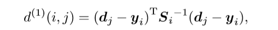
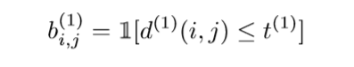
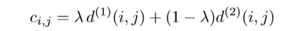
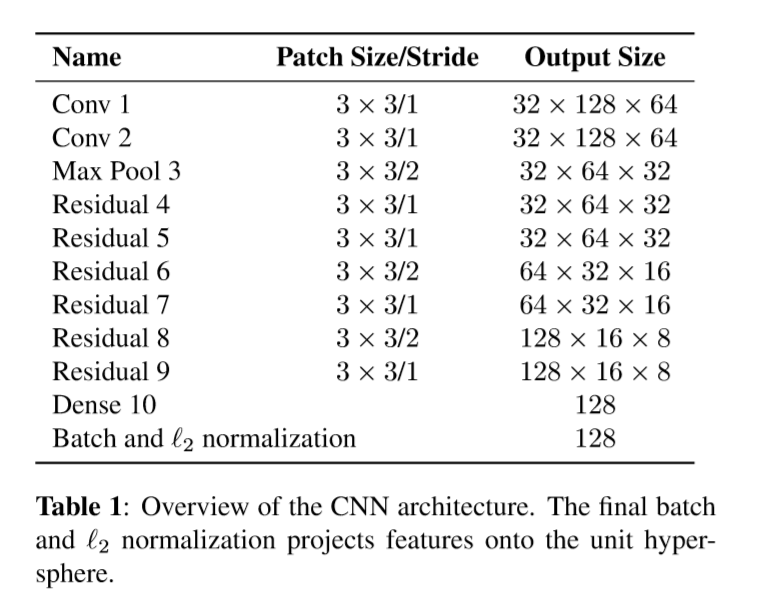

## [Simple Online And Realtime Tracking With A Deep Association Metric](./attachments/deep_sort.pdf)
### 研究背景

SORT(Simple Online And Realtime Tracking)在多目标追踪方面的非常实用的一个算法，尤其**简单**且**有效**。

随着目标检测技术的快速发展，`tracking-by-detection`已经逐渐成为了多目标追踪问题的核心方案。与此同时，多目标追踪问题也就成为了一个全局优化的问题，在整个视频batch当中。在这样的情况下，` Multiple Hypothesis Tracking (MHT) [8] and the Joint Probabilistic DataAssociationFilter(JPDAF)`这种相当传统的方法再一次被唤醒，而且取得了很不错的结果，但是他们增加了计算量以及实现的复杂性。

SORT算法，采用`Kalman`滤波器在图像域进行预测，然后通过匈牙利算法进行逐帧的数据联合(依据bbox overlap)。这种简单的方法在高帧速率下获得了良好的性能。

虽然SORT在追踪的过程中实现了较高的精度和准确度，可是它增加了`identity switches`，这是因为所采用的关联度量算法(匈牙利算法)只有在状态估计不确定性较低时才准确。SORT在通过**遮挡进行跟踪方面也存在缺陷**，因为目标通常出现在前视摄像机场景中。

### 创新点

* DeepSort算法则是在SORT的基础上，进一步引入了**运动和外貌信息**，进一步加强了SORT的表现，同时也使得我们能够追踪那些长时间被遮挡的目标，有效地减少了`identity switches`。
* 具体的做法呢，就是在SORT的基础上，

	* 我们在离线的预训练阶段，我们学习了一个deep association(CNN)。

	* 在在线应用过程中，我们利用视觉外观空间中的最近邻查询建立了测量跟踪关联。

通过整合这个网络，我们在克服遮挡以及漏检方面增加了鲁棒性，同时保持系统易于实现，高效，适用于在线场景。

实验也表明，我们这样的扩展方式，减少了45%的`identity switches`。实现了有竞争力的表现。

### 细节

我们采用了传统的单假设的追踪方法与递归的Kalman滤波器进行逐帧的数据关联。

#### 追踪处理与状态估计

这个追踪处理的方式，和SORT是完全相同的，我们在它的基础上，假设了一个摄像机没有固定，以及运行信息不可得的场景(这对于追踪问题而言是很普通的现象，与SORT中的设置是有区别的)。我们在追踪的时候，设置了8个空间状态的信息，分别是bbox的中心坐标(u,v),以及他们的速度和纵横比γ，高度h以及他们的速度，并将(u,v,γ,h)作为目标的直接观测值。

对于每个轨道k，我们计算自上一次成功测量关联ak以来的帧数。此计数器在Kalman滤波预测期间递增，并在跟踪与测量再次相关联时重置为0。如果计数器的值大于某个最大值Amax，则被认为目标已经离开，同时删除轨迹。

新轨道是一种无法与现有轨道关联的时候初始化的假设。这些新轨道在前三帧被归类为试探性的。在前三帧中没有成功关联到度量的轨道将被删除。

#### 分配问题

通过CNN的方式解决Kalman预测与新的测量之间的关联问题，是去构建一个可以通过匈牙利算法解决的分配问题。在这个问题当中，我们通过结合两种适当的度量方式来将运动和外貌的信息引入到问题当中。

**引入运动信息**

为了获取**运动信息**，我们在Kalman预测以及新的测量之间计算马氏距离，通过下面的式子完成：

其中(yi,Si)表示的是i-th轨道在测量空间的分布，dj表示的是j-th的bbox的检测

马氏距离通过测量标准的偏差(检测偏离平均轨迹位置),去充分考虑状态估计的不确定性。同时，他可以通过阈值的方式排除不可能的关联。

**依旧存在的问题**

当运动不确定性较低时，马氏距离是一个合适的关联度量。在我们的图像空间问题的形式当中，从卡尔曼滤波框架得到的预测状态分布只提供了对目标位置的粗略估计。特别是，不确定的相机运动可以在图像水平上引入快速的位移，使得马氏距离在遮挡问题上成为一个相当不可靠度量。

**引入外观信息**

对于每一个bbox detection dj 计算一个描述其外观的向量ri。 **理解的不到位...**

**两种度量的结合**

运动信息 + 外观信息

在组合中，这两个指标通过服务于分配问题的不同方面而相互补充。一方面，马氏距离提供了基于运动的可能物体位置信息，这对短期预测特别有用。另一方面，余弦距离考虑的是长时间遮挡后的外观信息，这些信息对于恢复身份非常有用，因为此时运动的区分度较低。

当有大量的摄像机动作时。λ = 0。只考虑外观的信息，而不考虑运动的信息。

#### 级联的结构

替代了在全局解决分配问题，我们引入了一个级联来解决一系列的子问题。

some situation:

* 当一个物体被遮挡较长一段时间后，后续的卡尔曼滤波预测增加了与该物体位置相关的不确定性,导致概率质量向状态空间的各个方向扩散，最终观测结果的不确定性。

* 与直觉相反，相同的检测用两个不同的轨道进行匹配是，马氏距离有利于更大的不确定性，因为它有效地减少了距离的标准差。这是一个不受欢迎的行为，因为它会导致增加的轨道碎片和不稳定的轨道。

因此，我们介绍了级联的结构，给定一些优先级。

#### Deep appearance Descriptor

通过使用简单的最近邻查询而不需要额外的度量学习，我们方法的成功应用在实际的在线跟踪应用程序之前，就能在离线时找到具有识别力的特征。因此我们采用了已经在大规模的人员重新识别数据集上进行了训练的CNN网络来提取特征。该网络的结构如下表所示：

最后 batch and l2 normalization 将特征投影到单位超球面，以兼容我们的余弦外观计量。

### 实验

我们评估了我们的跟踪器在MOT16基准上的性能。这个基准测试在七个具有挑战性的测试序列上评估跟踪性能，包括带有移动摄像机的前视图场景以及自顶向下的监视设置。

**指标**

* MOTA( Multi-object tracking accuracy):总结在FP、FN和 identity switches 方面的总体跟踪准确度

* MOTP(Multi-object tracking precision):总结在GT和 reported location 的bbox重叠上的跟踪精度

* ID(Identity switches):GT和 reported location身份发生变化的次数。

* MT(Mostly tracked):至少在其生命周期的80%中，有相同标签的GT跟踪的百分比

* ML(Mostlylost):GT追踪的百分比，这些追踪最多持续了他们生命20%的时间。

* Fragmentation(FM):一个轨迹因漏检而中断的次数。

总的来说，由于外观信息的整合，我们成功地通过长时间的遮挡来保持了身份。