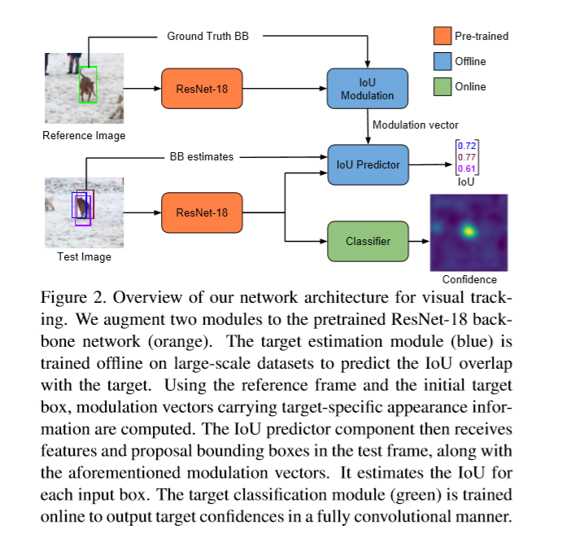
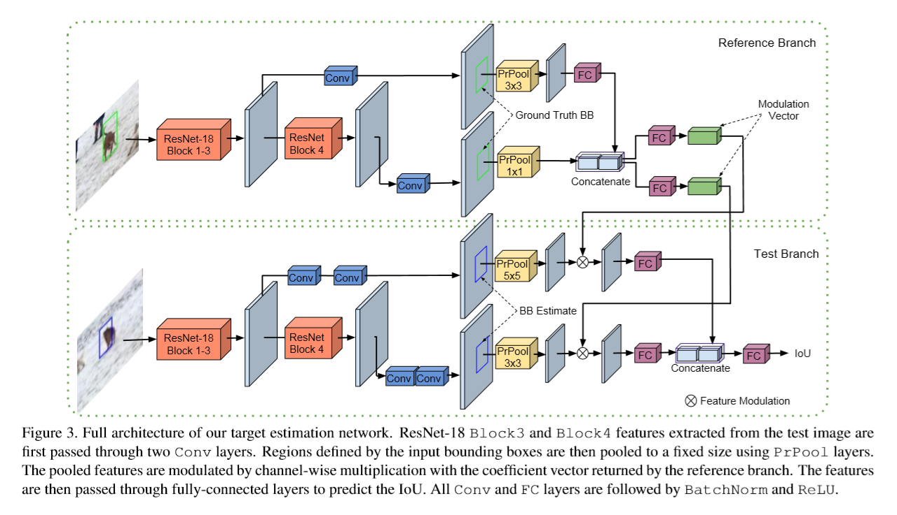
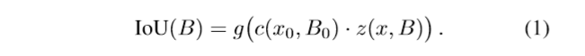
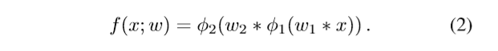
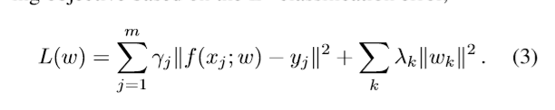
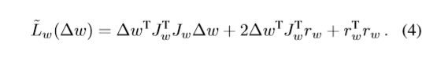

# ATOM Accurate Tracking by Overlap Maximization

**[[paper]](https://arxiv.org/pdf/1811.07628) [[code]](https://github.com/visionml/pytracking)**

## 背景

近年来，虽然目标跟踪的**鲁棒性**虽然已经得到了令人惊异的改善，但是在跟踪的**精度**方面的提升却很大程度上是被限制的。因为重点已经指向了强大的分类器的发展，而精确的目标状态评估则在很大程度上是被限制的。实际上，大部分跟踪器都使用了简单的多尺度搜索的方式来评估目标的bbox。我们认为，这种方法在根本上是有限的，因为目标估计是一项复杂的任务，需要对目标有较高层次的了解。

我们为了解决精确的目标位置的评估，提出了一个新的跟踪结构，包含了专门的目标状态评估与分类的模块，**通过广泛的离线学习，将高水平的知识纳入目标估计中**，我们的目标评估模块是被训练用于预测原目标与评估的bbox之间的重叠率。通过仔细地整合目标特定信息，我们的方法达到了以前没有见过的bbox精度。然后我们引入了一个**分类模块**，该模块通过**在线训练**从而保证了在干扰物的存在下，达到一种高的分辨能力。而且我们的方法咋在五个challenging benchmarks上达到了SOTA。在新的大尺度数据集TrackingNet上，我们的方法的性能要比以往做好的方法高出15%，运行速度是30FPS。

## 引入

通常来说，在线目标跟踪是一种困难的、难于适应的问题，这些跟踪方法在只有第一帧的GT下在线学习外观模型。然后这个模型需要进一步泛化到他从来没见过的物体当中。

近年来，跟踪研究的注意力已经集中到了目标的分类当中了，许多的精力被投入到了构造鲁棒性的分类器上。另一方面，目标的状态估计还没达到预期的进展。这个趋势在VOT2018挑战赛上清晰可见，因为在这里我们可以看得到，很古老的跟踪器，比如KCF仍然拥有可竞争的精度，然后却表现出了极差的鲁棒性。事实上，很多当前SOTA的跟踪器都在通过执行多尺度搜索的方式，依靠分类模块进行 目标状态的评估。但是这种策略存在着根本的限制性，因为bbox的评估是一个急剧挑战性的任务，需要对于目标姿态的高层次理解。

在这个任务中，我们打算打破分类和状态评估之间的差距。于是我们设计了一个新的跟踪结构，该结构包含了两个专门设计的模块来进行目标的状态评估和分类。

受IOU-Net的影响，我们训练这个目标状态评估的模块来预测评估得到的目标框与真值框之间的IOU阈值。因为原始的IOU-Net是用于分类任务的，所以它很难适应于通用的跟踪任务所以我们设计了一个新的结构，来将特定目标的信息结合到IOU的预测当中，我们通过引入一个**基于调制的网络**组件来实现，该组件将参考图像中的目标的外观合并到 获得的特定目标的IoU估计当中。这进一步使得我们的目标估计组件可以在大型数据集上**离线训练**。通过这种方式，在跟踪的过程中，我们可以通过在每帧中最大化预测到的IOU重叠面积来确定目标的位置。

为了开发一种无缝透明的跟踪方法，我们还重新讨论了目标分类问题，以避免不必要的复杂性。我们的目标分类模块试简单的却是强有力的。其中包含了两层全连接网络head。跟目标状态评估模块不同，这个分类模块试在线训练得到的，所以在场景中拥有很高的鲁棒性。

为了保证实时的性能，我们解决了这个有效的在线优化问题，在这个情境下，梯度下降是远远不够的。为此，我们采用了一个共轭的梯度策略，而且也证明了它能很容易地依靠深度神经网络来进行实现。最后的跟踪过程是进行分类、位置评估和模型状态的更新之间交替地进行。

## Proposal Method

首先，我在这里想说一下，大部分的Siamese跟踪器都是不考虑干扰物的，因为他们没有在线学习的过程。然后像SiamRPN和它的扩展版本DaSiamRPN都只使用了简单的线性更新方式来进行模板的更新，他们也通过离线在大尺度的数据集上训练，从而将一些具体的目标的信息，或者说对目标的高层理解，融入到了网络当中。使得最终的bbox回归网络更加强大。

在这个工作中，我们提出了新的跟踪方法，包含了两个部分：

* **Target Estimation** learned offline

* **Target Classification** learned online

这些模块被整合成为一个统一的多任务网络结构，如下所示：

在分类和评估分支上，我们使用了相同的网络ResNet-18，这个网络都是在ImageNet上预训练好的，当然在我们的工作中做了相应的微调。

#### Estmation

而这个目标状态评估是有IOU-predictor网络来完成的。这个网络是通过离线的方式，在大规模的数据集以及检测数据集上来训练的，而且这个分支的权重在跟踪过程中是被冻结的。这个IOU-predictor网络需要四个输入：

* 当前帧经过backbone的特征

* 当前帧中的bbox

* 参考帧经过backbone的特征

* 参考帧上对应的bbox

它的输出：

* 它预测得到的当前帧中每个bbox的IOU得分值。

**在跟踪过程中，通过梯度上升使IoU得分最大化，得到最终的边界框**

#### Classification

Target Classification是由另一个网络head来完成的，跟评估网络不同的是，这个分类网络完全是在线训练而来的。主要是基于在当前帧经过backbone特征提取之后的特征图上，来预测目标的得分值，从而在其他的物体当中区别目标。训练和预测都以全卷积的方式来进行进行，从而确保了网络的效率问题。但是 如果使用传统的方法，比如SGD来在线训练我们的网络的话，是没法达到我们网络的最优状态的，为此，我们提出了一个新的优化策略：**基于共轭梯度以及高斯牛顿法的策略**，该方法能够快速地进行在线训练。

我们也通过实验证明，我们的方法是比较容易实现的。

### Target Estimation by Overlap Maximization

**我们的状态评估部分的主要目的就是根据一个初始化的估计来确定目标的bbox。** 我们的灵感来源于IOU-Net，IOU-Net是最近提出的目标检测的方法，它是典型的anchor-based bbox回归方法的一个替代品。与传统的方法相反，IOU-Net被训练来预测图片目标和一个输入的bbox候选区域的IOU。bbox的评估是通过执行最大化IOU预测的方式得到的。

为了描述我们的目标状态估计模块，我们首先需要对IOU-Net进行一个简短的介绍。

首先有给定的一张图片经过深度网络后的特征图x，以及一个目标的bbox估计B，IOU-Net用来预测B与目标之间的IOU，这里的B表示为：B=(cx/w, cy/h, logw, logh)，其中(cx, cy)表示图片bbox的中心坐标。网络用一个精确的ROI Pooling层对x中B的部分进行池化，最后再feature map上得到了一个预确定的大小。很重要的一点是，PrPool是自适应平均池化的连续变体，它的关键优点是使得bbox的坐标可微。这也使得，BBox可以通过梯度上升的方式来最大化IOU。

#### Network Architecture

对于目标检测任务，IOU-Nets单独针对每一个类别进行训练，然而在跟踪任务中，类别一般而言是不清楚的。此外，与目标检测不同，目标不需要属于任何预定义的类集，也不需要在任何现有的训练数据集中表示。所以我们真正需要 的是一个目标特异性的IOU预测器，由于IOU预测任务是高层次，所以它不适合**在线**训练或者**在线**对单一帧中进行微调。因此，我们认为需要**离线**训练目标估计网络来学习IoU预测的一般表示。

在目标跟踪任务中，目标在哪是提前不知道的，所以就存在这样的一种挑战：构建IOU预测网络，这个网络可以有效地利用在测试阶段给定的模板目标的外貌信息。我们的初步实验表明，单纯的融合模板图像特征和当前帧图像特征的方法性能较差。我们也发现，Siam结构也仅仅能够提供次优的结果。所以我们提出了基于微调的网络结构，这个结构可以用来为在单个模板图片中给出的任意目标来预测IOU.这个网络如下图所示：

这个网络有两个分支，而且他们两个都用Resnet18作为backbone，且采用Block3和Block4的特征作为输入。模板分支输入特征x0和目标bbox的anno，然后他返回一个用于微调的向量c(x0, B0)，其中包含了正例系数1x1xDz。

而这个当前的图片，我们想要在该图像上评估目标的bbox，它需要经历网络的测试分支。它首先通过两个卷积层输入主干特征x，后面跟了一个PrPool来对bbox进行池化。当测试分支为IoU预测提取一般特征时，相对于参考分支，测试分支具有更多的层和更高的池分辨率。最后的输出z(x, B)de 大小是k x k x Dz，k是PrPool空间的输出大小。然后这个特征与模板分支中得到的c进行逐层相乘。这为IoU预测创建了特定于图标的表示，且有效地融合了模板的外貌信息。微调后的表现最后作为IOU predictor模块g的输入，这个模块包含了全连接层，最终预测得到的IOU可以通过下式进行表示：

为了训练这个网络，我们在给定的标注数据的条件下最小化上式的预测误差，且在跟踪过程中，我们通过最大化最终的IOU(B)来得到目标位置的评估。

**Training**

从上式(1)中我们发现使用bbox image pairs，整个IOU预测网络可以以端到端的方式进行训练。

* dataset： 
	* LaSOT、 TrackingNet  我们从最大间隔为50帧的视频中采样图像对。
	* COCO 合成的，用来增加训练数据的多样性。

在模板图像中，我们选取一个以目标为中心的正方形patch，其面积大约是目标面积的25倍；在测试图片中，我们采集了与模板相似相似的块，但是加入了一些 位置、尺度的扰动来模拟跟踪场景。这些裁剪的区域然后被resize到固定的大小。对于每个图片对，我们通过将高斯噪声增加到真值坐标的位置上来生成16个候选区域的bbox，而且确保最小的IOU值为0.1。

当然也加入了一些数据增强的操作，比如翻转和颜色抖动。

损失函数： mean-squared error loss

epoch：40

batchsize = 64

### Target Classification by Fast Online Learning

虽然目标评估模块提供了精确的bbox输出但是它缺乏鲁棒地区分目标和背景干扰的能力。所以我们需要将第二个网络head补充到评估模块中，它唯一的目的就是要加强这种识别力。和评估模块不同，这个分类模块仅仅**在线进行训练**。由于目标分类模块的目的是提供一个物体粗略的二维位置信息，我们希望它对目标的大小和比例不变。相反，它应该通过最小化错误检测来使得网络更加健壮。

**Model**

我们的目标分类模块试一个两层的全连接神经网络，其形式可以定义为：

这里的x是经过backbone后的feature map。w = {w1, w2}是网络的参数，Φ1，Φ2表示的是激活函数，* 表示的是多层卷积。虽然我们的框架是通用的，当然我们允许使用更加复杂的模型来达到这样的目的。

受到最近有区别力的相关滤波器的影响，我们基于L2分类错误制定了一个类似的学习目标：

每个训练样例的feature map xj都被一个置信度yj进行标定，且在以目标位置的中心设置了一个采样高斯函数。每个训练样本的影响由权值γj来控制，而对wk的正则化量由λk来设置。

**Online Learning**

一种强制最小化(3)的方法是使用标准的梯度下降来完成的。这些方法在现代的深度学习库中实现起来是比较容易的。但是由于收敛起来比较慢，所以在在线学习中没有得到很好的研究。所以我们提出了一个更加复杂的优化策略，该策略是专门为在线学习问题所定制的，而且只需要增加很少的实现复杂度就能达到不错的效果。

这个学习策略中涉及到的数学方法较为复杂，这里就不进行细化，大概的意思就是说我们要最小化(3)，然后我们使用一些方法对该问题进行了一个近似的替换。

高斯牛顿子问题，形成了一个二次正定函数，允许使用共轭梯度的方式进行求解。这个共轭梯度法(CG)直观上来说，他能够在每次迭代的过程中找到最优的搜索方向p和步长α。因为这个CG算法包含了一些简单的向量操作，所以可以通过很少的python代码来实现。唯一具有挑战性的方面是对搜索方向p的运算进行评估。

我们发现，这个CG已经成功地部署到了许多DCF跟踪算法上了，然而他们的实现需要自己动手实现一些操作，在这个过程中，即便是一些简单的模型，也需要比较冗长的工作，也因为一些小的修改(增加一个层、更换激活函数等)的存在，使得方法缺少灵活性。

我们的实现只需要用户提供函数r(w)来计算残差，这很容易实现。因此，我们的算法适用于任何形式的浅层学习问题。

###  在线跟踪方法

ATOM是基于PyTorch实现的，它在Nvidia GT-1080 GPU上的运行速度是30FPS。

**Feature extraction**

我们使用ImageNet上预训练的ResNet-18作为backbone。对于**目标分类**，我们使用**block 4特征**，而目**标估计组件使用block 3和block 4作为输入**。特征提取通常是从图像区域中提取大小为**288×288**的小块，小块大小为估计目标大小的**5**倍。backbone每帧只提取一个image patch的特征。

**Classification Model**

分类网络的第一层包含了一个1 x 1的卷积层，它将特征的维度降为64，这样可以满足内存和计算量的要求。分类网络的第二层采用了4 x 4的卷积核，输出维度为1个通道，在第一层中，我们没有发现非线性层的任何益处，所以φ1我们采用了恒等式。而第二层中，我们用到的是PELU作为非线性函数。

**Target Estimation**

我们首先在预先评估的目标位置和尺度上进行特征的提取，然后使用分类模块找到具有最大置信度得分的2维坐标位置。将二者进行结合，生成了bbox。虽然使用这一单一proposal可以执行状态估计，但我们发现使用多个随机初始化可以更好地避免局部极大值。因此，我们通过在B中加入均匀随机噪声，生成一组10个初始proposal。通过步长为1的5次梯度上升迭代，将每个box的预测IoU最大化。最终我们取其中三个最高的IOU值所对应的bbox。且不进行后处理，或者其他的过滤操作。**注意评估网络中的调制向量c(x0,B0)是在第一帧中预先计算的。**

**Hard Negative Mining**

为了提升我们分类模块的鲁棒性，我们采用了一个难例挖掘策略。即如果一个干扰物的峰值被检测到了，那我们就针对这个训练样例将学习率加倍，并马上按照默认的设定来执行优化策略。如果最后的得分值小于0.25，则认为是lost。

## Conclusions 

我们提出了一种新的跟踪体系结构，具有明确的组件用于目标估计和分类。估计模块是在大型数据集上离线训练的，用于预测目标和边界盒估计之间的IoU重叠。我们的架构通过执行特性调制集成了目标特定的知识。分类组件由一个两层的全卷积网络头组成，并使用专门的优化方法在线训练。我们的方法能够进行精确的目标评估，同时能够鲁棒性的反对干扰物。

