# Ocean Object-aware Anchor-free Tracking

**[[paper]]() [[code]](https://github.com/researchmm/TracKit)**

## 背景

对于目前而言，anchor-based的Siamese系列跟踪方法已经在精度方面取得了比较出色的性能。然而进一步的改善被限制在了跟踪的鲁棒性上，我们发现其中的根本原因就是在回归网络的训练过程中没我们只训练了正的样例，而忽略了负样例，这使得对于与目标的重叠率很小的anchor的细化是比较困难的。

本文鉴于这样的情况，就想着用anchor-free的方式来进行进行目标跟踪，因为在anchor-free中，没有anchor的设置，网络会对feature map上的每个点，直接回归他们对应目标的位置和尺度。而且对于每一个位于真值box中的像素都会被很好地训练。这样的跟踪器，它有能力在推理的过程中纠正不精确的预测。除此之外呢，我们引入一个特征对齐的模块来从预测的bbox中学习一种object-aware的特征，这种特征能够很好地作用于前景与背景之间的分类。

其实我们主要的工作就是提出了一个全新的anchor-free目标跟踪框架，实验也进一步证明我们的方法在五个benchmarks上达到了SOTA的性能。

## 引入

首先，我们很清楚的一点是，Siamese系列的网络，确确实实对于跟踪过程中的精度与速度进行了一定程度上的平衡。但是在跟踪的过程中，由于目标的形变、遮挡之类的问题，预测的框中与目标本身一定会有很小的情况，在ancher-base的方法中，每每在这种情况下，与目标的IOU值比较小的bbox一定是被直接丢掉的，但是在跟踪的时候，这样做反而限制了整体鲁棒性的提升。这样导致的结果就是在目标被遮挡之后，很容易就会产生漂移的现象。

所以很自然地就会有人问：**我们能不能设计一个带有纠正不精确的预测框能力的bbox回归器？** 在本文的工作中，作者通过提出一个新的object-aware的anchor-free的跟踪器来告诉大家，这样的猜想是可行的。作者提出的这个跟踪器包含了两个分支：**分类**和**回归**。这个回归网络即便再识别到的很小的前景框的情况下仍然可以定位目标。最终，这个跟踪器在推理阶段就有能录来纠正那些IOU比较小的弱的预测。

当回归网络预测得到一个更精确的bbox的时候，相应的特征会反过来出尽分类网络进行分类。我们用这个预测得到的bbox作为参考来为分类模块学习一个object-aware的特征。更具体地来说，就是我们引入了一个特征对齐模块，它包含一个二维空间变换，使特征采样位置与预测的边界盒对齐。该模块保证采样在指定的预测区域内，进而累积到目标尺度以及位置的变化。这使得学习到的特征对于分类而言是更加有区别力的、更可靠的。

作者还为他们的anchor-free的跟踪器装备了一个在线更新的模块，使得它在推理的过程中能够捕获目标外观的变化。这个在线模块很大程度上增强了跟踪的性能。这也体现出我们方法的可扩展性。

## 贡献

* 该算法不仅可以修正不精确的bbox预测，而且可以学习object-aware特征来提高匹配精度

* 通过将anchor-free网络与有效的特征组合模块相结合，设计了一种新的跟踪框架。

## Object-aware Anchor-Free Networks

这个网络包含了两个部分：

* 目标感知的分类网络：进行前景与背景的概率预测

* 回归网络：目标尺度的评估

### Anchor-free Regression Network

回顾最近的anchor-based跟踪器，我们发现，当预测得到的bbox变的不可靠的时候，跟踪器会迅速漂移。其主要的原因在于，在训练的过程中，这些方法只考虑了与GT的IOU比较大的anchor box。所以这些方法缺乏修正弱的预测的能力。

为了解决这个问题，我们引入了一种新的基于anchor-free的回归来进行视觉目标跟踪。它将在GT bbox内的像素当做是训练样例。这个核心的思想就是估计在目标bbox中的每一个像素到GT bbox四条边的距离。

这个回归网络是这样的，在4个3 x 3的卷积层，其维度是256的后面跟了一个3 x 3维度是4的卷积来预测距离，如下图所示：

这种基于anchor-free的回归方式，允许在GT bbox中的所有像素全部参与训练，因此尽管只要一小块区域是前景的情况下，他也可以预测到目标的长宽比。

### Object-aware Classification Network

在以往的Siamese跟踪方法中，分类置信度是由特征图上的某一块区域的特征进行估计得到的。该采样特征描述了图像中固定的局部区域，不能随对象尺度的变化而缩放。因此，这个分类置信度对于在复杂的背景中区分目标而言是不可靠的。

为了解决这个问题，我们提出了一个特征对齐模块来为分类学习一种object-aware的特征。对齐模块将卷积核的固定采样位置转换为与预测的边界盒对齐。

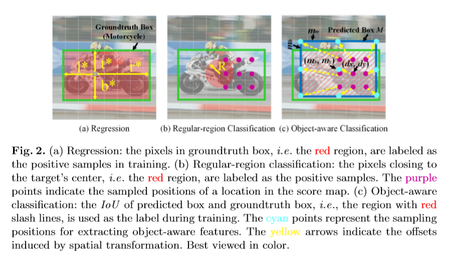

标准的2D卷积使用k  x k 的卷积核来进行特征的提取，提取的过程中作用到的范围是一个网格，如上图(b)所示，但是这个规格稍微网格并不能保证我们采样到的特征覆盖到了整个上下文区域M(M是回归网络回归得到的预测区域，我们的目标就是通过这个区域的内容来评估它所对应的分类特征图上某一个位置的类别信息)

因此，我们在这个规格的网格采样的基础上加入了一定的空间转换，使得它最终采样得到的特征能够覆盖到我们整个预测的区域M，如上图(c)所示。其中这个转换表示为图(c)中黄色的虚线。T(黄色虚线箭头)是通过测量以G为单位的采样位置(紫色点)到与预测的边框对齐的位置的相对方向和距离得到的。对于新的采样位置，这个目标感知的特征则会通过这个特征对齐模块来进行提取，这个模块可以定义为下面的式子：

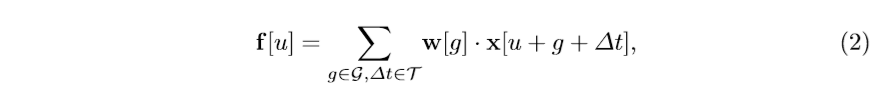

其中：

* x表示的是输入的特征图

* w表示的是学习到的卷积的权重

* u表示特征图上的一个位置

* f表示目标感知的特征图输出

* △t表示的是从原始卷积的位置到新的调整位置转换的距离向量。

这个位置转换可以定义为：

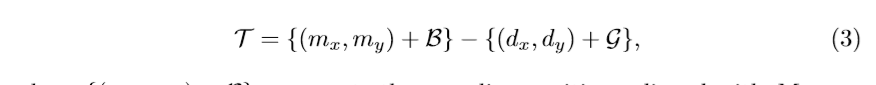

其中的第一项表示的是与M对齐后的采样位置。比如在上面图(c)中蓝绿色的点。第二项表示的用标准卷积得到的常规采样位置。 第二项表示的是用标准的卷积采样后的位置。其中B表示的是新的采样位置相对于其中心的坐标。

值得注意的是，当Eq.(2)中变换∆t∈t为0时，特征采样机制退化为规则点上的固定采样，生成规则区域特征。采样位置的变换可以适应视频帧中预测bbox的变化，因此我们提取到的目标感知的特征对于目标尺度的变化是鲁棒性的。这有利于在跟踪过程中特征的匹配。

此外，目标感知特征提供了候选目标的全局描述，使对象和背景的区分更加可靠。

我们利用目标感知特征和正则区域特征来预测一个区域是属于目标物体还是属于图像背景。对于基于上面的目标感知特征的分类，我们用了一个标准的3 x 3卷积在f上预测置信度po。对于基于常规特征的分类，4个3 x 3的卷积核，channel是256.后面跟了一个3 x 3的卷积，channel是1，这些卷积是在常规特征f'上进行的，最终预测一个置信度pr。**通过计算置信度po和pr的总和，得到最终的分类分数。**

目标感知特征提供了目标的全局描述，从而提高了候选区域的匹配精度。同时，正则区域特征集中于图像的局部区域，对目标中心的定位具有较强的鲁棒性。这两种特征的结合提高了分类网络的可靠性。

## Loss Function

为了优化我们提出的anchor-free网络，我们采用了IoU loss和BCE loss来共同训练回归和分类网络。在回归分支，这个loss被定义为：

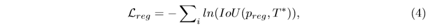

其中，preg表示的是预测，i表示的是跟踪样例的下标，在分类中，基于目标感知特征f的损失可以 表示为：

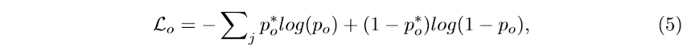

同时，基于规则特征的损失可以表示为：

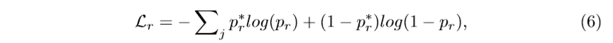

po和pr分别是根据目标感知特征和规则区域特征计算的分类分值图。j表示的是对于分类的训练样例的下标。po* 和pr* 表示的是真值标签。更具体地，po* 是一个概率标签，其中每个值表示预测的边界框和groundtruth之间的IoU，pr* 是一个二值标签，接近于中心的像素被设置为1。pr* 可以通过下面的方式来计算：

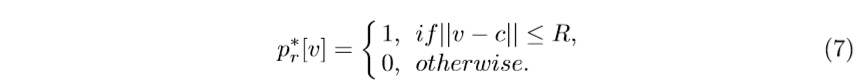

整个目标感知的anchor-free网络的联合训练过程中需要优化的目标函数为：

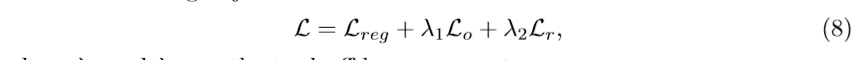

### Relation to Prior Anchor-Free Work

我们的anchor-free的方法与检测中的方法是有一定的相似之处。下面我们就来谈谈我们的的方法与这些相关研究的不同之处。以FCOS为例，我们的方法跟FCOS都是直接在像素级别的图像块中直接预测目标的位置。然而，我们的方法与FCOS之间有着两个基础方面是不同的。

* 在FCOS中，对于分类和回归网络的训练样例是完全相同的。那些样例都采集自GTbox内的位置，而在我们的方法中，对于分类和回归的数据采样策略是不对称的。而这种采样方式是为跟踪任务而量身定做的。具体而言，在分类网络中，仅仅考虑接近于目标的像素为正样例，而在回归网络中，则是将GT bbox包含的所有像素都作为训练样例。这种细粒度的采样策略保证了分类网络能够获得一个鲁棒的相似度度量来进行区域匹配，这对于跟踪是非常重要的。

* 在FCOS中，分类得分是在一个固定的规则区域的特征的基础上计算得到的。但是与之相反，我们的饿方法额外引入了目标感知的分支，这个分支捕获了全局的目标的信息。这个特征与与预测的bbox进行对齐，使得我们的网络能够适应目标尺度的改变。

**目标感知的特征与规则区域的特征相结合，使得我们的分类得分更加可靠。**

## Object-aware Anchor -Free Tracking

接下来，我们主要介绍的是如何将我们提出来的基于目标感知的anchor-free的网络应用在目标跟踪的任务中。它包含了两个部分：

* 一个离线的anchor-free模型

* 一个在线更新的模型

### Framework

这个离线跟踪是建立在目标感知的anchor-free网络之上的，包含了以下三个部分：

* 特征提取

* 结合

* 目标定位

**特征提取**

我们的输入也是一个pair，它们都经过一个被修改过的ResNet50的backbone，然后得到两个feature map。更具体地来说，我们减掉了标准的ResNet-50的最后一个stage，而且只保持前4个stage作为backbone。其中，前3个stage与原始的ResNet-50有着相同的结构。在第4个stage中，下采样单元的卷积步长，从2改到了1来增加feature map的大小。同时，所有3 x 3的卷积的stride都扩大到了2来增加感受野的大小。这些修改增加了输出特征的分辨率、从而改善了用这些特征进行目标定位的能力。

**特征结合**

这里用到的是SiamRPN++中的depth-wise相关操作，来将模板以及搜索区域的特征进行结合。并生成相应的相似度特征，用于后续的目标定位。但是不像在SiamRPN++中要在不同的尺度上进行相关操作，我们只需要在一个尺度上进行操作就可以了。然后通过逐点相加的方法来融合三个特征。具体的过程如下图所示：

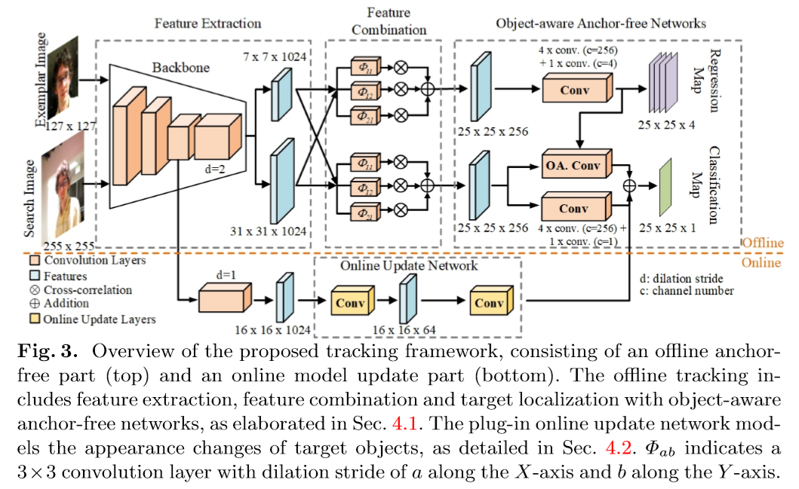

具体而言，其特征融合的过程可以被定义为下面的式子：

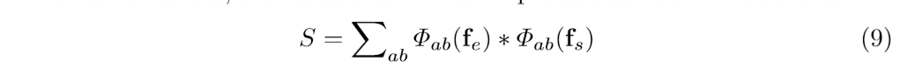

其中fe和fs分别代表的是模板、搜索图像的特征。Φab表示的是一个扩张卷积层。* 表示的是互相关操作。这个扩张卷积层的卷积核的大小被设置为 3 x 3 扩张卷积中的a表示的是沿着X轴方向的步长、b表示的是沿着Y轴方向的步长。这个扩张卷积也将特征图的channel由1024减少到256来节约计算量。在实验过程中，我们发现，增加扩张卷积的多样性能够改善特征的表现能力。所以，以经验为主地方式，我们选择了三个不同的扩张尺度，我们将这些步长依次设计为{(1, 1), (1, 2), (2, 1)}，这些不同扩张比例的扩张卷积可以捕获到一个区域不同尺度的特征，从而改善了最终结合得到特征的尺度不变性。

**目标定位**

这个步骤用到了我们前面提出的目标感知的anchor-free网络来在搜索图片上定位目标的位置。这个概率po和pr是通过分类网络预测得到的。然后它们通过一定的权重进行组合，得到最终分类的概率。

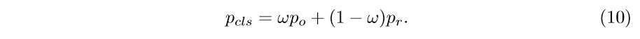

类似于以前的SiamRPN++等工作，我们强加了大量的尺度变化来抑制目标大小、长宽比的变化，如下所示：

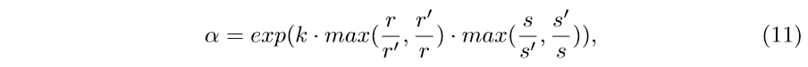

其中k是一个超参数，r和r'表示的是之前帧和当前帧所预测的bbox的长宽比，s和s'表示的是之前帧和当前帧所预测得到的bbox的大小。最终的分类得分值是α·pcls。最大值的分类特征图上的分类得分表示前景目标的位置。为了使预测的bbox形状平稳变化，使用线性权函数计算最终尺度：

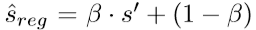

### 增加在线更新

我们在离线算法的基础上，装备了一个在线更新的模块。我们引入一个在线的分支在跟踪的过程中捕获目标外观的变化。这个在线更新的分支继承了主干网络前三个satge的结构和参数。，第四个stage保持和主干网络相同的结构。但是它的初始化参数是通过在[ Learning discriminative model prediction for tracking]中提出的预训练策略正获取的。对于模型的更新，我们使用共轭梯度算法在推理的过程来训练在线分支。这个前景的得分值是通过分类得分与在线分支的加权来得到的，加权的方式如下所示：

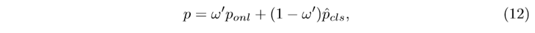

但是我们的模型中没有使用IOUNet

## 实验(略)

## Conclusion

本文，作者基于anchor-based的方法是难于细化有一部分与目标的重叠率比较小的anchors，提出了一个新奇的目标感知的anchor-free跟踪框架。我们的方法直接在视频帧中回归目标的位置，而不是针对预定义的anchor来预测偏移量。此外，这个学习到的目标感知特征通过对齐模块提供了一个对于目标的全局描述，促进了目标匹配的可行性。实验也进一步证明，我们的跟踪器在五个benchmark上达到了SOTA的性能。

