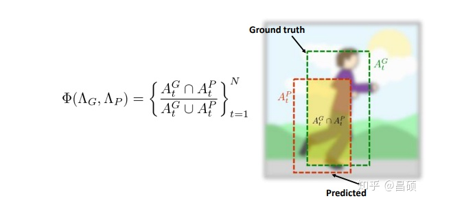
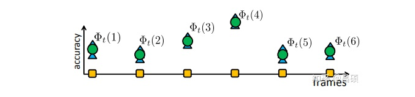
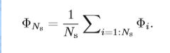
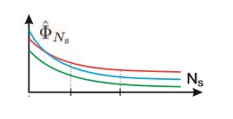
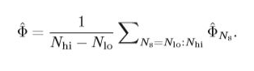
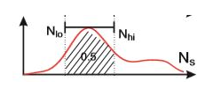
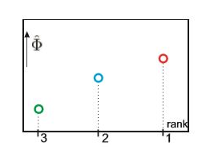

# 单目标跟踪的评价指标

单目标跟踪的评价指标主要有两个，一个是**pixel error**，一般是算**中心距离**，另一个是**overlap rate**，一般是算**区域重叠率**，其实这个区域重叠率的计算方式与目标检测当中的IOU是一致的。

## OTB

在这个数据集中，我们主要使用两类评价指标：

* **平均像素误差** Average Pixel Error（APE）根据预测目标中心位置与真实目标位置的像素距离作为误差值，该值越大，说明误差越大。最终结果取帧间的平均值。

* **平均重叠率** Average Overlap Rate （AOR）最后同样取帧间的平均值

* **精确图** precision plot 追踪算法估计的目标位置（bounding box）的中心点与人工标注（ground-truth）的目标的中心点，这两者的距离小于给定阈值的视频帧的百分比。不同的阈值，得到的百分比不一样，因此可以获得一条曲线。

* **成功率图** Success Plot 首先定义重合率得分（overlap score，OS），追踪算法得到的bounding box（记为a），与ground-truth给的box（记为b），重合率定义为：OS = |a∩b|/|a∪b|，|·|表示区域的像素数目。当某一帧的OS大于设定的阈值时，则该帧被视为成功的（Success），总的成功的帧占所有帧的百分比即为成功率（Success rate）。OS的取值范围为0~1，因此可以绘制出一条曲线。

* **OPE** 用ground-truth中目标的位置初始化第一帧，然后运行跟踪算法得到平均精度和成功率。这种方法被称为one-pass evaluation (OPE)。

* **鲁棒性评估（SRE，TRE）** 通过从时间（temporally，从不同帧起始）和空间（spatially，不同的bounding box，真实位置稍作偏移）上打乱，然后进行评估。可以分为：temporal robustness evaluation (TRE) 和 spatial robustness evaluation (SRE)。

## VOT

单目标跟踪算法中VOT的三个主要评价指标的计算：EAO, Accuracy, Robustness 

* **Accuracy**

其中ground truth代表目标物的真是位置，而predicted代表算法预测的输出位置，等式左边代表当前视频帧的accuracy，其实本质上来说，这个accuracy就是目标检测中经常提到的IOU。

* **Robustness**

记录在算法在一个视频序列中出现跟踪失败的次数，这里失败的定义是：单帧accuracy的值低于设定的阈值判定算法跟踪失败。其中算法失败后，将进行重新初始化，在失败帧接着进行二次跟踪。

但是这种方式存在一个问题：跟踪算法在某一帧失败后，如果从失败帧重新初始化，有可能再次失败。所以为了缓解这个问题，VOT官方规定5帧之后再进行初始化。

* **多次测量**

在一个视频帧上算法会进行多次的重复测量，有的算法由于含有随机性每次测量的结果会有不同。

                       Φt(i,k) accuracy of i-th tracker at frame t at repetition k

* **视频的平均准确率** Average accuracy over sequence

	* 定义每一帧的平均准确率 Per-frame averaged accuracy

	
	
	所以结合上面的公式对视频序列中的每一帧计算后可以得到：
	
	

则视频的平均准确率：

* **视频的平均鲁棒性** Average robustness per sequence

定义函数 F(i, k)为跟踪失败次数，在第k次算法重复测量过程中。那么视频的平均鲁棒性计算如下：

* **EAO** expected average overlap

	* 理想EAO
	
	  EAO本身不是通过A和R来计算的，但是跟A与R有一定的相关性。这个理想EAO提出的目的也是希望一个好       的跟踪器同时拥有好的A和R，如果直接用A和R的两个数加权和则有失公允，所以需要重新定义。
	
	  假设有Ns帧长的一个视频，那么一个跟踪器在这段视频上的覆盖率精度op为每一帧accuracy的均值，op就是bb与       gt的交并比用ϕ表示，即
	
	    
		 
	   那么一个理想的EAO就是把Ns从1到一个期望的极大值对应的ϕNs 求个平均，就是期望平均覆盖率，恰如          其名，等价于下图的曲线下面积
	   
	   
	   
	   举个栗子，假如一个跟踪器从第一帧开始跟，Ns=1,那么显然op为1，ϕ也为1，Ns=2时，第一帧op为1，第        二帧op为0.6，那么ϕ=0.8，加入这个Ns极大值就是2，那么EAO就是0.9。一般的，对于短时跟踪器，ϕNs        随着Ns增长而降低，也就是呈现图上的曲线，这个是可以反映A和R的，其中A是在op上进行体现的。
	   
	* 标准EAO

       在VOT中EAO计算并不是从Ns=1:Nmax的，而是Ns=Nlow:Nhigh,我把它们称为标准EAO，即
	   
	   
	   
	   Nlow和Nhigh简单的说就是一个典型视频长度范围，这些长度的视频占所有视频的概率是0.5，图上看就是          概率分布最中间的部分
	   
	   
	   
	   最后看看著名的EAO图怎么花的，很简单横坐标是排名，纵坐标是算出来的标准EAO，EAO极大值是1，          rank极大值也是一，所以排名越往右上的EAO性能越好。
	   
	   
	   
* **实际EAO的计算**

VOT是这样算的，因为VOT在跟丢后会重新初始化，这样就把一个视频按失败点可以分成若干段，不用另外初始化了，这样就扩充了视频的个数，节省了计算量，对这些视频的帧数做一个统计，算一个分布图，由于这个是离散的，那么用KDE的方法插值成连续的，然后找到最高点，两边的边界就是同时满足P(low) = P(high)且P(Ns)在Nlow到Nhigh上的积分值等于0.5。

然后对于分割出来的N个视频，对每一个Ns=Nlow:Nhigh计算N个视频的平均覆盖率，计算的时候剔出那些因为帧数超过原视频极限的视频。比如说，一段a帧的视频是从A帧长的视频里分出来的，a<A，但是如果此时计算的a<Ns<A，那么这个视频仍要继续算覆盖率，后面>a帧的部分因为跟丢了覆盖率都按0算；如果Ns>A，那么这个视频就剔出不统计了，还有一种情况，Ns<a，那么只算到Ns为止的覆盖率。通过剪枝或者补零的方式计算所有符合条件的ϕNs。最后再求一个平均即得到了估计的标准EAO，就是VOT报告的EAO了。

* **EAO与R的关系**

之前说过R为鲁棒性，反映为跟丢的次数。讨论极限情况，每一帧的op都为1，A跟踪器和B跟踪器的差别仅在R上，A跟丢1次，B没有跟丢，A即使丢了，初始化后的op仍始终为1，即两者的精度是相同的，鲁棒性不同，来看EAO，假设A在中间帧i跟丢了，所以被分成了2个视频，前一个视频的ϕ\phiϕ显然为0.5，后一个为1，那么EAO为0.75，而B的EAO为1，这就反映了R。以此类推，跟丢的次数越多，被分成的视频就越多，跟丢点越靠前越不利，因为后面大部分的帧的op都算成0了。所以跟丢越多EAO越低。但是EAO和R不等价，很容易看出来，当R相同时，比如都跟丢了一次，但是明显跟丢点在靠前位置的跟踪器的EAO会更低。所以这也反映了VOT这种计算方法的不合理处。

**待更新别的常见数据集上的评测指标···**