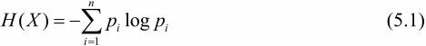

#### 决策树学习的3个步骤
* 特征选择

* 决策树的生成

* 决策树的剪枝

#### 决策树的定义
分类决策树模型是一种描述对实例进行分类的树形结构。决策树由**结点**，**有向边**组成。结点有两种类型：**内部结点**和**叶结点**。内部结点表示一个**特征或属性**，叶结点表示一个**类**。

#### 决策树学习的规则
从根节点开始，对实例的某一特征进行测试，根据测试结果，将实例分配到其子节点；这时，每一个子结点对应着该特征的一个取值，如此递归地对实例进行测试并分配，直至达到叶结点。最后将实例分到叶结点的类中。

#### 决策树与条件概率分布

决策树还表示给定**特征条件**下的**条件概率分布**。这一条件概率分布定义在特征空间的一个**划分**上。将特征空间划分为互不相交的单元或区域，并在每个单元定义一个**类的概率分布**就构成了一个条件概率分布。**决策树的一条路径对应于划分中的一个单元**。决策树表示的条件概率分布由各个单元给定条件下类的条件概率分布组成。

#### 局部最优和全局最优

* 局部最优：决策树的生成

* 全局最优：决策树的剪枝

#### 信息增益

##### 一、熵
*  在信息论与概率统计中，熵是表示**随机变量不确定性**的度量。熵只依赖于X的分布，而与X的取值无关。熵越大，随机变量的不确定性越大。
>

* 在默认情况下，没有分类的情况下，事物本身的混乱程度，即它的熵值为H0, 根据某一个属性值对他进行分类后，事物此时的熵H1相对于上一次没有分类时的H0有所下降，也就是**分类提高了事物的纯度，混乱度下降**，即分类使得实例对应的熵有所下降。

##### 二、条件熵
* 普通条件熵：条件熵H(Y|X)表示在已知随机变量X的条件下随机变量Y的不确定性。

* 随机变量X给定条件下Y的条件熵：X给定条件下Y的条件概率分布的熵对X的数学期望。
>
##### 三、经验熵与经验条件熵
当熵和条件熵中的概率由数据局估计（特别是极大似然估计）得到时，所对应的熵与条件熵分别称为经验熵和经验条件熵。

##### 四、信息增益
表示得知特征X的信息而使得类Y的信息的不确定性减少的程度。
>
* 互信息：一般地，熵与条件熵之差称为互信息

##### 五、信息增益比
特征A对训练数据集D的信息增益比gR(D,A)定义为其信息增益g(D,A)与训练数据集D关于特征A的值的熵之比。

#### ID3算法（决策树生成）

* 核心：在决策树各个结点上应用信息增益选择特征，递归地构建决策树。
* 具体方法：从根结点开始，对结点计算所有可能的特征的信息增益，选择信息增益最大的特征作为结点的特征。由该特征的不同取值建立子结点；再对子结点递归地调用以上方法，构建决策树；直到所有特征的信息增益均很小或者没有特征可以选择为止。
* 缺点：ID3算法只有树的生成，所以该算法生成的数容易产生过拟合

#### C4.5生成算法
C4.5生成算法是在ID3的基础上进行的改进，它将特征选择的方式由信息增益换为了信息增益比。

#### 决策树的剪枝
* 定义：在决策树学习的过程中将已生成的树进行简化的过程。
* 目标：极小化决策树整体的损失函数，或者代价函数

>eg:设数T的叶结点个数为|T|,t是树T的叶结点，该叶结点有Nt个样本点，其中K类的样本点有Ntk个，Ht(T)为叶结点t上的经验熵，α≥0为参数，则损失函数可以定义为：
>
>其中经验熵为：
>
>在损失函数中，将式（5.11）右端的第1项记作：
>
>这时有：
>

剪枝，就是当a确定时，选择**损失函数最小**的模型，即损失函数最小的子树。当a值确定时，子树越大，往往与训练数据的拟合越好，但是模型的复杂度就越高；相反，子树越小，模型的复杂度就越低，但是往往与训练数据的拟合不好。损失函数正好表示了对两者的平衡。

#### CART(分类回归树)算法
* 简述：CART同样由特征选择、树的生成及剪枝组成，既可以用于分类也可以用于回归。
* 概念：CART是在给定输入随机变量X条件下输出随机变量Y的条件概率分布的学习方法。CART假设决策树是**二叉树**，内部结点特征的取值为“是”和“否”，左分支是取值为“是”的分支，右分支是取值为“否”的分支。这样的决策树等价于递归地二分每个特征，将输入空间即特征空间划分为有限个单元，并在这些单元上确定预测的概率分布，也就是在输入给定的条件下输出的条件概率分布。
* 实现步骤：
	* 决策树生成：基于训练数据集生成决策树，生成的决策树要尽量大；
	* 决策树剪枝：用验证数据集对已生成的树进行行剪枝并选择最优子树，这时用损失函数最小作为剪枝的标准。

##### CART生成

* 定义：就是递归地构建二叉决策树的过程。对==回归树用平方误差最小化准则 #F44336==，对==分类树用基尼指数（Gini index）最小化准则 #F44336==，进行特征选择，生成二叉树。

==**分类数的生成** #090909==
* 基尼指数：分类问题中，假设有K个类，样本点属于第k类的概率为pk，则概率分布的基尼指数定义为：
> 

对于二类分类问题，若样本点属于第1个类的概率是p，则概率分布的基尼指数为:
>

对于给定的样本集合D，其基尼指数为：
这里，Ck是D中属于第k类的样本子集，K是类的个数。

如果样本集合D根据特征A是否取某一可能值a被分割成D1和D2两部分，即：
>
>则在特征A的条件下，集合D的基尼指数定义为:
>

基尼指数Gini(D)表示集合D的==不确定性==，基尼指数Gini(D,A)表示经==A＝a #F44336==分割后集合D的不确定性。==基尼指数值越大，样本集合的不确定性也就越大 #03A9F4==，这一点与熵相似。

##### CART剪枝

* 概念：CART剪枝算法从“完全生长”的决策树的底端剪去一些子树，使决策树变小（模型变简单），从而能够对未知数据有更准确的预测。
* 步骤：
	* 从生成算法产生的决策树T0底端开始不断剪枝，直到T0的根结点，形成一个子树序列{T0，T1,…,Tn}；
	* 通过交叉验证法在独立的验证数据集上对子树序列进行测试，从中选择最优子树。

* 剪枝过程中子树的损失函数:
>

对固定的a，一定存在使损失函数Ca(T)最小的子树，将其表示为Ta。Ta在损失函数Ca(T)最小的意义下是最优的。容易验证这样的最优子树是唯一的。当a大的时候，最优子树Ta偏小；当a小的时候，最优子树Ta偏大。极端情况，当a＝0时，整体树是最优的。当a→时，根结点组成的单结点树是最优的。

==有待补充... #F44336==