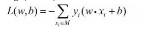
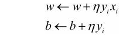
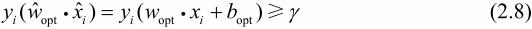
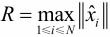
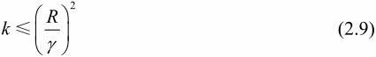
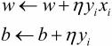
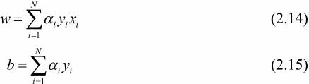

#### 概念

感知机：是二类分类的线性分类模型，其输入为实例的特征向量，输出为实例的类别，类别取 +1，-1两种。

#### 目标
求出将训练数据进行线性划分的分离超平面

####  损失函数
基于误分类的损失函数，并利用梯度下降法对损失函数进行极小化

梯度下降的步骤：首先，任意选取一个超平面,w0,b0，然后用梯度下降法不断地极小化目标函数。极小化过程中不是一次使M中所有误分类点的梯度下降，而是一次随机选取一个误分类点使其梯度下降。
#### 算法

* 特点：简单而易于实现

* 形式：原始形式，对偶形式

#### 假设空间

定义在特征空间中的所有线性分类模型或线性分类器

#### 数据集的线性可分性

给定一个数据集其中，xi∊x＝Rn，yi∊＝{+1,-1}，i＝1,2,…,N，如果存在某个超平面S能够将数据集的正实例点和负实例点完全正确地划分到超平面的两侧，即对所有yi＝+1的实例i，有w·xi+b>0，对所有yi＝-1的实例i，有w·xi+b<0，则称数据集T为线性可分数据集（linearly separable data set）；否则，称数据集T线性不可分。

#### 感知机学习算法的原始形式
输入：训练数据集T＝{(x1，y1),(x2,y2),…,(xN,yN)}，其中xi∊x＝Rn，yi∊＝{-1,+1}，i＝1,2,…,N；学习率(0<≤1)；
输出：w,b；感知机模型f(x)＝sign(w·x+b)。
（1）选取初值w0,b0
（2）在训练集中选取数据(xi，yi)
（3）如果yi(w·xi+b)≤0

（4）转至（2），直至训练集中没有误分类点。

这种学习算法直观上有如下解释：当一个实例点被误分类，即位于分离超平面的错误一侧时，则调整w,b的值，使分离超平面向该误分类点的一侧移动，以减少该误分类点与超平面间的距离，直至超平面越过该误分类点使其被正确分类。

#### Novikoff定理

设训练数据集T＝{(x1，y1),(x2，y2),…,(xN,yN)}是线性可分的，其中xi∊x＝Rn，yi∊＝{-1,+1}，i＝1,2,…,N，则：

（1）存在满足条件||opt||＝1的超平面opt·＝wopt·x+bopt＝0将训练数据集完全正确分开；且存在>0，对所有i＝1,2,…,N

（2）令，则感知机算法2.1在训练数据集上的误分类次数**k**满足不等式

定理表明，**误分类的次数k是有上界**的，经过有限次搜索可以找到将训练数据完全正确分开的分离超平面。也就是说，**当训练数据集线性可分时，感知机学习算法原始形式迭代是收敛的**。

#### 感知机学习算法的对偶形式

对偶形式的基本想法是，将w和b表示为实例xi和标记yi的线性组合的形式，通过求解其系数而求得w和b。不失一般性，在算法2.1中可假设初始值w0,b0均为0。对误分类点（xi，yi）通过

步修改w,b，设修改n次，则w,b关于（xi，yi）的增量分别是aiyixi和aiyi，这里ai＝ni。这样，从学习过程不难看出，最后学习到的w,b可以分别表示为

这里，ai≥0，i＝1,2,…,N，当＝1时，表示第i个实例点由于误分而进行更新的次数。实例点更新次数越多，意味着它距离分离超平面越近，也就越难正确分类。换句话说，这样的实例对学习结果影响最大。

#### 算法过程
对偶形式中训练实例仅以内积的形式出现。为了方便，可以预先将训练集中实例间的内积计算出来并以矩阵的形式存储，这个矩阵就是所谓的Gram矩阵（Gram matrix）[Gram的计算方法](https://blog.csdn.net/appleyuchi/article/details/78170424)
